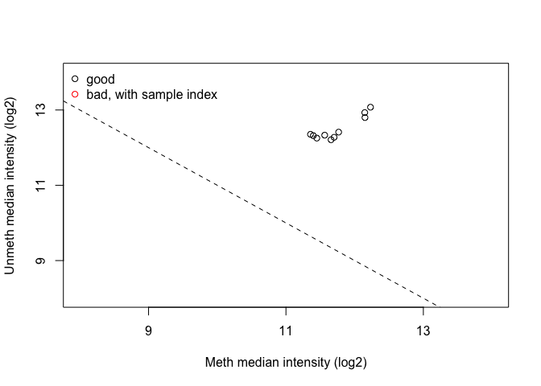
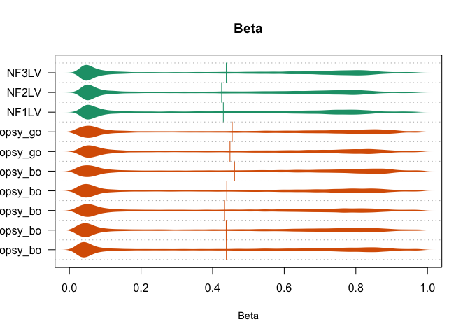

**Code Author**: Mark E. Pepin, MD, PhD, MS **Contact**:
[pepinme\@gmail.com](mailto:pepinme@gmail.com){.email} **Institution**:
Heidelberg University Hospital **Location**: 669 Neuenheimer Feld,
Institute for Experimental Cardiology, 69120 Heidelberg, Germany

# Preliminary Setup

## Parameters

Define the parameters used, along with the conditions required for the
current analysis. This segment must be modified for each analysis
performed.


```r
##Set the experimental conditions [MUST DO THIS MANUALLY]
Run_tS<-Sys.time()
TREATMENT=c("CON", "DCM")
CELL=c("iPSC")
STATISTIC = 0.05 #P statistic threshold used in this combination.
VARIABLE = TREATMENT
COMPARISON= paste0(CELL[1], "_",VARIABLE[2], "_vs_", VARIABLE[1])

# Candidate Gene Selection (RNA-sequencing) EDIT THIS LIST BASED ON INTERESTS.
GENES=c("LEP", "ADIPOQ", "PLIN1")
VAR1="Treatment"
VAR2="Diabetes"
# Single Bar Graph
library(dplyr)
my_comparisons <- list( c("CON", "DCM")) # Comparisons to make
## Create color based on Genotype
ann_colors = list(Treatment = c(DCM="darkgray", CON = "darkcyan"))
TreatmentColors<-ann_colors$Treatment
ann_colorTable<-as.data.frame(ann_colors)

ann_colGroup<-subset(ann_colorTable, rownames(ann_colorTable) %in% TREATMENT)
ann_colListGroup<-list(ann_colors$Treatment)
ann_colGroupVec<-ann_colGroup$Treatment
names(ann_colGroupVec)<-as.factor(rownames(ann_colGroup))
GROUP_colors<-list(ann_colGroupVec=ann_colGroupVec)

# Create Output Folder Structure
ifelse(!dir.exists(file.path(paste0("../2_Output/"))), dir.create(file.path(paste0("../2_Output/"))), FALSE)
```

```
## [1] FALSE
```

```r
ifelse(!dir.exists(file.path(paste0("../2_Output/", COMPARISON))), dir.create(file.path(paste0("../2_Output/", COMPARISON))), FALSE)
```

```
## [1] FALSE
```

## Packages


```r
if (!require("pacman")) install.packages("pacman")
pacman::p_load(dplyr, Hmisc, openxlsx, corrplot, RColorBrewer, kableExtra, ggplot2, gridExtra, ggpubr, ggsignif, DESeq2, data.table, GenomicFeatures, biomaRt, Haplin, pheatmap, calibrate, ggrepel, tidyr, gtools)
```

# Genome-wide DNA methylation - Illumina(R) HumanMethylation 450k Methylation


```r
library(minfi)
library(limma)
library(shinyMethyl)
library(dplyr)
library(IlluminaHumanMethylation450kmanifest)
library(IlluminaHumanMethylation450kanno.ilmn12.hg19)
library(RColorBrewer)
#########Part 1: Importing the Data
#Parameters
##Get the array annotation
annoM450k<-getAnnotation(IlluminaHumanMethylation450kanno.ilmn12.hg19)
annoM450k<-dplyr::select(as.data.frame(annoM450k), Name, chr, pos, Relation_to_Island, UCSC_RefGene_Name, UCSC_RefGene_Accession, UCSC_RefGene_Group, Regulatory_Feature_Group)
#Import the sample sheet
targets<-read.metharray.sheet(base="../1_Input/IDAT", pattern=".csv")
```

```
## [1] "../1_Input/IDAT/SampleSheet.csv"
```

```r
 #Import the annotation file
AnnoTargets<-targets
targets$ID <- paste(targets$Sample_Group,targets$Sample_Name,sep=".")
targets$Sample_Well<-AnnoTargets$Sample_Well
targets$Sample_Plate<-AnnoTargets$Sample_Plate
targets$Sample_Group<-AnnoTargets$Sample_Group
targets$Sample_Group<-factor(targets$Sample_Group, levels = c("CON", "DCM"))
targets$Sex<-AnnoTargets$Sex
targets$Outcome<-AnnoTargets$Outcome
targets$Conc<-AnnoTargets$Conc
targets$Col_ID<-AnnoTargets$Col_ID
targets$Tissue<-AnnoTargets$Tissue
targets<-targets %>% filter(Tissue %in% CELL)

#Import the array data from input directory (red and green .idat files)
RGSet<-read.metharray.exp(base = "../1_Input/IDAT", targets = targets, verbose = TRUE)
sampleNames(RGSet)<-targets$Sample_Name
##Quality Control
#First step is to identify CpGs that failed to identify methylated positions (defined by expression intensity that reflects background levels)
detP<-detectionP(RGSet)
PLOT.COL <- brewer.pal(8,"Dark2")
##Detection P-value Plot
pdf(file=paste0("../2_Output/", COMPARISON, "/", COMPARISON, "_detectionP.pdf"))
par(mfrow=c(1,1))
barplot(colMeans(detP), col=PLOT.COL[factor(targets$Sample_Group)], 
        cex.names=0.8, ylim=c(0,0.005), ylab="Mean detection p-values")
abline(h=0.05,col="red")
legend("topleft", legend=levels(factor(targets$Sample_Group)), fill=PLOT.COL, 
       bg="white")
dev.off()
```

```
## quartz_off_screen 
##                 2
```

```r
## Filter RGSet by detection P-value
keep <- colMeans(detP) < 0.05
RGSet <- RGSet[,keep]
RGSet
```

```
## class: RGChannelSet 
## dim: 622399 24 
## metadata(0):
## assays(2): Green Red
## rownames(622399): 10600313 10600322 ... 74810490 74810492
## rowData names(0):
## colnames(24): A1_cells_bo A2_cells_bo ... C9_cells_co C10_cells_co
## colData names(17): Sample_Name Sample_Well ... ID filenames
## Annotation
##   array: IlluminaHumanMethylation450k
##   annotation: ilmn12.hg19
```

```r
##QC Report
qcReport(RGSet, sampNames=targets$ID, sampGroups=targets$Sample_Group, pdf="qcReport.pdf")
```

```
## quartz_off_screen 
##                 2
```

```r
#
par(mfrow=c(1,1))
barplot(colMeans(detP), col=PLOT.COL[factor(targets$Sample_Group)], las=2, 
        cex.names=0.8, ylim=c(0,0.005), ylab="Mean detection p-values")
abline(h=0.05,col="red")
legend("topleft", legend=levels(factor(targets$Sample_Group)), fill=PLOT.COL, 
       bg="white")
```

<!-- -->

```r
# #Determine the fraction of "failed" CpG probes (those which failed to identify a methylated CpG)
# colMeans(failed)
#Convert R/G to Methylated/Unmethylated in an object of class MethylSet
MSet<-preprocessRaw(RGSet)
#QC data
qc<-getQC(MSet)
plotQC(qc)
```

<!-- -->

```r
pdf(file=paste0("../2_Output/", COMPARISON, "/", COMPARISON, "_QC.Methyl.pdf"))
plotQC(qc)
dev.off()
```

```
## quartz_off_screen 
##                 2
```

```r
##Density plot
# densityPlot(RGSet, sampGroups = targets$Sample_Group, main= "Beta", xlab = "Beta")
pdf(file=paste0("../2_Output/", COMPARISON, "/", COMPARISON, "_densityPlot.pdf"))
densityPlot(RGSet, sampGroups = targets$Sample_Group, main= "Beta", xlab = "Beta")
dev.off()
```

```
## quartz_off_screen 
##                 2
```

```r
densityBeanPlot(RGSet, sampGroups = targets$Sample_Group)
```

<!-- -->

```r
pdf(file=paste0("../2_Output/", COMPARISON, "/", COMPARISON, "_BeanPlot.pdf"))
densityBeanPlot(RGSet, sampGroups = targets$Sample_Group)
dev.off()
```

```
## quartz_off_screen 
##                 2
```

```r
qcReport(RGSet, pdf= paste0("../2_Output/", COMPARISON, "/", COMPARISON, "_qcReport.pdf"))
```

```
## quartz_off_screen 
##                 2
```

```r
# #Convert to a shinyMethyl dataset (nice summary of the quality control)
# summarized.data <- shinySummarize(RGSet)
# runShinyMethyl(summarized.data)

gRatioSet.quantile <- preprocessQuantile(RGSet, fixOutliers = TRUE, removeBadSamples = TRUE, badSampleCutoff = 10.5, quantileNormalize = TRUE, stratified = TRUE, mergeManifest = FALSE)
beta.all<-getBeta(RGSet)
write.csv(beta.all, "../1_Input/EPIC.betaValues.csv")
```

## Supplemental Figure SXX: Outlier Analysis


```r
par(mfrow=c(1,1))
barplot(colMeans(detP), col=PLOT.COL[factor(targets$Sample_Group)], las=2, 
        cex.names=0.8, ylim=c(0,0.005), ylab="Mean detection p-values")
abline(h=0.05,col="red")
legend("topleft", legend=levels(factor(targets$Sample_Group)), fill=PLOT.COL, 
       bg="white")
```


<!-- ## Supplemental: SNPs in Methylation Data -->

<!-- SNPs have been shown to confound the interpretation of methylation arrays when mutations exist within the CpG sites. To address this concern, a package called "MethylToSNP" exists to identify novel SNPs based on methylation array data, which has been proposed to reduce the number of CpGs that are filtered. Using this approach, XXXX CpGs were identified as putative SNPs which are likely influenced by minor allele fractions (MAFs); among these, XXXX have been identified as SNPs via published genomic sequencing analyses. -->

<!-- ```{r SNPs, fig.cap = "Supplemental Figure S4: Putative SNP Identification from CpG Probe Intensity"} -->
<!-- #Remove SNPs -->
<!-- ##Option 1: Built-in function that removes all known SNPs -->
<!-- gRatioSet_noSNPs<-dropLociWithSnps(gRatioSet.quantile, snps = c("SBE", "CpG"), maf = 0) -->
<!-- ##Option 2: Identify putative SNPs using methylation barcoding (i.e. "gap hunting") -->
<!-- library("MethylToSNP") -->
<!-- library("RColorBrewer") -->
<!-- library("pheatmap") -->
<!-- library("magrittr") -->
<!-- Mvalues<-as.data.frame(getM(MSet)) -->
<!-- x <- MethylToSNP(MSet,verbose=TRUE) -->
<!-- x$CpG_ID<-rownames(x) -->
<!-- ### -->
<!-- pdf(file="../2_Output/Putative.SNPs.pdf", width = 10, height = 5) #Print Putative SNP Methylation -->
<!-- plotPotentialSNPs(x, MSet) -->
<!-- dev.off() -->
<!-- plotPotentialSNPs(x, MSet) -->
<!-- SNPs<-merge(x, as.data.frame(getM(MSet)), by = "row.names") -->
<!-- write.csv(SNPs, "../2_Output/SNPs.csv") -->
<!-- SNPs_matrix<-SNPs %>% set_rownames(.$Row.names) -->
<!-- SNPs_matrix<-SNPs_matrix[,13:ncol(SNPs_matrix)] %>% as.matrix() -->
<!-- SNPs_matrix<-SNPs_matrix[!is.infinite(rowSums(SNPs_matrix)),] #One infinite value exists!! (took ~2-3 days to troubleshoot) -->
<!-- # Index -->
<!-- Index<-read.csv("../1_Input/colData.csv") -->
<!-- Index_SNPs<-Index[colnames(SNPs_matrix),] %>% dplyr::select(Sample_Group) -->
<!-- ann_colors = list(Sample_Group = c(DCM="#1b9e77", CON = "#d95f02")) -->
<!-- paletteLength <- 100 -->
<!-- myColor <- colorRampPalette(c("dodgerblue4", "white", "gold2"))(paletteLength) -->
<!-- ann_colors = list(Sample_Group = c(DCM="#1b9e77", -->
<!--                            CON = "#d95f02")) -->

<!-- heatmap_SNP<-pheatmap::pheatmap(SNPs_matrix, scale="row", #Heatmap of SNPs -->
<!--                       cluster_cols = TRUE, -->
<!--                       cluster_rows = TRUE, -->
<!--                      cutree_cols = 3, -->
<!--                      cutree_rows = 4, -->
<!--                      angle_col = 45, -->
<!--                      fontsize_col = 8, -->
<!--                      color = myColor, -->
<!--                      show_rownames = FALSE, -->
<!--                      border_color = NA, -->
<!--                      annotation_colors = ann_colors, -->
<!--                      annotation_col = Index_SNPs, -->
<!--                     filename = paste0("../2_Output/SNPS.heatmap.pdf")) -->
<!-- pheatmap(SNPs_matrix, scale="row", #Heatmap of SNPs -->
<!--                       cluster_cols = TRUE, -->
<!--                       cluster_rows = TRUE, -->
<!--                      cutree_cols = 3, -->
<!--                      cutree_rows = 4, -->
<!--                      fontsize_col = 8, -->
<!--                      color = myColor, -->
<!--                      show_rownames = FALSE, -->
<!--                      border_color = NA, -->
<!--                      annotation_colors = ann_colors, -->
<!--                      annotation_col = Index_SNPs) -->
<!-- ## Cluster Analysis -->
<!-- hc <-heatmap_SNP$tree_row -->
<!-- lbl <- cutree(hc, 4) # split gene dendrogram in 5 groups -->
<!-- cluster1<-which(lbl==1) -->
<!-- cluster2<-which(lbl==2) -->
<!-- cluster3<-which(lbl==3) -->
<!-- cluster4<-which(lbl==4) -->
<!-- # -->
<!-- Cluster1_data<-SNPs_matrix[cluster1,] -->
<!-- Cluster2_data<-SNPs_matrix[cluster2,] -->
<!-- Cluster3_data<-SNPs_matrix[cluster3,] -->
<!-- Cluster4_data<-SNPs_matrix[cluster4,] -->
<!-- # -->

<!-- heatmap_c1<-pheatmap(Cluster1_data, scale="row", -->
<!--                       cluster_cols = TRUE, -->
<!--                       cluster_rows = TRUE, -->
<!--                       #breaks = myBreaks, -->
<!--                       cutree_cols = 2, -->
<!--                       angle_col = 45, -->
<!--                       fontsize_col = 8, -->
<!--                       color = myColor, -->
<!--                       show_rownames = FALSE, -->
<!--                       border_color = NA, -->

<!--                       annotation_colors = ann_colors, -->

<!--                      annotation_col = Index_SNPs, -->

<!--                       filename = paste0("../2_Output/SNPS_Cluster1.heatmap.pdf")) -->

<!-- # -->

<!-- heatmap_c2<-pheatmap(Cluster2_data, scale="row", -->

<!--                       cluster_cols = TRUE, -->

<!--                       cluster_rows = TRUE, -->

<!--                       #breaks = myBreaks, -->

<!--                       cutree_cols = 2, -->

<!--                       angle_col = 45, -->

<!--                       fontsize_col = 8, -->

<!--                       color = myColor, -->

<!--                       show_rownames = FALSE, -->

<!--                       border_color = NA, -->

<!--                      annotation_colors = ann_colors, -->

<!--                      annotation_col = Index_SNPs, -->

<!--                       filename = paste0("../2_Output/SNPS_Cluster2.heatmap.pdf")) -->

<!-- # -->

<!-- heatmap_c3<-pheatmap(Cluster3_data, scale="row", -->
<!--                       cluster_cols = TRUE, -->
<!--                       cluster_rows = TRUE, -->
<!--                       #breaks = myBreaks, -->
<!--                       cutree_cols = 2, -->
<!--                       angle_col = 45, -->
<!--                       fontsize_col = 8, -->
<!--                       color = myColor, -->
<!--                       show_rownames = FALSE, -->
<!--                       border_color = NA, -->
<!--                      annotation_colors = ann_colors, -->
<!--                      annotation_col = Index_SNPs, -->
<!--                       filename = paste0("../2_Output/SNPS_Cluster3.heatmap.pdf")) -->

<!-- # -->

<!-- heatmap_c4<-pheatmap(Cluster4_data, scale="row", -->
<!--                       cluster_cols = TRUE, -->
<!--                       cluster_rows = TRUE, -->
<!--                       #breaks = myBreaks, -->
<!--                       cutree_cols = 2, -->
<!--                       angle_col = 45, -->
<!--                       fontsize_col = 8, -->
<!--                       color = myColor, -->
<!--                       show_rownames = FALSE, -->
<!--                       border_color = NA, -->
<!--                      annotation_colors = ann_colors, -->
<!--                      annotation_col = Index_SNPs, -->
<!--                       filename = paste0("../2_Output/SNPS_Cluster4.heatmap.pdf")) -->

<!-- ``` -->

## Figure 2A: MDS Plot - Unsupervised Clustering by "Sample_Group"

Because such a robust racial signature in cardiac DNA methylation was
seen in the pilot analysis, we reproduced the unsupervised method in the
larger cohort. This time, we continue to see a distinct racial
difference. Furthermore, we found that this racially-determined
clustering persisted to among the 500,000 most-variable CpG probes in
the EPIC array.

<!-- -->

## PCA


```r
#Plot Features of the PCA
library(dplyr)
library(plotly)
##Import the data to be used for PCA
Index_PCA<-targets
rownames(Index_PCA)<-Index_PCA$Sample_Name
PCA_data<-as.data.frame(getM(gRatioSet.quantile))
#transpose the dataset (required for PCA)
data.pca<-t(PCA_data)
data.pca<-as.data.frame(data.pca)
##merge the file
data.pca_Final<-merge(Index_PCA, data.pca, by=0)
rownames(data.pca_Final)<-data.pca_Final$Row.names
pca.comp<-prcomp(data.pca_Final[,(ncol(Index_PCA)+2):ncol(data.pca_Final)])

pcaCharts=function(x) {
    x.var <- x$sdev ^ 2
    x.pvar <- x.var/sum(x.var)
    par(mfrow=c(2,2))
    plot(x.pvar,xlab="Principal component",
         ylab="Proportion of variance", ylim=c(0,1), type='b')
    plot(cumsum(x.pvar),xlab="Principal component",
         ylab="Cumulative Proportion of variance",
         ylim=c(0,1),
         type='b')
    screeplot(x)
    screeplot(x,type="l")
    par(mfrow=c(1,1))
}
pcaCharts(pca.comp)
```

<!-- -->

```r
png(file=paste0("../2_Output/", COMPARISON,  "/", COMPARISON, "_PCA.Charts.png"))
pcaCharts(pca.comp)
dev.off()
```

```
## quartz_off_screen 
##                 2
```

### 3-Dimensional PCA

From the previous calculations, it is seens that only 2 principal
components are necessary (accounting for \>80% cumulative variance).
Nonetheless, below is a 3-D PCA to ensure that all groups are
characterize to higher-degree of stringency. Nevertheless, a racial
difference could not be appreciated.


```r
##Create a 3D-PCA for Inspection
library(plotly)
##Index
Index_PCA<-targets
rownames(Index_PCA)<-Index_PCA$Sample_Name

PCs<-merge(pca.comp$x, Index_PCA, by=0)
rownames(PCs)<-PCs$Row.names
PCs$Group <- as.factor(PCs$Sample_Group)
fig <- plot_ly(PCs, x = ~PC1, y = ~PC2, z = ~PC3, color = ~Sample_Group, text = ~paste('Sample_Name:', Sample_Name, '<br>Tissue:', Tissue, '<br>Outcome:', Outcome, '<br>Sex:', Sex))
fig <- fig %>% add_markers()
fig <- fig %>% layout(scene = list(xaxis = list(title = 'PC1'),
                     yaxis = list(title = 'PC2'),
                     zaxis = list(title = 'PC3')))
fig
```

```{=html}
<div id="htmlwidget-0ed3cff61cab74c0c287" style="width:672px;height:480px;" class="plotly html-widget"></div>
<script type="application/json" data-for="htmlwidget-0ed3cff61cab74c0c287">{"x":{"visdat":{"2ee72d1f4380":["function () ","plotlyVisDat"]},"cur_data":"2ee72d1f4380","attrs":{"2ee72d1f4380":{"x":{},"y":{},"z":{},"text":{},"color":{},"alpha_stroke":1,"sizes":[10,100],"spans":[1,20],"type":"scatter3d","mode":"markers","inherit":true}},"layout":{"margin":{"b":40,"l":60,"t":25,"r":10},"scene":{"xaxis":{"title":"PC1"},"yaxis":{"title":"PC2"},"zaxis":{"title":"PC3"}},"hovermode":"closest","showlegend":true},"source":"A","config":{"modeBarButtonsToAdd":["hoverclosest","hovercompare"],"showSendToCloud":false},"data":[{"x":[77.9600791014893,-8.85871319983235,-2.3258763441347,-7.91557474476333,-5.12544124055454,-6.31032622733963,-15.5555084612836,19.1451274289372,-0.370810911338616,-7.2301707948147],"y":[63.3739250059267,-28.5775366493097,-38.9831271081527,-26.5114827922627,-26.5322218237842,-24.6351203021513,-25.5921588263502,19.6910128735114,-34.7694530835565,-19.4396082462673],"z":[131.113571695425,-7.98668393195755,-25.645441514114,-14.9352103367056,-7.8256237104918,-3.54404886501356,-13.3068841181743,19.0115820730706,-26.0649079763584,-9.98096383837802],"text":["Sample_Name: C1_cells_co <br>Tissue: iPSC <br>Outcome: CON <br>Sex: M","Sample_Name: C10_cells_co <br>Tissue: iPSC <br>Outcome: CON <br>Sex: F","Sample_Name: C2_cells_co <br>Tissue: iPSC <br>Outcome: CON <br>Sex: M","Sample_Name: C3_cells_co <br>Tissue: iPSC <br>Outcome: CON <br>Sex: F","Sample_Name: C4_cells_co <br>Tissue: iPSC <br>Outcome: CON <br>Sex: M","Sample_Name: C5_cells_co <br>Tissue: iPSC <br>Outcome: CON <br>Sex: M","Sample_Name: C6_cells_co <br>Tissue: iPSC <br>Outcome: CON <br>Sex: M","Sample_Name: C7_cells_co <br>Tissue: iPSC <br>Outcome: CON <br>Sex: M","Sample_Name: C8_cells_co <br>Tissue: iPSC <br>Outcome: CON <br>Sex: F","Sample_Name: C9_cells_co <br>Tissue: iPSC <br>Outcome: CON <br>Sex: F"],"type":"scatter3d","mode":"markers","name":"CON","marker":{"color":"rgba(102,194,165,1)","line":{"color":"rgba(102,194,165,1)"}},"textfont":{"color":"rgba(102,194,165,1)"},"error_y":{"color":"rgba(102,194,165,1)"},"error_x":{"color":"rgba(102,194,165,1)"},"line":{"color":"rgba(102,194,165,1)"},"frame":null},{"x":[-74.840661246498,-72.6476533955918,-59.4408574966577,-13.7136537072147,-4.21579120231104,6.11119549549595,9.59163470727785,5.85414321742238,173.476095054373,-15.3097146431571,-13.7765637170266,0.319854833899074,6.97727589132507,8.20191160229823],"y":[66.6389631010503,89.1024717499668,120.443036300283,-28.4395221216847,-22.325597162093,-26.7115831833687,-22.6504061481375,-15.1207211276863,64.8545317043899,-25.7647846869283,-27.3850982890718,-12.2567307943521,-18.5256954472338,0.116907057264034],"z":[-23.0507887812109,-16.1327461317539,-15.3423208102994,-3.59376989204799,1.84807232198693,12.2145192980728,17.1138420638432,14.8393139305453,-91.6382517593327,-8.60068453610674,0.447886121276813,18.7299603053965,20.7702635178944,31.5593148744268],"text":["Sample_Name: A1_cells_bo <br>Tissue: iPSC <br>Outcome: Bad <br>Sex: M","Sample_Name: A2_cells_bo <br>Tissue: iPSC <br>Outcome: Bad <br>Sex: M","Sample_Name: A3_cells_bo <br>Tissue: iPSC <br>Outcome: Bad <br>Sex: M","Sample_Name: A4_cells_bo <br>Tissue: iPSC <br>Outcome: Bad <br>Sex: M","Sample_Name: A5_cells_bo <br>Tissue: iPSC <br>Outcome: Bad <br>Sex: M","Sample_Name: A6_cells_bo <br>Tissue: iPSC <br>Outcome: Bad <br>Sex: M","Sample_Name: A7_cells_bo <br>Tissue: iPSC <br>Outcome: Bad <br>Sex: F","Sample_Name: B1_cells_go <br>Tissue: iPSC <br>Outcome: Good <br>Sex: M","Sample_Name: B2_cells_go <br>Tissue: iPSC <br>Outcome: Good <br>Sex: M","Sample_Name: B3_cells_go <br>Tissue: iPSC <br>Outcome: Good <br>Sex: M","Sample_Name: B4_cells_go <br>Tissue: iPSC <br>Outcome: Good <br>Sex: M","Sample_Name: B5_cells_go <br>Tissue: iPSC <br>Outcome: Good <br>Sex: M","Sample_Name: B6_cells_go <br>Tissue: iPSC <br>Outcome: Good <br>Sex: F","Sample_Name: B7_cells_go <br>Tissue: iPSC <br>Outcome: Good <br>Sex: M"],"type":"scatter3d","mode":"markers","name":"DCM","marker":{"color":"rgba(141,160,203,1)","line":{"color":"rgba(141,160,203,1)"}},"textfont":{"color":"rgba(141,160,203,1)"},"error_y":{"color":"rgba(141,160,203,1)"},"error_x":{"color":"rgba(141,160,203,1)"},"line":{"color":"rgba(141,160,203,1)"},"frame":null}],"highlight":{"on":"plotly_click","persistent":false,"dynamic":false,"selectize":false,"opacityDim":0.2,"selected":{"opacity":1},"debounce":0},"shinyEvents":["plotly_hover","plotly_click","plotly_selected","plotly_relayout","plotly_brushed","plotly_brushing","plotly_clickannotation","plotly_doubleclick","plotly_deselect","plotly_afterplot","plotly_sunburstclick"],"base_url":"https://plot.ly"},"evals":[],"jsHooks":[]}</script>
```

## Differential Methylation of iPSCs (DCM vs. CON)

## Using Minfi to compute differential expression

Owing to the apparent separation by patient Sample_Group, we chose to
identify the CpG sites responsible for a Sample_Group-based epigenomic
difference.


```r
#Quantification and Differential Expression Analysis
RGSet<-read.metharray.exp(base = "../1_Input/IDAT", targets = targets, verbose = TRUE)
# sampleNames(RGSet)<-targets$Sample_Name
GRset.funnorm <- preprocessFunnorm(RGSet)
beta <- getBeta(GRset.funnorm)
M<-getM(GRset.funnorm)
Condition <- pData(GRset.funnorm)$Sample_Group
dmp <- dmpFinder(beta, pheno = Condition  , type = "categorical")
DMPs<-merge(dmp, annoM450k, by= 0)
DMPs<-as.data.frame(DMPs)
rownames(DMPs)<-DMPs$Row.names
DMPs<-DMPs %>% dplyr::select(-Row.names)
#create an beta table
beta.table<-as.data.frame(t(beta))
beta.table$Col_ID<-rownames(beta.table)
beta_named<-merge(beta.table, targets, by = "Col_ID")
rownames(beta_named)<-beta_named$Sample_Name
beta_named<-beta_named %>% dplyr::select(-names(targets)) %>% t()
write.csv(beta_named, paste0("../2_Output/", COMPARISON, "/", COMPARISON, "_beta.table.csv"))
#Add beta values to statistics
Results_dmp<-merge(DMPs, beta_named, by = 0)
#Calculate Average CpG Methylation by Sample_Group
library(dplyr)
library(matrixStats)
Results<-Results_dmp %>% replace(is.na(.), 0) %>% dplyr::mutate(
  DCM_SD = rowSds(as.matrix(Results_dmp[,targets$Sample_Name[targets$Sample_Group=="DCM"]])),
  DCM_Mean = rowMeans(as.matrix(Results_dmp[,targets$Sample_Name[targets$Sample_Group=="DCM"]])),
  CON_SD = rowSds(as.matrix(Results_dmp[,targets$Sample_Name[targets$Sample_Group=="CON"]])),
  CON_Mean = rowMeans(as.matrix(Results_dmp[,targets$Sample_Name[targets$Sample_Group=="CON"]])),
  Methylation.Diff=(DCM_Mean-CON_Mean)*100)
rownames(Results)<-Results$Row.names
Results_dmp_p05<-filter(Results, pval<0.05)
Results_dmp_q05<-filter(Results, qval<0.05)
#########################################
#Identify Promoter-associated CpG Islands
library(tidyr)
PromCGI<-dplyr::filter(Results_dmp_p05, grepl("Island", Relation_to_Island), grepl("TSS", UCSC_RefGene_Group))
#Separate Gene Names into unique rows
PromCGI_sep<-PromCGI %>% mutate(UCSC_RefGene_Name = strsplit(as.character(UCSC_RefGene_Name), ";")) %>% unnest(UCSC_RefGene_Name) %>% distinct()
#Save a copy of the countData
library(openxlsx)
wb_countData<-createWorkbook()
addWorksheet(wb_countData, "Unfiltered")
  writeData(wb_countData, "Unfiltered", Results, startCol = 1)
addWorksheet(wb_countData, "P_0.05")
  writeData(wb_countData, "P_0.05", Results_dmp_p05, startCol = 1)
addWorksheet(wb_countData, "Q_0.05")
  writeData(wb_countData, "Q_0.05", Results_dmp_q05, startCol = 1)
addWorksheet(wb_countData, "Promoter.CGI")
  writeData(wb_countData, "Promoter.CGI", PromCGI_sep, startCol = 1)
saveWorkbook(wb_countData, file = paste0("../2_Output/", COMPARISON, "/", COMPARISON, "_DMPs.xlsx"), overwrite = TRUE)
```

<!-- ## Regional Methylation -->

<!-- ```{r DMRcate} -->
<!-- library(DMRcate) -->
<!-- library(missMethyl) -->
<!-- library(biomaRt) -->
<!-- myAnnotation<-cpg.annotate(object = Mvalues, datatype = "array", what = "M", fdr = 0.2, -->
<!--                            analysis.type = "differential", design = design, -->
<!--                            contrasts = TRUE, cont.matrix = contMatrix, -->
<!--                            coef = "Sample_Group", arraytype = "450K") -->
<!-- design_test<-model.matrix(~targets$Sample_Group) -->
<!-- DMRs <- dmrcate(myAnnotation, lambda=1000, C=2) #calculates DMRs -->
<!-- results.ranges <- extractRanges(DMRs) -->
<!-- beta<-beta[,targets$Sample_Name] #ensure that columns are ordered exactly the same as the targets_filtered table. -->
<!-- groups <- c(DCM="#1b9e77", CON="#7570b3") -->
<!-- type<-factor(targets$Sample_Group) -->
<!-- cols <- groups[as.character(type)] #creates a string of colors for the DMR.plot function -->
<!-- pdf(file = paste0("../2_Output/", COMPARISON, "/", COMPARISON, "_DMR.top.pdf")) -->
<!-- DMR.plot(ranges = results.ranges, dmr = 1, CpGs = beta, what = "Beta", arraytype = "450K", phen.col = cols, genome = "hg19") -->
<!-- dev.off() -->
<!-- results.ranges.sig<-as.data.frame(results.ranges) %>% filter(Fisher < 0.1) -->
<!-- enrichment_GO <- goregion(results.ranges[(elementMetadata(results.ranges)[, "overlapping.genes"] %in% results.ranges.sig$overlapping.genes)], all.cpg = rownames(rownames(beta)), collection = "GO", array.type = "450K") -->
<!-- write.xlsx(results.ranges.sig, paste0("../2_Output/", COMPARISON, "/", COMPARISON, "_DMRs.FDR0.01.xlsx")) -->
<!-- ensembl = useMart("ensembl",dataset="hsapiens_gene_ensembl") #uses human ensembl annotations -->
<!-- #gets gene symbol, transcript_id and go_id for all genes annotated with GO:0007507 -->
<!-- gene.data <- getBM(attributes=c('external_gene_name', 'ensembl_transcript_id', 'go_id'), filters = 'go', values = 'GO:0006103', mart = ensembl) -->
<!-- ``` -->

## Distribution of Methylation by Genomic and CpG Annotation

The following figure illustrates the enrichment of differential
methylation with respect to CpG-based and genomic annotations.


```r
library(plotly)
library(dplyr)
library(tidyr)
library(stringr)
library(reshape2)
library(readxl)
library(kableExtra)
library(ComplexHeatmap)
library(openxlsx)

##Create a regional annotation matrix of the m450k array
Region_epic<-Results_dmp %>% 
  dplyr::select(Row.names, UCSC_RefGene_Group, Relation_to_Island)
Stage1<-Region_epic %>% 
  mutate(UCSC_RefGene_Group = strsplit(as.character(UCSC_RefGene_Group), ";")) %>% 
  unnest(UCSC_RefGene_Group) 
Stage2<-Stage1 %>% 
  mutate(Relation_to_Island = strsplit(as.character(Relation_to_Island), ";")) %>%  
  unnest(Relation_to_Island)
Stage3<-distinct(Stage2)
Regional.Groups<-dplyr::group_by_(Stage3, "UCSC_RefGene_Group", "Relation_to_Island") %>% 
  tally()
Region.matrix<-Regional.Groups %>% 
  spread(Relation_to_Island, n)
Region.matrix<-Region.matrix %>% 
  dplyr::select(UCSC_RefGene_Group, OpenSea, N_Shelf, N_Shore, Island, S_Shore, S_Shelf)
rownames(Region.matrix)<-Region.matrix$UCSC_RefGene_Group
Region.matrix<-Region.matrix[c("TSS1500", "TSS200", "5'UTR", "1stExon", "Body", "3'UTR"),]
rownames(Region.matrix)<-Region.matrix$UCSC_RefGene_Group
Contour_3D_epic<-Region.matrix[,-1]
rownames(Contour_3D_epic)<-Region.matrix$UCSC_RefGene_Group
write.xlsx(Contour_3D_epic, "../2_Output/Contour.3D_EPIC.xlsx", overwrite = TRUE)

##Create a regional annotation matrix of differentially-methylated positions
Region_p05<-Results_dmp_p05 %>% dplyr::select(Row.names, UCSC_RefGene_Group, Relation_to_Island)
Stage1<-Region_p05 %>% mutate(UCSC_RefGene_Group = strsplit(as.character(UCSC_RefGene_Group), ";")) %>% unnest(UCSC_RefGene_Group) 
Stage2<-Stage1 %>% mutate(Relation_to_Island = strsplit(as.character(Relation_to_Island), ";")) %>%  unnest(Relation_to_Island)
Stage3<-distinct(Stage2)
Regional.Groups<-dplyr::group_by_(Stage3, "UCSC_RefGene_Group", "Relation_to_Island") %>% tally()
Region.matrix<-Regional.Groups %>% spread(Relation_to_Island, n)
Region.matrix<-Region.matrix %>% dplyr::select(UCSC_RefGene_Group, OpenSea, N_Shelf, N_Shore, Island, S_Shore, S_Shelf)
rownames(Region.matrix)<-Region.matrix$UCSC_RefGene_Group
Region.matrix<-Region.matrix[c("TSS1500", "TSS200", "5'UTR", "1stExon", "Body", "3'UTR"),]
rownames(Region.matrix)<-Region.matrix$UCSC_RefGene_Group
Contour_3D<-Region.matrix[,-1]
rownames(Contour_3D)<-Region.matrix$UCSC_RefGene_Group
write.csv(Contour_3D, "../2_Output/Contour.3D_DMPs.p05.csv")
### Identify DMP Enrichment (IMPORTANT)
Enrichment_Region<-Contour_3D/Contour_3D_epic
Promoter_enr<-Enrichment_Region[rownames(Enrichment_Region)=="TSS200",] + Enrichment_Region[rownames(Enrichment_Region)=="TSS1500",]
rownames(Promoter_enr)<-"Promoter"
Enrichment_Region<-Enrichment_Region %>% 
  filter(!grepl("TSS", rownames(Enrichment_Region))) %>%
  rbind(Promoter_enr, .) %>%
  data.matrix()
paletteLength<-100
myColor <- colorRampPalette(c("dodgerblue4", "white", "brown4"))(paletteLength)
pheatmap(Enrichment_Region, color = myColor, cluster_rows = FALSE, cluster_cols = FALSE, filename = paste0("../2_Output/", COMPARISON, "/", COMPARISON, "_DMP.Distribution.pdf"))
```

<!-- -->

```r
write.csv(Enrichment_Region, "DCM_vs_CON.csv")
##Make a Table of the CpG Methylation Distribution
Enrichment_Region %>% kable( align="c", booktabs=T, 
                     caption="Methylation Distribution") %>% 
  kable_styling(latex_options=c("striped", "condensed", "repeat_header"))
```

<table class="table" style="margin-left: auto; margin-right: auto;">
<caption>Methylation Distribution</caption>
 <thead>
  <tr>
   <th style="text-align:left;">   </th>
   <th style="text-align:center;"> OpenSea </th>
   <th style="text-align:center;"> N_Shelf </th>
   <th style="text-align:center;"> N_Shore </th>
   <th style="text-align:center;"> Island </th>
   <th style="text-align:center;"> S_Shore </th>
   <th style="text-align:center;"> S_Shelf </th>
  </tr>
 </thead>
<tbody>
  <tr>
   <td style="text-align:left;"> Promoter </td>
   <td style="text-align:center;"> 0.1164621 </td>
   <td style="text-align:center;"> 0.1029990 </td>
   <td style="text-align:center;"> 0.1242210 </td>
   <td style="text-align:center;"> 0.1460420 </td>
   <td style="text-align:center;"> 0.1156378 </td>
   <td style="text-align:center;"> 0.1037933 </td>
  </tr>
  <tr>
   <td style="text-align:left;"> 5'UTR </td>
   <td style="text-align:center;"> 0.0530359 </td>
   <td style="text-align:center;"> 0.0622389 </td>
   <td style="text-align:center;"> 0.0569429 </td>
   <td style="text-align:center;"> 0.0741839 </td>
   <td style="text-align:center;"> 0.0573959 </td>
   <td style="text-align:center;"> 0.0576832 </td>
  </tr>
  <tr>
   <td style="text-align:left;"> 1stExon </td>
   <td style="text-align:center;"> 0.0588488 </td>
   <td style="text-align:center;"> 0.0489130 </td>
   <td style="text-align:center;"> 0.0623833 </td>
   <td style="text-align:center;"> 0.0746424 </td>
   <td style="text-align:center;"> 0.0625000 </td>
   <td style="text-align:center;"> 0.0370370 </td>
  </tr>
  <tr>
   <td style="text-align:left;"> Body </td>
   <td style="text-align:center;"> 0.0523911 </td>
   <td style="text-align:center;"> 0.0493794 </td>
   <td style="text-align:center;"> 0.0510093 </td>
   <td style="text-align:center;"> 0.0633285 </td>
   <td style="text-align:center;"> 0.0507863 </td>
   <td style="text-align:center;"> 0.0473963 </td>
  </tr>
  <tr>
   <td style="text-align:left;"> 3'UTR </td>
   <td style="text-align:center;"> 0.0485610 </td>
   <td style="text-align:center;"> 0.0415879 </td>
   <td style="text-align:center;"> 0.0554833 </td>
   <td style="text-align:center;"> 0.0638298 </td>
   <td style="text-align:center;"> 0.0563931 </td>
   <td style="text-align:center;"> 0.0479303 </td>
  </tr>
</tbody>
</table>

```r
write.xlsx(Enrichment_Region, paste0("../2_Output/", COMPARISON, "/", COMPARISON, "_DMP.Enrichment_3D.xlsx"), overwrite = T)
color <- colorRampPalette(c("grey", "orange", "red"))
t <- list(
  family = "times",
  size = 16,
  color = "black")
x_axis<-list(title = 'CpG Region', 
                     type="category", 
                     zeroline=TRUE, 
                     showline=TRUE, 
                     zerolinewidth = 4, 
            zerolinecolor="darkgrey", 
            linecolor="darkgrey", 
            linewidth=4, 
            titlefont=t, 
            tickfont=t)
y_axis<-list(title = 'Gene Region', 
                     type="category", 
                     zeroline=TRUE, 
                     showline=TRUE, 
                     zerolinewidth = 4, 
            zerolinecolor="darkgrey", 
            linecolor="darkgrey", 
            linewidth=4, 
            titlefont=t, 
            tickfont=t)
z_axis<-list(title = 'Number of DMPs', 
                     zerolinewidth = 4, 
                    zerolinecolor="darkgrey", 
                    linecolor="darkgrey", 
                    linewidth=4, 
                    titlefont=t, 
                    tickfont=t)
q<-plot_ly(z=~Enrichment_Region, colors=color(10), 
    text=as.character(rownames(Enrichment_Region))) %>% add_surface() %>% 
    layout(scene = list(xaxis = x_axis, yaxis = y_axis, zaxis = z_axis))
q #must comment out for PDF generation via knitr (Pandoc).
```

```{=html}
<div id="htmlwidget-abe0d5b12822ca5cb440" style="width:672px;height:480px;" class="plotly html-widget"></div>
<script type="application/json" data-for="htmlwidget-abe0d5b12822ca5cb440">{"x":{"visdat":{"2ee73db9e5dd":["function () ","plotlyVisDat"]},"cur_data":"2ee73db9e5dd","attrs":{"2ee73db9e5dd":{"z":{},"text":["Promoter","5'UTR","1stExon","Body","3'UTR"],"colors":["#BEBEBE","#CCB893","#DAB269","#E9AD3F","#F7A715","#FF9200","#FF6E00","#FF4900","#FF2400","#FF0000"],"alpha_stroke":1,"sizes":[10,100],"spans":[1,20],"type":"surface","inherit":true}},"layout":{"margin":{"b":40,"l":60,"t":25,"r":10},"scene":{"xaxis":{"title":"CpG Region","type":"category","zeroline":true,"showline":true,"zerolinewidth":4,"zerolinecolor":"darkgrey","linecolor":"darkgrey","linewidth":4,"titlefont":{"family":"times","size":16,"color":"black"},"tickfont":{"family":"times","size":16,"color":"black"}},"yaxis":{"title":"Gene Region","type":"category","zeroline":true,"showline":true,"zerolinewidth":4,"zerolinecolor":"darkgrey","linecolor":"darkgrey","linewidth":4,"titlefont":{"family":"times","size":16,"color":"black"},"tickfont":{"family":"times","size":16,"color":"black"}},"zaxis":{"title":"Number of DMPs","zerolinewidth":4,"zerolinecolor":"darkgrey","linecolor":"darkgrey","linewidth":4,"titlefont":{"family":"times","size":16,"color":"black"},"tickfont":{"family":"times","size":16,"color":"black"}}},"hovermode":"closest","showlegend":false,"legend":{"yanchor":"top","y":0.5}},"source":"A","config":{"modeBarButtonsToAdd":["hoverclosest","hovercompare"],"showSendToCloud":false},"data":[{"colorbar":{"title":"Enrichment_Region","ticklen":2,"len":0.5,"lenmode":"fraction","y":1,"yanchor":"top"},"colorscale":[["0","rgba(190,190,190,1)"],["0.0416666666666666","rgba(196,188,174,1)"],["0.0833333333333333","rgba(201,185,158,1)"],["0.125","rgba(206,183,142,1)"],["0.166666666666667","rgba(212,181,126,1)"],["0.208333333333333","rgba(217,179,110,1)"],["0.25","rgba(222,177,95,1)"],["0.291666666666667","rgba(228,175,80,1)"],["0.333333333333333","rgba(233,173,63,1)"],["0.375","rgba(238,171,50,1)"],["0.416666666666667","rgba(244,169,35,1)"],["0.458333333333333","rgba(248,164,19,1)"],["0.5","rgba(251,157,11,1)"],["0.541666666666667","rgba(254,149,3,1)"],["0.583333333333333","rgba(255,137,0,1)"],["0.625","rgba(255,124,0,1)"],["0.666666666666667","rgba(255,110,0,1)"],["0.708333333333333","rgba(255,97,0,1)"],["0.75","rgba(255,83,0,1)"],["0.791666666666667","rgba(255,69,0,1)"],["0.833333333333333","rgba(255,57,0,1)"],["0.875","rgba(255,42,0,1)"],["0.916666666666667","rgba(255,30,0,1)"],["0.958333333333333","rgba(255,19,0,1)"],["1","rgba(255,0,0,1)"]],"showscale":true,"z":[[0.1164621465399,0.102998995174501,0.124221049754897,0.146041950369168,0.115637795393847,0.103793295570619],[0.0530358898721731,0.0622389306599833,0.0569429198682766,0.0741838816628411,0.0573958674975402,0.0576832151300236],[0.0588487972508591,0.0489130434782609,0.0623832648487112,0.0746423541620339,0.0625,0.037037037037037],[0.0523911393278587,0.0493794088757925,0.0510093237983163,0.0633284583420387,0.0507863308501833,0.0473962571196094],[0.0485609908224182,0.0415879017013233,0.0554833116601647,0.0638297872340425,0.056393076493579,0.0479302832244009]],"text":["Promoter","5'UTR","1stExon","Body","3'UTR"],"type":"surface","frame":null}],"highlight":{"on":"plotly_click","persistent":false,"dynamic":false,"selectize":false,"opacityDim":0.2,"selected":{"opacity":1},"debounce":0},"shinyEvents":["plotly_hover","plotly_click","plotly_selected","plotly_relayout","plotly_brushed","plotly_brushing","plotly_clickannotation","plotly_doubleclick","plotly_deselect","plotly_afterplot","plotly_sunburstclick"],"base_url":"https://plot.ly"},"evals":[],"jsHooks":[]}</script>
```

## Figure XX: Heatmap and Hierarchical Clustering of Differential Methylation (P \< 0.05)

Due to the prominent signature of CpG Island-associated promoter
methylation in iPSCs exposed to serum for failing and non-failing
patients, we examined all DMPs present within this region via heatmap.


```r
library(ComplexHeatmap)
library(dplyr)
##Import Data Matrix
# betaHM<-read.csv("../1_Input/EPIC.betaValues.csv", row.names = 1)
## Filters to Apply to DMP
pvalue_threshold=0.001
METHYLATION=0
DMP_location="Island"
Gene_region="TSS"
Samples<-AnnoTargets$Sample_Name
##Filter Differential Methylation Data
DMP.p05<-Results %>% filter(pval<pvalue_threshold)
DMP.p05<-DMP.p05 %>% dplyr::select(Row.names, 
                            Methylation.Diff, 
                            pval, 
                            qval, 
                            Relation_to_Island, 
                            UCSC_RefGene_Group, 
                            chr, 
                            pos, 
                            matches(Samples)) %>%
                      filter(abs(Methylation.Diff)>METHYLATION)
DMP.p05.Region<-DMP.p05 %>% 
  # filter(grepl(DMP_location, Relation_to_Island)) %>%
  filter(grepl(Gene_region, UCSC_RefGene_Group)) %>% 
  dplyr::select(matches(AnnoTargets$Sample_Name)) %>%
  data.matrix()
#Import the Index File
LVAD_Counts_Data <- targets
rownames(LVAD_Counts_Data)<-targets$Sample_Name
Index<-LVAD_Counts_Data %>% dplyr::select(Sample_Group)
Index<-as.data.frame(Index)
paletteLength <- 100
ann_colors = list(Sample_Group = c(DCM="darkcyan", CON="darkgray"), Outcome = c(Bad = "firebrick2", Good = "darkgoldenrod2", CON = "black"))
myColor <- colorRampPalette(c("dodgerblue4", "white", "goldenrod2"))(paletteLength)
pheatmap::pheatmap(DMP.p05.Region, scale="row", 
                      cluster_cols = TRUE, 
                      cluster_rows = TRUE,
                      #breaks = myBreaks,
                      cutree_cols = 2,
                      cutree_rows = 2,
                      angle_col = 45,
                      fontsize_col = 8,
                      color = myColor, 
                      show_rownames = FALSE, 
                      border_color = NA, 
                      annotation_col = Index,
                      annotation_colors=ann_colors,
                      filename = paste0("../2_Output/", COMPARISON, "/", COMPARISON, "_", DMP_location, ".", Gene_region,".heatmap.pdf"))

pheatmap::pheatmap(DMP.p05.Region, scale="row", 
                      cluster_cols = TRUE, 
                      cluster_rows = TRUE,
                      #breaks = myBreaks,
                      cutree_cols = 2,
                      cutree_rows = 2,
                      angle_col = 45,
                      fontsize_col = 8,
                      color = myColor, 
                      show_rownames = FALSE, 
                      border_color = NA, 
                      annotation_col = Index,
                      annotation_colors=ann_colors)
```

## Figure XX: Volcano Plot - DMPs


```r
# Load packages
library(dplyr)
library(ggplot2)
library(ggrepel)
library(openxlsx)
Results<-read.xlsx(paste0("../2_Output/", COMPARISON, "/", COMPARISON, "_DMPs.xlsx"), sheet = "Unfiltered")
#Read data from the web
Volcano_data = mutate(Results, sig=ifelse(Results$pval<0.05 & abs(Results$Methylation.Diff)>5, "P<0.05 and |Methylation| > 5%", "Not Sig"), minuslogpvalue = -log(pval), Methylation=Methylation.Diff)

#Split gene names for labelling
Volcano_data_split<-Volcano_data %>% mutate(UCSC_RefGene_Name = strsplit(as.character(UCSC_RefGene_Name), ";")) %>% unnest(UCSC_RefGene_Name) %>% distinct()

max(Volcano_data$minuslogpvalue, na.rm = TRUE)
```

```
## [1] 15.86107
```

```r
# Results<-Results %>% filter(grepl("TSS", UCSC_RefGene_Group))
#plot the ggplot
p = ggplot(Volcano_data_split, aes(Methylation, minuslogpvalue)) + theme(panel.background = element_rect("white", colour = "black", size=2), panel.grid.major = element_line(colour = "gray50", size=.75), panel.grid.minor = element_line(colour = "gray50", size=0.4)) + 
geom_point(aes(fill=sig, size = minuslogpvalue), colour="grey", shape=21, stroke = 0, alpha = 8/10) + labs(x=expression(Methylation_Change), y=expression(-Log[10](P-value))) + xlim(min(Volcano_data$Methylation, na.rm = TRUE),max(Volcano_data$Methylation, na.rm = TRUE))+ ylim(-0, max(Volcano_data$minuslogpvalue, na.rm = TRUE)) +   geom_hline(yintercept = 0, size = 1) + geom_vline(xintercept=0, size=1)+ 
  scale_fill_manual(values=c("grey", "darkgoldenrod2")) +
  scale_size_continuous(range = c(.25, 4))
pdf(file = paste0("../2_Output/", COMPARISON, "/", COMPARISON, "Volcano.Plot.pdf"), height = 6, width = 10)
p+
  geom_text_repel(data=top_n(filter(Volcano_data_split, pval<0.05, Methylation < 0, sig!="Not Sig"), 10, -Methylation), aes(label=UCSC_RefGene_Name)) +
  geom_text_repel(data=top_n(filter(Volcano_data_split, pval<0.05, Methylation > 0, sig!="Not Sig"), 10, Methylation), aes(label=UCSC_RefGene_Name))
dev.off()
```

```
## quartz_off_screen 
##                 2
```

# Combined Analysis - Biopsy and iPSC


```r
library(openxlsx)
library(dplyr)
library(tidyr)
library(ComplexHeatmap)
library(minfi)
NUMBER = 20
STAT = 0.001
#Index
AnnoTargets<-read.metharray.sheet(base="../1_Input/IDAT", pattern=".csv")
```

```
## [1] "../1_Input/IDAT/SampleSheet.csv"
```

```r
rownames(AnnoTargets)<-AnnoTargets$Sample_Name
Index_combined<-AnnoTargets %>% dplyr::select(Sample_Group, Tissue, Sample_ID)
#iPSC Data
DMPs_iPSC<-read.xlsx("../2_Output/iPSC_DCM_vs_CON/iPSC_DCM_vs_CON_DMPs.xlsx", sheet = "P_0.05", rowNames = T)
iPSC_stats<-DMPs_iPSC %>% dplyr::select(Methylation_iPSC = Methylation.Diff, pval_iPSC = pval, adj.P.Val_iPSC = qval, Name:Regulatory_Feature_Group)


#biopsies
DMPs_heart<-read.xlsx("../2_Output/heart_DCM_vs_CON/heart_DCM_vs_CON_DMPs.xlsx", sheet = "P_0.05", rowNames = T)
heart_stats<-DMPs_heart %>% dplyr::select(Methylation_heart = Methylation.Diff, pval_heart = pval, adj.P.Val_heart = qval, Name:Regulatory_Feature_Group)
heart_index<-AnnoTargets %>% dplyr::filter(Tissue=="heart") %>% dplyr::select(Tissue, Sample_Group, Sample_ID)

#Beta
beta_all<-read.csv("../1_Input/beta_all.csv", row.names = 1)

#combine data
Combined_DMPs<-inner_join(iPSC_stats, heart_stats)
Combined_DMPs_Separated<-Combined_DMPs %>% mutate(UCSC_RefGene_Name = strsplit(as.character(UCSC_RefGene_Name), ";")) %>% unnest(UCSC_RefGene_Name) %>% distinct() %>% merge(., beta_all, by.x = "Name", by.y = 0)

# Select only co-methylated positions (iPSC and heart)
Combined_together<-Combined_DMPs_Separated %>% filter(Methylation_iPSC>0 & Methylation_heart>0 | Methylation_iPSC<0 & Methylation_heart<0) %>% arrange(desc(Methylation_iPSC)) %>% filter(pval_iPSC < STAT) %>% arrange(pval_iPSC)
#Find row number for top candidates
Candidates<-which(Combined_together$UCSC_RefGene_Name == "ATG7")
# Combined_together<-merge(Combined_together, beta_all, by.x = "Name", by.y = 0)
rownames(Combined_together)<-make.unique(Combined_together$UCSC_RefGene_Name, sep = ".")
#Create heatmap matrices and annotation
heart_hm<-Combined_together %>% dplyr::select(contains("NF") | contains("biopsy")) %>% data.matrix()
heart_index<-AnnoTargets %>% dplyr::filter(Tissue=="heart") %>% dplyr::select(Tissue, Sample_Group, Sample_ID)
iPSC_hm<-Combined_together %>% dplyr::select(contains("cells") & contains("co"),contains("cells") & contains("go"), contains("cells") & contains("bo")) %>% data.matrix()
iPSC_index<-AnnoTargets %>% dplyr::filter(Tissue=="iPSC") %>% dplyr::select(Tissue, Sample_Group, Sample_ID)
write.xlsx(Combined_together, "../2_Output/Overlapping.DMPs_iPSC.Biopsy.xlsx", overwrite = T)

# Venn Diagram
library(VennDiagram)
futile.logger::flog.threshold(futile.logger::ERROR, name = "VennDiagramLogger")
```

```
## NULL
```

```r
x<-list(iPSC = DMPs_iPSC$Name, heart = DMPs_heart$Name)
venn.diagram(x,fill = c("darkgray", "firebrick2"), alpha = c(0.75, 0.75), lty = 'blank', filename = "../2_Output/Overlapping_DMPs_iPSC.Biopsy.png", na = "remove")
```

```
## [1] 1
```

```r
# Heatmap

ann_colors = list(Sample_Group = c(DCM="#1b9e77", CON = "goldenrod2"), Tissue = c(heart = "coral2", iPSC = "darkgray"), Sample_ID = c(A = "white", B = "orange", C = "black", F = "red", G = "green", T = "blue", V = "purple"))
paletteLength <- 100
myColor <- colorRampPalette(c("dodgerblue4", "white", "gold2"))(paletteLength)

#iPSC
heatmap_iPSC<-ComplexHeatmap::pheatmap(iPSC_hm, scale="row",
                    cluster_cols = F,
                    cluster_rows = T,
                     # angle_col = 45,
                     fontsize_col = 8,
                     color = myColor,
                    annotation_names_col = FALSE,
                     show_rownames = F,
                     border_color = NA,
                    annotation_colors = ann_colors,
                    annotation_col = iPSC_index)
heatmap_iPSC


ha = rowAnnotation(foo = anno_mark(at = c(1:10), labels = Combined_together$UCSC_RefGene_Name[1:10]))

#heart
heatmap_heart<-ComplexHeatmap::pheatmap(heart_hm, scale = "row",
                    cluster_cols = F,
                    cluster_rows = T,
                     # angle_col = 45,
                     fontsize_col = 8,
                     color = myColor,
                     show_rownames = F,
                     border_color = NA,
                    annotation_names_col = FALSE,
                    right_annotation = ha,
                    annotation_colors = ann_colors,
                    annotation_col = heart_index)

heatmap_heart
heatmap_iPSC + heatmap_heart

pdf(file="../2_Output/complexheatmap_combined.pdf", height = 5, width = 7, onefile = F)
heatmap_iPSC + heatmap_heart
dev.off()
```

```
## quartz_off_screen 
##                 2
```
# Validation

```r
#Import Pepin et al. 2019 Combined methylation-RNA-sequencing dataset
Pepin_DMPs<-read.xlsx("../1_Input/Validation/HF.Effect_NR_Pre.v.CON_Annotated_DiffMeth.xlsx")
```

# Motif Enrichment


```r
###### Working example (from BED file)
library(monaLisa)
library(GenomicRanges)
library(SummarizedExperiment)
library(openxlsx)
library(dplyr)
library(TFBSTools)
library(JASPAR2020)
library(BSgenome.Hsapiens.UCSC.hg19)
mcparams <- BiocParallel::MulticoreParam(10L) #parallelization (10-core)
DMPs_iPSC<-read.xlsx("../3_Results/Overlapping.DMPs_iPSC.Biopsy.xlsx", startRow = 2)
bed<-DMPs_iPSC %>% dplyr::select(chr, pos, Methylation_iPSC) %>% transmute(seqnames=chr, start=pos-20, end=pos+20, width = 41, strand = "*", deltaMeth=Methylation_iPSC)
bed_mr<-as(bed, "GRanges")
# define bins by differential methylation
bins <- bin(x = bed_mr$deltaMeth, binmode = "equalN", nElement = 100, minAbsX = 1)
table(bins)
```

```
## bins
## [-6.06,-1.5]  (-1.5,1.02]  (1.02,7.75] 
##          100          226          100
```

```r
pdf(paste0("../2_Output/_bins.pdf"), width = 7.5, height = 5)
plotBinDensity(bed_mr$deltaMeth, bins, legend = "topright")
dev.off()
```

```
## quartz_off_screen 
##                 2
```

```r
# get PWMs from JASPAR
pwms <- getMatrixSet(JASPAR2020,
                     opts = list(matrixtype = "PWM",
                                 tax_group = "vertebrates"))
# trim bed file for sequenes that are consistent
lmrsel <- trim(resize(bed_mr, width = median(width(bed_mr)), fix = "center"))
# get sequences from mouse genome
lmrseqs <- getSeq(BSgenome.Hsapiens.UCSC.hg19, bed_mr)
# GC proportion (bias)
plotBinDiagnostics(seqs = lmrseqs, bins = bins, aspect = "GCfrac")
```

<!-- -->

```r
plotBinDiagnostics(seqs = lmrseqs, bins = bins, aspect = "dinucfreq")
# run motif enrichment
se <- calcBinnedMotifEnrR(seqs = lmrseqs, bins = bins, pwmL = pwms, BPPARAM = BiocParallel::MulticoreParam(8))
# Filter results
Test<-as.data.frame(assays(se))
sel <- apply(assay(se, "negLog10P"), 1, 
             function(x) max(abs(x), 0, na.rm = TRUE)) > 1.0
sum(sel)
```

```
## [1] 65
```

```r
#> [1] 59
seSel <- se[sel, ]

# plot
pdf("../2_Output/Motifs.pdf", width = 11, height = 10)
plotMotifHeatmaps(x = seSel, which.plots = c("log2enr", "negLog10P"), 
                  width = 2.0, cluster = TRUE, maxEnr = 2, maxSig = 10, 
                  show_motif_GC = TRUE, show_dendrogram = T,show_seqlogo = TRUE)
dev.off()
```

```
## quartz_off_screen 
##                 2
```

```r
plotMotifHeatmaps(x = seSel, which.plots = c("log2enr", "negLog10P"), 
                  width = 2.0, cluster = TRUE, maxEnr = 2, maxSig = 10, 
                  show_motif_GC = TRUE, show_dendrogram = T,show_seqlogo = TRUE)
```

# Supplemental Table: R Session Information

All packages and setting are acquired using the following command:


```r
options(kableExtra.latex.load_packages = FALSE)
Run_tE<-Sys.time()
Run_time<-Run_tE - Run_tS
Run_time
```

```
## Time difference of 14.97141 mins
```

```r
library(kableExtra)
sinfo<-devtools::session_info()
sinfo$platform
```

```
##  setting  value
##  version  R version 4.1.2 (2021-11-01)
##  os       macOS Big Sur 10.16
##  system   x86_64, darwin17.0
##  ui       X11
##  language (EN)
##  collate  en_US.UTF-8
##  ctype    en_US.UTF-8
##  tz       Europe/Berlin
##  date     2021-12-31
##  pandoc   2.14.0.3 @ /Applications/RStudio.app/Contents/MacOS/pandoc/ (via rmarkdown)
```

```r
sinfo$packages %>% kable( 
                         align="c", 
                         caption="Packages and Required Dependencies") %>% 
    kable_styling(latex_options=c("repeat_header", "condensed"))
```

<table class="table" style="margin-left: auto; margin-right: auto;">
<caption>Packages and Required Dependencies</caption>
 <thead>
  <tr>
   <th style="text-align:left;">   </th>
   <th style="text-align:center;"> package </th>
   <th style="text-align:center;"> ondiskversion </th>
   <th style="text-align:center;"> loadedversion </th>
   <th style="text-align:center;"> path </th>
   <th style="text-align:center;"> loadedpath </th>
   <th style="text-align:center;"> attached </th>
   <th style="text-align:center;"> is_base </th>
   <th style="text-align:center;"> date </th>
   <th style="text-align:center;"> source </th>
   <th style="text-align:center;"> md5ok </th>
   <th style="text-align:center;"> library </th>
  </tr>
 </thead>
<tbody>
  <tr>
   <td style="text-align:left;"> abind </td>
   <td style="text-align:center;"> abind </td>
   <td style="text-align:center;"> 1.4.5 </td>
   <td style="text-align:center;"> 1.4-5 </td>
   <td style="text-align:center;"> /Library/Frameworks/R.framework/Versions/4.1/Resources/library/abind </td>
   <td style="text-align:center;"> /Library/Frameworks/R.framework/Versions/4.1/Resources/library/abind </td>
   <td style="text-align:center;"> FALSE </td>
   <td style="text-align:center;"> FALSE </td>
   <td style="text-align:center;"> 2016-07-21 </td>
   <td style="text-align:center;"> CRAN (R 4.1.0) </td>
   <td style="text-align:center;">  </td>
   <td style="text-align:center;"> /Library/Frameworks/R.framework/Versions/4.1/Resources/library </td>
  </tr>
  <tr>
   <td style="text-align:left;"> annotate </td>
   <td style="text-align:center;"> annotate </td>
   <td style="text-align:center;"> 1.72.0 </td>
   <td style="text-align:center;"> 1.72.0 </td>
   <td style="text-align:center;"> /Library/Frameworks/R.framework/Versions/4.1/Resources/library/annotate </td>
   <td style="text-align:center;"> /Library/Frameworks/R.framework/Versions/4.1/Resources/library/annotate </td>
   <td style="text-align:center;"> FALSE </td>
   <td style="text-align:center;"> FALSE </td>
   <td style="text-align:center;"> 2021-10-26 </td>
   <td style="text-align:center;"> Bioconductor </td>
   <td style="text-align:center;">  </td>
   <td style="text-align:center;"> /Library/Frameworks/R.framework/Versions/4.1/Resources/library </td>
  </tr>
  <tr>
   <td style="text-align:left;"> AnnotationDbi </td>
   <td style="text-align:center;"> AnnotationDbi </td>
   <td style="text-align:center;"> 1.56.2 </td>
   <td style="text-align:center;"> 1.56.2 </td>
   <td style="text-align:center;"> /Library/Frameworks/R.framework/Versions/4.1/Resources/library/AnnotationDbi </td>
   <td style="text-align:center;"> /Library/Frameworks/R.framework/Versions/4.1/Resources/library/AnnotationDbi </td>
   <td style="text-align:center;"> TRUE </td>
   <td style="text-align:center;"> FALSE </td>
   <td style="text-align:center;"> 2021-11-09 </td>
   <td style="text-align:center;"> Bioconductor </td>
   <td style="text-align:center;">  </td>
   <td style="text-align:center;"> /Library/Frameworks/R.framework/Versions/4.1/Resources/library </td>
  </tr>
  <tr>
   <td style="text-align:left;"> askpass </td>
   <td style="text-align:center;"> askpass </td>
   <td style="text-align:center;"> 1.1 </td>
   <td style="text-align:center;"> 1.1 </td>
   <td style="text-align:center;"> /Library/Frameworks/R.framework/Versions/4.1/Resources/library/askpass </td>
   <td style="text-align:center;"> /Library/Frameworks/R.framework/Versions/4.1/Resources/library/askpass </td>
   <td style="text-align:center;"> FALSE </td>
   <td style="text-align:center;"> FALSE </td>
   <td style="text-align:center;"> 2019-01-13 </td>
   <td style="text-align:center;"> CRAN (R 4.1.0) </td>
   <td style="text-align:center;">  </td>
   <td style="text-align:center;"> /Library/Frameworks/R.framework/Versions/4.1/Resources/library </td>
  </tr>
  <tr>
   <td style="text-align:left;"> assertthat </td>
   <td style="text-align:center;"> assertthat </td>
   <td style="text-align:center;"> 0.2.1 </td>
   <td style="text-align:center;"> 0.2.1 </td>
   <td style="text-align:center;"> /Library/Frameworks/R.framework/Versions/4.1/Resources/library/assertthat </td>
   <td style="text-align:center;"> /Library/Frameworks/R.framework/Versions/4.1/Resources/library/assertthat </td>
   <td style="text-align:center;"> FALSE </td>
   <td style="text-align:center;"> FALSE </td>
   <td style="text-align:center;"> 2019-03-21 </td>
   <td style="text-align:center;"> CRAN (R 4.1.0) </td>
   <td style="text-align:center;">  </td>
   <td style="text-align:center;"> /Library/Frameworks/R.framework/Versions/4.1/Resources/library </td>
  </tr>
  <tr>
   <td style="text-align:left;"> backports </td>
   <td style="text-align:center;"> backports </td>
   <td style="text-align:center;"> 1.4.0 </td>
   <td style="text-align:center;"> 1.4.0 </td>
   <td style="text-align:center;"> /Library/Frameworks/R.framework/Versions/4.1/Resources/library/backports </td>
   <td style="text-align:center;"> /Library/Frameworks/R.framework/Versions/4.1/Resources/library/backports </td>
   <td style="text-align:center;"> FALSE </td>
   <td style="text-align:center;"> FALSE </td>
   <td style="text-align:center;"> 2021-11-23 </td>
   <td style="text-align:center;"> CRAN (R 4.1.0) </td>
   <td style="text-align:center;">  </td>
   <td style="text-align:center;"> /Library/Frameworks/R.framework/Versions/4.1/Resources/library </td>
  </tr>
  <tr>
   <td style="text-align:left;"> base64 </td>
   <td style="text-align:center;"> base64 </td>
   <td style="text-align:center;"> 2.0 </td>
   <td style="text-align:center;"> 2.0 </td>
   <td style="text-align:center;"> /Library/Frameworks/R.framework/Versions/4.1/Resources/library/base64 </td>
   <td style="text-align:center;"> /Library/Frameworks/R.framework/Versions/4.1/Resources/library/base64 </td>
   <td style="text-align:center;"> FALSE </td>
   <td style="text-align:center;"> FALSE </td>
   <td style="text-align:center;"> 2016-05-10 </td>
   <td style="text-align:center;"> CRAN (R 4.1.0) </td>
   <td style="text-align:center;">  </td>
   <td style="text-align:center;"> /Library/Frameworks/R.framework/Versions/4.1/Resources/library </td>
  </tr>
  <tr>
   <td style="text-align:left;"> base64enc </td>
   <td style="text-align:center;"> base64enc </td>
   <td style="text-align:center;"> 0.1.3 </td>
   <td style="text-align:center;"> 0.1-3 </td>
   <td style="text-align:center;"> /Library/Frameworks/R.framework/Versions/4.1/Resources/library/base64enc </td>
   <td style="text-align:center;"> /Library/Frameworks/R.framework/Versions/4.1/Resources/library/base64enc </td>
   <td style="text-align:center;"> FALSE </td>
   <td style="text-align:center;"> FALSE </td>
   <td style="text-align:center;"> 2015-07-28 </td>
   <td style="text-align:center;"> CRAN (R 4.1.0) </td>
   <td style="text-align:center;">  </td>
   <td style="text-align:center;"> /Library/Frameworks/R.framework/Versions/4.1/Resources/library </td>
  </tr>
  <tr>
   <td style="text-align:left;"> beanplot </td>
   <td style="text-align:center;"> beanplot </td>
   <td style="text-align:center;"> 1.2 </td>
   <td style="text-align:center;"> 1.2 </td>
   <td style="text-align:center;"> /Library/Frameworks/R.framework/Versions/4.1/Resources/library/beanplot </td>
   <td style="text-align:center;"> /Library/Frameworks/R.framework/Versions/4.1/Resources/library/beanplot </td>
   <td style="text-align:center;"> FALSE </td>
   <td style="text-align:center;"> FALSE </td>
   <td style="text-align:center;"> 2014-09-19 </td>
   <td style="text-align:center;"> CRAN (R 4.1.0) </td>
   <td style="text-align:center;">  </td>
   <td style="text-align:center;"> /Library/Frameworks/R.framework/Versions/4.1/Resources/library </td>
  </tr>
  <tr>
   <td style="text-align:left;"> Biobase </td>
   <td style="text-align:center;"> Biobase </td>
   <td style="text-align:center;"> 2.54.0 </td>
   <td style="text-align:center;"> 2.54.0 </td>
   <td style="text-align:center;"> /Library/Frameworks/R.framework/Versions/4.1/Resources/library/Biobase </td>
   <td style="text-align:center;"> /Library/Frameworks/R.framework/Versions/4.1/Resources/library/Biobase </td>
   <td style="text-align:center;"> TRUE </td>
   <td style="text-align:center;"> FALSE </td>
   <td style="text-align:center;"> 2021-10-26 </td>
   <td style="text-align:center;"> Bioconductor </td>
   <td style="text-align:center;">  </td>
   <td style="text-align:center;"> /Library/Frameworks/R.framework/Versions/4.1/Resources/library </td>
  </tr>
  <tr>
   <td style="text-align:left;"> BiocFileCache </td>
   <td style="text-align:center;"> BiocFileCache </td>
   <td style="text-align:center;"> 2.2.0 </td>
   <td style="text-align:center;"> 2.2.0 </td>
   <td style="text-align:center;"> /Library/Frameworks/R.framework/Versions/4.1/Resources/library/BiocFileCache </td>
   <td style="text-align:center;"> /Library/Frameworks/R.framework/Versions/4.1/Resources/library/BiocFileCache </td>
   <td style="text-align:center;"> FALSE </td>
   <td style="text-align:center;"> FALSE </td>
   <td style="text-align:center;"> 2021-10-26 </td>
   <td style="text-align:center;"> Bioconductor </td>
   <td style="text-align:center;">  </td>
   <td style="text-align:center;"> /Library/Frameworks/R.framework/Versions/4.1/Resources/library </td>
  </tr>
  <tr>
   <td style="text-align:left;"> BiocGenerics </td>
   <td style="text-align:center;"> BiocGenerics </td>
   <td style="text-align:center;"> 0.40.0 </td>
   <td style="text-align:center;"> 0.40.0 </td>
   <td style="text-align:center;"> /Library/Frameworks/R.framework/Versions/4.1/Resources/library/BiocGenerics </td>
   <td style="text-align:center;"> /Library/Frameworks/R.framework/Versions/4.1/Resources/library/BiocGenerics </td>
   <td style="text-align:center;"> TRUE </td>
   <td style="text-align:center;"> FALSE </td>
   <td style="text-align:center;"> 2021-10-26 </td>
   <td style="text-align:center;"> Bioconductor </td>
   <td style="text-align:center;">  </td>
   <td style="text-align:center;"> /Library/Frameworks/R.framework/Versions/4.1/Resources/library </td>
  </tr>
  <tr>
   <td style="text-align:left;"> BiocIO </td>
   <td style="text-align:center;"> BiocIO </td>
   <td style="text-align:center;"> 1.4.0 </td>
   <td style="text-align:center;"> 1.4.0 </td>
   <td style="text-align:center;"> /Library/Frameworks/R.framework/Versions/4.1/Resources/library/BiocIO </td>
   <td style="text-align:center;"> /Library/Frameworks/R.framework/Versions/4.1/Resources/library/BiocIO </td>
   <td style="text-align:center;"> FALSE </td>
   <td style="text-align:center;"> FALSE </td>
   <td style="text-align:center;"> 2021-10-26 </td>
   <td style="text-align:center;"> Bioconductor </td>
   <td style="text-align:center;">  </td>
   <td style="text-align:center;"> /Library/Frameworks/R.framework/Versions/4.1/Resources/library </td>
  </tr>
  <tr>
   <td style="text-align:left;"> BiocParallel </td>
   <td style="text-align:center;"> BiocParallel </td>
   <td style="text-align:center;"> 1.28.2 </td>
   <td style="text-align:center;"> 1.28.2 </td>
   <td style="text-align:center;"> /Library/Frameworks/R.framework/Versions/4.1/Resources/library/BiocParallel </td>
   <td style="text-align:center;"> /Library/Frameworks/R.framework/Versions/4.1/Resources/library/BiocParallel </td>
   <td style="text-align:center;"> FALSE </td>
   <td style="text-align:center;"> FALSE </td>
   <td style="text-align:center;"> 2021-11-25 </td>
   <td style="text-align:center;"> Bioconductor </td>
   <td style="text-align:center;">  </td>
   <td style="text-align:center;"> /Library/Frameworks/R.framework/Versions/4.1/Resources/library </td>
  </tr>
  <tr>
   <td style="text-align:left;"> biomaRt </td>
   <td style="text-align:center;"> biomaRt </td>
   <td style="text-align:center;"> 2.50.1 </td>
   <td style="text-align:center;"> 2.50.1 </td>
   <td style="text-align:center;"> /Library/Frameworks/R.framework/Versions/4.1/Resources/library/biomaRt </td>
   <td style="text-align:center;"> /Library/Frameworks/R.framework/Versions/4.1/Resources/library/biomaRt </td>
   <td style="text-align:center;"> TRUE </td>
   <td style="text-align:center;"> FALSE </td>
   <td style="text-align:center;"> 2021-11-21 </td>
   <td style="text-align:center;"> Bioconductor </td>
   <td style="text-align:center;">  </td>
   <td style="text-align:center;"> /Library/Frameworks/R.framework/Versions/4.1/Resources/library </td>
  </tr>
  <tr>
   <td style="text-align:left;"> Biostrings </td>
   <td style="text-align:center;"> Biostrings </td>
   <td style="text-align:center;"> 2.62.0 </td>
   <td style="text-align:center;"> 2.62.0 </td>
   <td style="text-align:center;"> /Library/Frameworks/R.framework/Versions/4.1/Resources/library/Biostrings </td>
   <td style="text-align:center;"> /Library/Frameworks/R.framework/Versions/4.1/Resources/library/Biostrings </td>
   <td style="text-align:center;"> TRUE </td>
   <td style="text-align:center;"> FALSE </td>
   <td style="text-align:center;"> 2021-10-26 </td>
   <td style="text-align:center;"> Bioconductor </td>
   <td style="text-align:center;">  </td>
   <td style="text-align:center;"> /Library/Frameworks/R.framework/Versions/4.1/Resources/library </td>
  </tr>
  <tr>
   <td style="text-align:left;"> bit </td>
   <td style="text-align:center;"> bit </td>
   <td style="text-align:center;"> 4.0.4 </td>
   <td style="text-align:center;"> 4.0.4 </td>
   <td style="text-align:center;"> /Library/Frameworks/R.framework/Versions/4.1/Resources/library/bit </td>
   <td style="text-align:center;"> /Library/Frameworks/R.framework/Versions/4.1/Resources/library/bit </td>
   <td style="text-align:center;"> FALSE </td>
   <td style="text-align:center;"> FALSE </td>
   <td style="text-align:center;"> 2020-08-04 </td>
   <td style="text-align:center;"> CRAN (R 4.1.0) </td>
   <td style="text-align:center;">  </td>
   <td style="text-align:center;"> /Library/Frameworks/R.framework/Versions/4.1/Resources/library </td>
  </tr>
  <tr>
   <td style="text-align:left;"> bit64 </td>
   <td style="text-align:center;"> bit64 </td>
   <td style="text-align:center;"> 4.0.5 </td>
   <td style="text-align:center;"> 4.0.5 </td>
   <td style="text-align:center;"> /Library/Frameworks/R.framework/Versions/4.1/Resources/library/bit64 </td>
   <td style="text-align:center;"> /Library/Frameworks/R.framework/Versions/4.1/Resources/library/bit64 </td>
   <td style="text-align:center;"> FALSE </td>
   <td style="text-align:center;"> FALSE </td>
   <td style="text-align:center;"> 2020-08-30 </td>
   <td style="text-align:center;"> CRAN (R 4.1.0) </td>
   <td style="text-align:center;">  </td>
   <td style="text-align:center;"> /Library/Frameworks/R.framework/Versions/4.1/Resources/library </td>
  </tr>
  <tr>
   <td style="text-align:left;"> bitops </td>
   <td style="text-align:center;"> bitops </td>
   <td style="text-align:center;"> 1.0.7 </td>
   <td style="text-align:center;"> 1.0-7 </td>
   <td style="text-align:center;"> /Library/Frameworks/R.framework/Versions/4.1/Resources/library/bitops </td>
   <td style="text-align:center;"> /Library/Frameworks/R.framework/Versions/4.1/Resources/library/bitops </td>
   <td style="text-align:center;"> FALSE </td>
   <td style="text-align:center;"> FALSE </td>
   <td style="text-align:center;"> 2021-04-24 </td>
   <td style="text-align:center;"> CRAN (R 4.1.0) </td>
   <td style="text-align:center;">  </td>
   <td style="text-align:center;"> /Library/Frameworks/R.framework/Versions/4.1/Resources/library </td>
  </tr>
  <tr>
   <td style="text-align:left;"> blob </td>
   <td style="text-align:center;"> blob </td>
   <td style="text-align:center;"> 1.2.2 </td>
   <td style="text-align:center;"> 1.2.2 </td>
   <td style="text-align:center;"> /Library/Frameworks/R.framework/Versions/4.1/Resources/library/blob </td>
   <td style="text-align:center;"> /Library/Frameworks/R.framework/Versions/4.1/Resources/library/blob </td>
   <td style="text-align:center;"> FALSE </td>
   <td style="text-align:center;"> FALSE </td>
   <td style="text-align:center;"> 2021-07-23 </td>
   <td style="text-align:center;"> CRAN (R 4.1.0) </td>
   <td style="text-align:center;">  </td>
   <td style="text-align:center;"> /Library/Frameworks/R.framework/Versions/4.1/Resources/library </td>
  </tr>
  <tr>
   <td style="text-align:left;"> broom </td>
   <td style="text-align:center;"> broom </td>
   <td style="text-align:center;"> 0.7.10 </td>
   <td style="text-align:center;"> 0.7.10 </td>
   <td style="text-align:center;"> /Library/Frameworks/R.framework/Versions/4.1/Resources/library/broom </td>
   <td style="text-align:center;"> /Library/Frameworks/R.framework/Versions/4.1/Resources/library/broom </td>
   <td style="text-align:center;"> FALSE </td>
   <td style="text-align:center;"> FALSE </td>
   <td style="text-align:center;"> 2021-10-31 </td>
   <td style="text-align:center;"> CRAN (R 4.1.0) </td>
   <td style="text-align:center;">  </td>
   <td style="text-align:center;"> /Library/Frameworks/R.framework/Versions/4.1/Resources/library </td>
  </tr>
  <tr>
   <td style="text-align:left;"> BSgenome </td>
   <td style="text-align:center;"> BSgenome </td>
   <td style="text-align:center;"> 1.62.0 </td>
   <td style="text-align:center;"> 1.62.0 </td>
   <td style="text-align:center;"> /Library/Frameworks/R.framework/Versions/4.1/Resources/library/BSgenome </td>
   <td style="text-align:center;"> /Library/Frameworks/R.framework/Versions/4.1/Resources/library/BSgenome </td>
   <td style="text-align:center;"> TRUE </td>
   <td style="text-align:center;"> FALSE </td>
   <td style="text-align:center;"> 2021-10-26 </td>
   <td style="text-align:center;"> Bioconductor </td>
   <td style="text-align:center;">  </td>
   <td style="text-align:center;"> /Library/Frameworks/R.framework/Versions/4.1/Resources/library </td>
  </tr>
  <tr>
   <td style="text-align:left;"> BSgenome.Hsapiens.UCSC.hg19 </td>
   <td style="text-align:center;"> BSgenome.Hsapiens.UCSC.hg19 </td>
   <td style="text-align:center;"> 1.4.3 </td>
   <td style="text-align:center;"> 1.4.3 </td>
   <td style="text-align:center;"> /Library/Frameworks/R.framework/Versions/4.1/Resources/library/BSgenome.Hsapiens.UCSC.hg19 </td>
   <td style="text-align:center;"> /Library/Frameworks/R.framework/Versions/4.1/Resources/library/BSgenome.Hsapiens.UCSC.hg19 </td>
   <td style="text-align:center;"> TRUE </td>
   <td style="text-align:center;"> FALSE </td>
   <td style="text-align:center;"> 2021-12-02 </td>
   <td style="text-align:center;"> Bioconductor </td>
   <td style="text-align:center;">  </td>
   <td style="text-align:center;"> /Library/Frameworks/R.framework/Versions/4.1/Resources/library </td>
  </tr>
  <tr>
   <td style="text-align:left;"> bslib </td>
   <td style="text-align:center;"> bslib </td>
   <td style="text-align:center;"> 0.3.1 </td>
   <td style="text-align:center;"> 0.3.1 </td>
   <td style="text-align:center;"> /Library/Frameworks/R.framework/Versions/4.1/Resources/library/bslib </td>
   <td style="text-align:center;"> /Library/Frameworks/R.framework/Versions/4.1/Resources/library/bslib </td>
   <td style="text-align:center;"> FALSE </td>
   <td style="text-align:center;"> FALSE </td>
   <td style="text-align:center;"> 2021-10-06 </td>
   <td style="text-align:center;"> CRAN (R 4.1.0) </td>
   <td style="text-align:center;">  </td>
   <td style="text-align:center;"> /Library/Frameworks/R.framework/Versions/4.1/Resources/library </td>
  </tr>
  <tr>
   <td style="text-align:left;"> bumphunter </td>
   <td style="text-align:center;"> bumphunter </td>
   <td style="text-align:center;"> 1.36.0 </td>
   <td style="text-align:center;"> 1.36.0 </td>
   <td style="text-align:center;"> /Library/Frameworks/R.framework/Versions/4.1/Resources/library/bumphunter </td>
   <td style="text-align:center;"> /Library/Frameworks/R.framework/Versions/4.1/Resources/library/bumphunter </td>
   <td style="text-align:center;"> TRUE </td>
   <td style="text-align:center;"> FALSE </td>
   <td style="text-align:center;"> 2021-10-26 </td>
   <td style="text-align:center;"> Bioconductor </td>
   <td style="text-align:center;">  </td>
   <td style="text-align:center;"> /Library/Frameworks/R.framework/Versions/4.1/Resources/library </td>
  </tr>
  <tr>
   <td style="text-align:left;"> cachem </td>
   <td style="text-align:center;"> cachem </td>
   <td style="text-align:center;"> 1.0.6 </td>
   <td style="text-align:center;"> 1.0.6 </td>
   <td style="text-align:center;"> /Library/Frameworks/R.framework/Versions/4.1/Resources/library/cachem </td>
   <td style="text-align:center;"> /Library/Frameworks/R.framework/Versions/4.1/Resources/library/cachem </td>
   <td style="text-align:center;"> FALSE </td>
   <td style="text-align:center;"> FALSE </td>
   <td style="text-align:center;"> 2021-08-19 </td>
   <td style="text-align:center;"> CRAN (R 4.1.0) </td>
   <td style="text-align:center;">  </td>
   <td style="text-align:center;"> /Library/Frameworks/R.framework/Versions/4.1/Resources/library </td>
  </tr>
  <tr>
   <td style="text-align:left;"> calibrate </td>
   <td style="text-align:center;"> calibrate </td>
   <td style="text-align:center;"> 1.7.7 </td>
   <td style="text-align:center;"> 1.7.7 </td>
   <td style="text-align:center;"> /Library/Frameworks/R.framework/Versions/4.1/Resources/library/calibrate </td>
   <td style="text-align:center;"> /Library/Frameworks/R.framework/Versions/4.1/Resources/library/calibrate </td>
   <td style="text-align:center;"> TRUE </td>
   <td style="text-align:center;"> FALSE </td>
   <td style="text-align:center;"> 2020-06-19 </td>
   <td style="text-align:center;"> CRAN (R 4.1.0) </td>
   <td style="text-align:center;">  </td>
   <td style="text-align:center;"> /Library/Frameworks/R.framework/Versions/4.1/Resources/library </td>
  </tr>
  <tr>
   <td style="text-align:left;"> callr </td>
   <td style="text-align:center;"> callr </td>
   <td style="text-align:center;"> 3.7.0 </td>
   <td style="text-align:center;"> 3.7.0 </td>
   <td style="text-align:center;"> /Library/Frameworks/R.framework/Versions/4.1/Resources/library/callr </td>
   <td style="text-align:center;"> /Library/Frameworks/R.framework/Versions/4.1/Resources/library/callr </td>
   <td style="text-align:center;"> FALSE </td>
   <td style="text-align:center;"> FALSE </td>
   <td style="text-align:center;"> 2021-04-20 </td>
   <td style="text-align:center;"> CRAN (R 4.1.0) </td>
   <td style="text-align:center;">  </td>
   <td style="text-align:center;"> /Library/Frameworks/R.framework/Versions/4.1/Resources/library </td>
  </tr>
  <tr>
   <td style="text-align:left;"> car </td>
   <td style="text-align:center;"> car </td>
   <td style="text-align:center;"> 3.0.12 </td>
   <td style="text-align:center;"> 3.0-12 </td>
   <td style="text-align:center;"> /Library/Frameworks/R.framework/Versions/4.1/Resources/library/car </td>
   <td style="text-align:center;"> /Library/Frameworks/R.framework/Versions/4.1/Resources/library/car </td>
   <td style="text-align:center;"> FALSE </td>
   <td style="text-align:center;"> FALSE </td>
   <td style="text-align:center;"> 2021-11-06 </td>
   <td style="text-align:center;"> CRAN (R 4.1.0) </td>
   <td style="text-align:center;">  </td>
   <td style="text-align:center;"> /Library/Frameworks/R.framework/Versions/4.1/Resources/library </td>
  </tr>
  <tr>
   <td style="text-align:left;"> carData </td>
   <td style="text-align:center;"> carData </td>
   <td style="text-align:center;"> 3.0.4 </td>
   <td style="text-align:center;"> 3.0-4 </td>
   <td style="text-align:center;"> /Library/Frameworks/R.framework/Versions/4.1/Resources/library/carData </td>
   <td style="text-align:center;"> /Library/Frameworks/R.framework/Versions/4.1/Resources/library/carData </td>
   <td style="text-align:center;"> FALSE </td>
   <td style="text-align:center;"> FALSE </td>
   <td style="text-align:center;"> 2020-05-22 </td>
   <td style="text-align:center;"> CRAN (R 4.1.0) </td>
   <td style="text-align:center;">  </td>
   <td style="text-align:center;"> /Library/Frameworks/R.framework/Versions/4.1/Resources/library </td>
  </tr>
  <tr>
   <td style="text-align:left;"> caTools </td>
   <td style="text-align:center;"> caTools </td>
   <td style="text-align:center;"> 1.18.2 </td>
   <td style="text-align:center;"> 1.18.2 </td>
   <td style="text-align:center;"> /Library/Frameworks/R.framework/Versions/4.1/Resources/library/caTools </td>
   <td style="text-align:center;"> /Library/Frameworks/R.framework/Versions/4.1/Resources/library/caTools </td>
   <td style="text-align:center;"> FALSE </td>
   <td style="text-align:center;"> FALSE </td>
   <td style="text-align:center;"> 2021-03-28 </td>
   <td style="text-align:center;"> CRAN (R 4.1.0) </td>
   <td style="text-align:center;">  </td>
   <td style="text-align:center;"> /Library/Frameworks/R.framework/Versions/4.1/Resources/library </td>
  </tr>
  <tr>
   <td style="text-align:left;"> cellranger </td>
   <td style="text-align:center;"> cellranger </td>
   <td style="text-align:center;"> 1.1.0 </td>
   <td style="text-align:center;"> 1.1.0 </td>
   <td style="text-align:center;"> /Library/Frameworks/R.framework/Versions/4.1/Resources/library/cellranger </td>
   <td style="text-align:center;"> /Library/Frameworks/R.framework/Versions/4.1/Resources/library/cellranger </td>
   <td style="text-align:center;"> FALSE </td>
   <td style="text-align:center;"> FALSE </td>
   <td style="text-align:center;"> 2016-07-27 </td>
   <td style="text-align:center;"> CRAN (R 4.1.0) </td>
   <td style="text-align:center;">  </td>
   <td style="text-align:center;"> /Library/Frameworks/R.framework/Versions/4.1/Resources/library </td>
  </tr>
  <tr>
   <td style="text-align:left;"> checkmate </td>
   <td style="text-align:center;"> checkmate </td>
   <td style="text-align:center;"> 2.0.0 </td>
   <td style="text-align:center;"> 2.0.0 </td>
   <td style="text-align:center;"> /Library/Frameworks/R.framework/Versions/4.1/Resources/library/checkmate </td>
   <td style="text-align:center;"> /Library/Frameworks/R.framework/Versions/4.1/Resources/library/checkmate </td>
   <td style="text-align:center;"> FALSE </td>
   <td style="text-align:center;"> FALSE </td>
   <td style="text-align:center;"> 2020-02-06 </td>
   <td style="text-align:center;"> CRAN (R 4.1.0) </td>
   <td style="text-align:center;">  </td>
   <td style="text-align:center;"> /Library/Frameworks/R.framework/Versions/4.1/Resources/library </td>
  </tr>
  <tr>
   <td style="text-align:left;"> circlize </td>
   <td style="text-align:center;"> circlize </td>
   <td style="text-align:center;"> 0.4.13 </td>
   <td style="text-align:center;"> 0.4.13 </td>
   <td style="text-align:center;"> /Library/Frameworks/R.framework/Versions/4.1/Resources/library/circlize </td>
   <td style="text-align:center;"> /Library/Frameworks/R.framework/Versions/4.1/Resources/library/circlize </td>
   <td style="text-align:center;"> FALSE </td>
   <td style="text-align:center;"> FALSE </td>
   <td style="text-align:center;"> 2021-06-09 </td>
   <td style="text-align:center;"> CRAN (R 4.1.0) </td>
   <td style="text-align:center;">  </td>
   <td style="text-align:center;"> /Library/Frameworks/R.framework/Versions/4.1/Resources/library </td>
  </tr>
  <tr>
   <td style="text-align:left;"> cli </td>
   <td style="text-align:center;"> cli </td>
   <td style="text-align:center;"> 3.1.0 </td>
   <td style="text-align:center;"> 3.1.0 </td>
   <td style="text-align:center;"> /Library/Frameworks/R.framework/Versions/4.1/Resources/library/cli </td>
   <td style="text-align:center;"> /Library/Frameworks/R.framework/Versions/4.1/Resources/library/cli </td>
   <td style="text-align:center;"> FALSE </td>
   <td style="text-align:center;"> FALSE </td>
   <td style="text-align:center;"> 2021-10-27 </td>
   <td style="text-align:center;"> CRAN (R 4.1.0) </td>
   <td style="text-align:center;">  </td>
   <td style="text-align:center;"> /Library/Frameworks/R.framework/Versions/4.1/Resources/library </td>
  </tr>
  <tr>
   <td style="text-align:left;"> clue </td>
   <td style="text-align:center;"> clue </td>
   <td style="text-align:center;"> 0.3.60 </td>
   <td style="text-align:center;"> 0.3-60 </td>
   <td style="text-align:center;"> /Library/Frameworks/R.framework/Versions/4.1/Resources/library/clue </td>
   <td style="text-align:center;"> /Library/Frameworks/R.framework/Versions/4.1/Resources/library/clue </td>
   <td style="text-align:center;"> FALSE </td>
   <td style="text-align:center;"> FALSE </td>
   <td style="text-align:center;"> 2021-10-11 </td>
   <td style="text-align:center;"> CRAN (R 4.1.0) </td>
   <td style="text-align:center;">  </td>
   <td style="text-align:center;"> /Library/Frameworks/R.framework/Versions/4.1/Resources/library </td>
  </tr>
  <tr>
   <td style="text-align:left;"> cluster </td>
   <td style="text-align:center;"> cluster </td>
   <td style="text-align:center;"> 2.1.2 </td>
   <td style="text-align:center;"> 2.1.2 </td>
   <td style="text-align:center;"> /Library/Frameworks/R.framework/Versions/4.1/Resources/library/cluster </td>
   <td style="text-align:center;"> /Library/Frameworks/R.framework/Versions/4.1/Resources/library/cluster </td>
   <td style="text-align:center;"> FALSE </td>
   <td style="text-align:center;"> FALSE </td>
   <td style="text-align:center;"> 2021-04-17 </td>
   <td style="text-align:center;"> CRAN (R 4.1.2) </td>
   <td style="text-align:center;">  </td>
   <td style="text-align:center;"> /Library/Frameworks/R.framework/Versions/4.1/Resources/library </td>
  </tr>
  <tr>
   <td style="text-align:left;"> CNEr </td>
   <td style="text-align:center;"> CNEr </td>
   <td style="text-align:center;"> 1.30.0 </td>
   <td style="text-align:center;"> 1.30.0 </td>
   <td style="text-align:center;"> /Library/Frameworks/R.framework/Versions/4.1/Resources/library/CNEr </td>
   <td style="text-align:center;"> /Library/Frameworks/R.framework/Versions/4.1/Resources/library/CNEr </td>
   <td style="text-align:center;"> FALSE </td>
   <td style="text-align:center;"> FALSE </td>
   <td style="text-align:center;"> 2021-10-26 </td>
   <td style="text-align:center;"> Bioconductor </td>
   <td style="text-align:center;">  </td>
   <td style="text-align:center;"> /Library/Frameworks/R.framework/Versions/4.1/Resources/library </td>
  </tr>
  <tr>
   <td style="text-align:left;"> codetools </td>
   <td style="text-align:center;"> codetools </td>
   <td style="text-align:center;"> 0.2.18 </td>
   <td style="text-align:center;"> 0.2-18 </td>
   <td style="text-align:center;"> /Library/Frameworks/R.framework/Versions/4.1/Resources/library/codetools </td>
   <td style="text-align:center;"> /Library/Frameworks/R.framework/Versions/4.1/Resources/library/codetools </td>
   <td style="text-align:center;"> FALSE </td>
   <td style="text-align:center;"> FALSE </td>
   <td style="text-align:center;"> 2020-11-04 </td>
   <td style="text-align:center;"> CRAN (R 4.1.2) </td>
   <td style="text-align:center;">  </td>
   <td style="text-align:center;"> /Library/Frameworks/R.framework/Versions/4.1/Resources/library </td>
  </tr>
  <tr>
   <td style="text-align:left;"> colorspace </td>
   <td style="text-align:center;"> colorspace </td>
   <td style="text-align:center;"> 2.0.2 </td>
   <td style="text-align:center;"> 2.0-2 </td>
   <td style="text-align:center;"> /Library/Frameworks/R.framework/Versions/4.1/Resources/library/colorspace </td>
   <td style="text-align:center;"> /Library/Frameworks/R.framework/Versions/4.1/Resources/library/colorspace </td>
   <td style="text-align:center;"> FALSE </td>
   <td style="text-align:center;"> FALSE </td>
   <td style="text-align:center;"> 2021-06-24 </td>
   <td style="text-align:center;"> CRAN (R 4.1.0) </td>
   <td style="text-align:center;">  </td>
   <td style="text-align:center;"> /Library/Frameworks/R.framework/Versions/4.1/Resources/library </td>
  </tr>
  <tr>
   <td style="text-align:left;"> ComplexHeatmap </td>
   <td style="text-align:center;"> ComplexHeatmap </td>
   <td style="text-align:center;"> 2.11.1 </td>
   <td style="text-align:center;"> 2.11.1 </td>
   <td style="text-align:center;"> /Library/Frameworks/R.framework/Versions/4.1/Resources/library/ComplexHeatmap </td>
   <td style="text-align:center;"> /Library/Frameworks/R.framework/Versions/4.1/Resources/library/ComplexHeatmap </td>
   <td style="text-align:center;"> TRUE </td>
   <td style="text-align:center;"> FALSE </td>
   <td style="text-align:center;"> 2021-11-26 </td>
   <td style="text-align:center;"> Github (jokergoo/ComplexHeatmap@826b321) </td>
   <td style="text-align:center;">  </td>
   <td style="text-align:center;"> /Library/Frameworks/R.framework/Versions/4.1/Resources/library </td>
  </tr>
  <tr>
   <td style="text-align:left;"> corrplot </td>
   <td style="text-align:center;"> corrplot </td>
   <td style="text-align:center;"> 0.92 </td>
   <td style="text-align:center;"> 0.92 </td>
   <td style="text-align:center;"> /Library/Frameworks/R.framework/Versions/4.1/Resources/library/corrplot </td>
   <td style="text-align:center;"> /Library/Frameworks/R.framework/Versions/4.1/Resources/library/corrplot </td>
   <td style="text-align:center;"> TRUE </td>
   <td style="text-align:center;"> FALSE </td>
   <td style="text-align:center;"> 2021-11-18 </td>
   <td style="text-align:center;"> CRAN (R 4.1.0) </td>
   <td style="text-align:center;">  </td>
   <td style="text-align:center;"> /Library/Frameworks/R.framework/Versions/4.1/Resources/library </td>
  </tr>
  <tr>
   <td style="text-align:left;"> cowplot </td>
   <td style="text-align:center;"> cowplot </td>
   <td style="text-align:center;"> 1.1.1 </td>
   <td style="text-align:center;"> 1.1.1 </td>
   <td style="text-align:center;"> /Library/Frameworks/R.framework/Versions/4.1/Resources/library/cowplot </td>
   <td style="text-align:center;"> /Library/Frameworks/R.framework/Versions/4.1/Resources/library/cowplot </td>
   <td style="text-align:center;"> TRUE </td>
   <td style="text-align:center;"> FALSE </td>
   <td style="text-align:center;"> 2020-12-30 </td>
   <td style="text-align:center;"> CRAN (R 4.1.0) </td>
   <td style="text-align:center;">  </td>
   <td style="text-align:center;"> /Library/Frameworks/R.framework/Versions/4.1/Resources/library </td>
  </tr>
  <tr>
   <td style="text-align:left;"> crayon </td>
   <td style="text-align:center;"> crayon </td>
   <td style="text-align:center;"> 1.4.2 </td>
   <td style="text-align:center;"> 1.4.2 </td>
   <td style="text-align:center;"> /Library/Frameworks/R.framework/Versions/4.1/Resources/library/crayon </td>
   <td style="text-align:center;"> /Library/Frameworks/R.framework/Versions/4.1/Resources/library/crayon </td>
   <td style="text-align:center;"> FALSE </td>
   <td style="text-align:center;"> FALSE </td>
   <td style="text-align:center;"> 2021-10-29 </td>
   <td style="text-align:center;"> CRAN (R 4.1.0) </td>
   <td style="text-align:center;">  </td>
   <td style="text-align:center;"> /Library/Frameworks/R.framework/Versions/4.1/Resources/library </td>
  </tr>
  <tr>
   <td style="text-align:left;"> crosstalk </td>
   <td style="text-align:center;"> crosstalk </td>
   <td style="text-align:center;"> 1.2.0 </td>
   <td style="text-align:center;"> 1.2.0 </td>
   <td style="text-align:center;"> /Library/Frameworks/R.framework/Versions/4.1/Resources/library/crosstalk </td>
   <td style="text-align:center;"> /Library/Frameworks/R.framework/Versions/4.1/Resources/library/crosstalk </td>
   <td style="text-align:center;"> FALSE </td>
   <td style="text-align:center;"> FALSE </td>
   <td style="text-align:center;"> 2021-11-04 </td>
   <td style="text-align:center;"> CRAN (R 4.1.0) </td>
   <td style="text-align:center;">  </td>
   <td style="text-align:center;"> /Library/Frameworks/R.framework/Versions/4.1/Resources/library </td>
  </tr>
  <tr>
   <td style="text-align:left;"> curl </td>
   <td style="text-align:center;"> curl </td>
   <td style="text-align:center;"> 4.3.2 </td>
   <td style="text-align:center;"> 4.3.2 </td>
   <td style="text-align:center;"> /Library/Frameworks/R.framework/Versions/4.1/Resources/library/curl </td>
   <td style="text-align:center;"> /Library/Frameworks/R.framework/Versions/4.1/Resources/library/curl </td>
   <td style="text-align:center;"> FALSE </td>
   <td style="text-align:center;"> FALSE </td>
   <td style="text-align:center;"> 2021-06-23 </td>
   <td style="text-align:center;"> CRAN (R 4.1.0) </td>
   <td style="text-align:center;">  </td>
   <td style="text-align:center;"> /Library/Frameworks/R.framework/Versions/4.1/Resources/library </td>
  </tr>
  <tr>
   <td style="text-align:left;"> data.table </td>
   <td style="text-align:center;"> data.table </td>
   <td style="text-align:center;"> 1.14.2 </td>
   <td style="text-align:center;"> 1.14.2 </td>
   <td style="text-align:center;"> /Library/Frameworks/R.framework/Versions/4.1/Resources/library/data.table </td>
   <td style="text-align:center;"> /Library/Frameworks/R.framework/Versions/4.1/Resources/library/data.table </td>
   <td style="text-align:center;"> TRUE </td>
   <td style="text-align:center;"> FALSE </td>
   <td style="text-align:center;"> 2021-09-27 </td>
   <td style="text-align:center;"> CRAN (R 4.1.0) </td>
   <td style="text-align:center;">  </td>
   <td style="text-align:center;"> /Library/Frameworks/R.framework/Versions/4.1/Resources/library </td>
  </tr>
  <tr>
   <td style="text-align:left;"> DBI </td>
   <td style="text-align:center;"> DBI </td>
   <td style="text-align:center;"> 1.1.1 </td>
   <td style="text-align:center;"> 1.1.1 </td>
   <td style="text-align:center;"> /Library/Frameworks/R.framework/Versions/4.1/Resources/library/DBI </td>
   <td style="text-align:center;"> /Library/Frameworks/R.framework/Versions/4.1/Resources/library/DBI </td>
   <td style="text-align:center;"> FALSE </td>
   <td style="text-align:center;"> FALSE </td>
   <td style="text-align:center;"> 2021-01-15 </td>
   <td style="text-align:center;"> CRAN (R 4.1.0) </td>
   <td style="text-align:center;">  </td>
   <td style="text-align:center;"> /Library/Frameworks/R.framework/Versions/4.1/Resources/library </td>
  </tr>
  <tr>
   <td style="text-align:left;"> dbplyr </td>
   <td style="text-align:center;"> dbplyr </td>
   <td style="text-align:center;"> 2.1.1 </td>
   <td style="text-align:center;"> 2.1.1 </td>
   <td style="text-align:center;"> /Library/Frameworks/R.framework/Versions/4.1/Resources/library/dbplyr </td>
   <td style="text-align:center;"> /Library/Frameworks/R.framework/Versions/4.1/Resources/library/dbplyr </td>
   <td style="text-align:center;"> FALSE </td>
   <td style="text-align:center;"> FALSE </td>
   <td style="text-align:center;"> 2021-04-06 </td>
   <td style="text-align:center;"> CRAN (R 4.1.0) </td>
   <td style="text-align:center;">  </td>
   <td style="text-align:center;"> /Library/Frameworks/R.framework/Versions/4.1/Resources/library </td>
  </tr>
  <tr>
   <td style="text-align:left;"> DelayedArray </td>
   <td style="text-align:center;"> DelayedArray </td>
   <td style="text-align:center;"> 0.20.0 </td>
   <td style="text-align:center;"> 0.20.0 </td>
   <td style="text-align:center;"> /Library/Frameworks/R.framework/Versions/4.1/Resources/library/DelayedArray </td>
   <td style="text-align:center;"> /Library/Frameworks/R.framework/Versions/4.1/Resources/library/DelayedArray </td>
   <td style="text-align:center;"> FALSE </td>
   <td style="text-align:center;"> FALSE </td>
   <td style="text-align:center;"> 2021-10-26 </td>
   <td style="text-align:center;"> Bioconductor </td>
   <td style="text-align:center;">  </td>
   <td style="text-align:center;"> /Library/Frameworks/R.framework/Versions/4.1/Resources/library </td>
  </tr>
  <tr>
   <td style="text-align:left;"> DelayedMatrixStats </td>
   <td style="text-align:center;"> DelayedMatrixStats </td>
   <td style="text-align:center;"> 1.16.0 </td>
   <td style="text-align:center;"> 1.16.0 </td>
   <td style="text-align:center;"> /Library/Frameworks/R.framework/Versions/4.1/Resources/library/DelayedMatrixStats </td>
   <td style="text-align:center;"> /Library/Frameworks/R.framework/Versions/4.1/Resources/library/DelayedMatrixStats </td>
   <td style="text-align:center;"> FALSE </td>
   <td style="text-align:center;"> FALSE </td>
   <td style="text-align:center;"> 2021-10-26 </td>
   <td style="text-align:center;"> Bioconductor </td>
   <td style="text-align:center;">  </td>
   <td style="text-align:center;"> /Library/Frameworks/R.framework/Versions/4.1/Resources/library </td>
  </tr>
  <tr>
   <td style="text-align:left;"> desc </td>
   <td style="text-align:center;"> desc </td>
   <td style="text-align:center;"> 1.4.0 </td>
   <td style="text-align:center;"> 1.4.0 </td>
   <td style="text-align:center;"> /Library/Frameworks/R.framework/Versions/4.1/Resources/library/desc </td>
   <td style="text-align:center;"> /Library/Frameworks/R.framework/Versions/4.1/Resources/library/desc </td>
   <td style="text-align:center;"> FALSE </td>
   <td style="text-align:center;"> FALSE </td>
   <td style="text-align:center;"> 2021-09-28 </td>
   <td style="text-align:center;"> CRAN (R 4.1.0) </td>
   <td style="text-align:center;">  </td>
   <td style="text-align:center;"> /Library/Frameworks/R.framework/Versions/4.1/Resources/library </td>
  </tr>
  <tr>
   <td style="text-align:left;"> DESeq2 </td>
   <td style="text-align:center;"> DESeq2 </td>
   <td style="text-align:center;"> 1.34.0 </td>
   <td style="text-align:center;"> 1.34.0 </td>
   <td style="text-align:center;"> /Library/Frameworks/R.framework/Versions/4.1/Resources/library/DESeq2 </td>
   <td style="text-align:center;"> /Library/Frameworks/R.framework/Versions/4.1/Resources/library/DESeq2 </td>
   <td style="text-align:center;"> TRUE </td>
   <td style="text-align:center;"> FALSE </td>
   <td style="text-align:center;"> 2021-10-26 </td>
   <td style="text-align:center;"> Bioconductor </td>
   <td style="text-align:center;">  </td>
   <td style="text-align:center;"> /Library/Frameworks/R.framework/Versions/4.1/Resources/library </td>
  </tr>
  <tr>
   <td style="text-align:left;"> devtools </td>
   <td style="text-align:center;"> devtools </td>
   <td style="text-align:center;"> 2.4.3 </td>
   <td style="text-align:center;"> 2.4.3 </td>
   <td style="text-align:center;"> /Library/Frameworks/R.framework/Versions/4.1/Resources/library/devtools </td>
   <td style="text-align:center;"> /Library/Frameworks/R.framework/Versions/4.1/Resources/library/devtools </td>
   <td style="text-align:center;"> FALSE </td>
   <td style="text-align:center;"> FALSE </td>
   <td style="text-align:center;"> 2021-11-30 </td>
   <td style="text-align:center;"> CRAN (R 4.1.0) </td>
   <td style="text-align:center;">  </td>
   <td style="text-align:center;"> /Library/Frameworks/R.framework/Versions/4.1/Resources/library </td>
  </tr>
  <tr>
   <td style="text-align:left;"> digest </td>
   <td style="text-align:center;"> digest </td>
   <td style="text-align:center;"> 0.6.29 </td>
   <td style="text-align:center;"> 0.6.29 </td>
   <td style="text-align:center;"> /Library/Frameworks/R.framework/Versions/4.1/Resources/library/digest </td>
   <td style="text-align:center;"> /Library/Frameworks/R.framework/Versions/4.1/Resources/library/digest </td>
   <td style="text-align:center;"> FALSE </td>
   <td style="text-align:center;"> FALSE </td>
   <td style="text-align:center;"> 2021-12-01 </td>
   <td style="text-align:center;"> CRAN (R 4.1.0) </td>
   <td style="text-align:center;">  </td>
   <td style="text-align:center;"> /Library/Frameworks/R.framework/Versions/4.1/Resources/library </td>
  </tr>
  <tr>
   <td style="text-align:left;"> DirichletMultinomial </td>
   <td style="text-align:center;"> DirichletMultinomial </td>
   <td style="text-align:center;"> 1.36.0 </td>
   <td style="text-align:center;"> 1.36.0 </td>
   <td style="text-align:center;"> /Library/Frameworks/R.framework/Versions/4.1/Resources/library/DirichletMultinomial </td>
   <td style="text-align:center;"> /Library/Frameworks/R.framework/Versions/4.1/Resources/library/DirichletMultinomial </td>
   <td style="text-align:center;"> FALSE </td>
   <td style="text-align:center;"> FALSE </td>
   <td style="text-align:center;"> 2021-10-26 </td>
   <td style="text-align:center;"> Bioconductor </td>
   <td style="text-align:center;">  </td>
   <td style="text-align:center;"> /Library/Frameworks/R.framework/Versions/4.1/Resources/library </td>
  </tr>
  <tr>
   <td style="text-align:left;"> doParallel </td>
   <td style="text-align:center;"> doParallel </td>
   <td style="text-align:center;"> 1.0.16 </td>
   <td style="text-align:center;"> 1.0.16 </td>
   <td style="text-align:center;"> /Library/Frameworks/R.framework/Versions/4.1/Resources/library/doParallel </td>
   <td style="text-align:center;"> /Library/Frameworks/R.framework/Versions/4.1/Resources/library/doParallel </td>
   <td style="text-align:center;"> FALSE </td>
   <td style="text-align:center;"> FALSE </td>
   <td style="text-align:center;"> 2020-10-16 </td>
   <td style="text-align:center;"> CRAN (R 4.1.0) </td>
   <td style="text-align:center;">  </td>
   <td style="text-align:center;"> /Library/Frameworks/R.framework/Versions/4.1/Resources/library </td>
  </tr>
  <tr>
   <td style="text-align:left;"> doRNG </td>
   <td style="text-align:center;"> doRNG </td>
   <td style="text-align:center;"> 1.8.2 </td>
   <td style="text-align:center;"> 1.8.2 </td>
   <td style="text-align:center;"> /Library/Frameworks/R.framework/Versions/4.1/Resources/library/doRNG </td>
   <td style="text-align:center;"> /Library/Frameworks/R.framework/Versions/4.1/Resources/library/doRNG </td>
   <td style="text-align:center;"> FALSE </td>
   <td style="text-align:center;"> FALSE </td>
   <td style="text-align:center;"> 2020-01-27 </td>
   <td style="text-align:center;"> CRAN (R 4.1.0) </td>
   <td style="text-align:center;">  </td>
   <td style="text-align:center;"> /Library/Frameworks/R.framework/Versions/4.1/Resources/library </td>
  </tr>
  <tr>
   <td style="text-align:left;"> dplyr </td>
   <td style="text-align:center;"> dplyr </td>
   <td style="text-align:center;"> 1.0.7 </td>
   <td style="text-align:center;"> 1.0.7 </td>
   <td style="text-align:center;"> /Library/Frameworks/R.framework/Versions/4.1/Resources/library/dplyr </td>
   <td style="text-align:center;"> /Library/Frameworks/R.framework/Versions/4.1/Resources/library/dplyr </td>
   <td style="text-align:center;"> TRUE </td>
   <td style="text-align:center;"> FALSE </td>
   <td style="text-align:center;"> 2021-06-18 </td>
   <td style="text-align:center;"> CRAN (R 4.1.0) </td>
   <td style="text-align:center;">  </td>
   <td style="text-align:center;"> /Library/Frameworks/R.framework/Versions/4.1/Resources/library </td>
  </tr>
  <tr>
   <td style="text-align:left;"> ellipsis </td>
   <td style="text-align:center;"> ellipsis </td>
   <td style="text-align:center;"> 0.3.2 </td>
   <td style="text-align:center;"> 0.3.2 </td>
   <td style="text-align:center;"> /Library/Frameworks/R.framework/Versions/4.1/Resources/library/ellipsis </td>
   <td style="text-align:center;"> /Library/Frameworks/R.framework/Versions/4.1/Resources/library/ellipsis </td>
   <td style="text-align:center;"> FALSE </td>
   <td style="text-align:center;"> FALSE </td>
   <td style="text-align:center;"> 2021-04-29 </td>
   <td style="text-align:center;"> CRAN (R 4.1.0) </td>
   <td style="text-align:center;">  </td>
   <td style="text-align:center;"> /Library/Frameworks/R.framework/Versions/4.1/Resources/library </td>
  </tr>
  <tr>
   <td style="text-align:left;"> evaluate </td>
   <td style="text-align:center;"> evaluate </td>
   <td style="text-align:center;"> 0.14 </td>
   <td style="text-align:center;"> 0.14 </td>
   <td style="text-align:center;"> /Library/Frameworks/R.framework/Versions/4.1/Resources/library/evaluate </td>
   <td style="text-align:center;"> /Library/Frameworks/R.framework/Versions/4.1/Resources/library/evaluate </td>
   <td style="text-align:center;"> FALSE </td>
   <td style="text-align:center;"> FALSE </td>
   <td style="text-align:center;"> 2019-05-28 </td>
   <td style="text-align:center;"> CRAN (R 4.1.0) </td>
   <td style="text-align:center;">  </td>
   <td style="text-align:center;"> /Library/Frameworks/R.framework/Versions/4.1/Resources/library </td>
  </tr>
  <tr>
   <td style="text-align:left;"> fansi </td>
   <td style="text-align:center;"> fansi </td>
   <td style="text-align:center;"> 0.5.0 </td>
   <td style="text-align:center;"> 0.5.0 </td>
   <td style="text-align:center;"> /Library/Frameworks/R.framework/Versions/4.1/Resources/library/fansi </td>
   <td style="text-align:center;"> /Library/Frameworks/R.framework/Versions/4.1/Resources/library/fansi </td>
   <td style="text-align:center;"> FALSE </td>
   <td style="text-align:center;"> FALSE </td>
   <td style="text-align:center;"> 2021-05-25 </td>
   <td style="text-align:center;"> CRAN (R 4.1.0) </td>
   <td style="text-align:center;">  </td>
   <td style="text-align:center;"> /Library/Frameworks/R.framework/Versions/4.1/Resources/library </td>
  </tr>
  <tr>
   <td style="text-align:left;"> farver </td>
   <td style="text-align:center;"> farver </td>
   <td style="text-align:center;"> 2.1.0 </td>
   <td style="text-align:center;"> 2.1.0 </td>
   <td style="text-align:center;"> /Library/Frameworks/R.framework/Versions/4.1/Resources/library/farver </td>
   <td style="text-align:center;"> /Library/Frameworks/R.framework/Versions/4.1/Resources/library/farver </td>
   <td style="text-align:center;"> FALSE </td>
   <td style="text-align:center;"> FALSE </td>
   <td style="text-align:center;"> 2021-02-28 </td>
   <td style="text-align:center;"> CRAN (R 4.1.0) </td>
   <td style="text-align:center;">  </td>
   <td style="text-align:center;"> /Library/Frameworks/R.framework/Versions/4.1/Resources/library </td>
  </tr>
  <tr>
   <td style="text-align:left;"> fastmap </td>
   <td style="text-align:center;"> fastmap </td>
   <td style="text-align:center;"> 1.1.0 </td>
   <td style="text-align:center;"> 1.1.0 </td>
   <td style="text-align:center;"> /Library/Frameworks/R.framework/Versions/4.1/Resources/library/fastmap </td>
   <td style="text-align:center;"> /Library/Frameworks/R.framework/Versions/4.1/Resources/library/fastmap </td>
   <td style="text-align:center;"> FALSE </td>
   <td style="text-align:center;"> FALSE </td>
   <td style="text-align:center;"> 2021-01-25 </td>
   <td style="text-align:center;"> CRAN (R 4.1.0) </td>
   <td style="text-align:center;">  </td>
   <td style="text-align:center;"> /Library/Frameworks/R.framework/Versions/4.1/Resources/library </td>
  </tr>
  <tr>
   <td style="text-align:left;"> ff </td>
   <td style="text-align:center;"> ff </td>
   <td style="text-align:center;"> 4.0.5 </td>
   <td style="text-align:center;"> 4.0.5 </td>
   <td style="text-align:center;"> /Library/Frameworks/R.framework/Versions/4.1/Resources/library/ff </td>
   <td style="text-align:center;"> /Library/Frameworks/R.framework/Versions/4.1/Resources/library/ff </td>
   <td style="text-align:center;"> FALSE </td>
   <td style="text-align:center;"> FALSE </td>
   <td style="text-align:center;"> 2021-10-29 </td>
   <td style="text-align:center;"> CRAN (R 4.1.0) </td>
   <td style="text-align:center;">  </td>
   <td style="text-align:center;"> /Library/Frameworks/R.framework/Versions/4.1/Resources/library </td>
  </tr>
  <tr>
   <td style="text-align:left;"> filelock </td>
   <td style="text-align:center;"> filelock </td>
   <td style="text-align:center;"> 1.0.2 </td>
   <td style="text-align:center;"> 1.0.2 </td>
   <td style="text-align:center;"> /Library/Frameworks/R.framework/Versions/4.1/Resources/library/filelock </td>
   <td style="text-align:center;"> /Library/Frameworks/R.framework/Versions/4.1/Resources/library/filelock </td>
   <td style="text-align:center;"> FALSE </td>
   <td style="text-align:center;"> FALSE </td>
   <td style="text-align:center;"> 2018-10-05 </td>
   <td style="text-align:center;"> CRAN (R 4.1.0) </td>
   <td style="text-align:center;">  </td>
   <td style="text-align:center;"> /Library/Frameworks/R.framework/Versions/4.1/Resources/library </td>
  </tr>
  <tr>
   <td style="text-align:left;"> foreach </td>
   <td style="text-align:center;"> foreach </td>
   <td style="text-align:center;"> 1.5.1 </td>
   <td style="text-align:center;"> 1.5.1 </td>
   <td style="text-align:center;"> /Library/Frameworks/R.framework/Versions/4.1/Resources/library/foreach </td>
   <td style="text-align:center;"> /Library/Frameworks/R.framework/Versions/4.1/Resources/library/foreach </td>
   <td style="text-align:center;"> TRUE </td>
   <td style="text-align:center;"> FALSE </td>
   <td style="text-align:center;"> 2020-10-15 </td>
   <td style="text-align:center;"> CRAN (R 4.1.0) </td>
   <td style="text-align:center;">  </td>
   <td style="text-align:center;"> /Library/Frameworks/R.framework/Versions/4.1/Resources/library </td>
  </tr>
  <tr>
   <td style="text-align:left;"> foreign </td>
   <td style="text-align:center;"> foreign </td>
   <td style="text-align:center;"> 0.8.81 </td>
   <td style="text-align:center;"> 0.8-81 </td>
   <td style="text-align:center;"> /Library/Frameworks/R.framework/Versions/4.1/Resources/library/foreign </td>
   <td style="text-align:center;"> /Library/Frameworks/R.framework/Versions/4.1/Resources/library/foreign </td>
   <td style="text-align:center;"> FALSE </td>
   <td style="text-align:center;"> FALSE </td>
   <td style="text-align:center;"> 2020-12-22 </td>
   <td style="text-align:center;"> CRAN (R 4.1.2) </td>
   <td style="text-align:center;">  </td>
   <td style="text-align:center;"> /Library/Frameworks/R.framework/Versions/4.1/Resources/library </td>
  </tr>
  <tr>
   <td style="text-align:left;"> formatR </td>
   <td style="text-align:center;"> formatR </td>
   <td style="text-align:center;"> 1.11 </td>
   <td style="text-align:center;"> 1.11 </td>
   <td style="text-align:center;"> /Library/Frameworks/R.framework/Versions/4.1/Resources/library/formatR </td>
   <td style="text-align:center;"> /Library/Frameworks/R.framework/Versions/4.1/Resources/library/formatR </td>
   <td style="text-align:center;"> FALSE </td>
   <td style="text-align:center;"> FALSE </td>
   <td style="text-align:center;"> 2021-06-01 </td>
   <td style="text-align:center;"> CRAN (R 4.1.0) </td>
   <td style="text-align:center;">  </td>
   <td style="text-align:center;"> /Library/Frameworks/R.framework/Versions/4.1/Resources/library </td>
  </tr>
  <tr>
   <td style="text-align:left;"> Formula </td>
   <td style="text-align:center;"> Formula </td>
   <td style="text-align:center;"> 1.2.4 </td>
   <td style="text-align:center;"> 1.2-4 </td>
   <td style="text-align:center;"> /Library/Frameworks/R.framework/Versions/4.1/Resources/library/Formula </td>
   <td style="text-align:center;"> /Library/Frameworks/R.framework/Versions/4.1/Resources/library/Formula </td>
   <td style="text-align:center;"> TRUE </td>
   <td style="text-align:center;"> FALSE </td>
   <td style="text-align:center;"> 2020-10-16 </td>
   <td style="text-align:center;"> CRAN (R 4.1.0) </td>
   <td style="text-align:center;">  </td>
   <td style="text-align:center;"> /Library/Frameworks/R.framework/Versions/4.1/Resources/library </td>
  </tr>
  <tr>
   <td style="text-align:left;"> fs </td>
   <td style="text-align:center;"> fs </td>
   <td style="text-align:center;"> 1.5.1 </td>
   <td style="text-align:center;"> 1.5.1 </td>
   <td style="text-align:center;"> /Library/Frameworks/R.framework/Versions/4.1/Resources/library/fs </td>
   <td style="text-align:center;"> /Library/Frameworks/R.framework/Versions/4.1/Resources/library/fs </td>
   <td style="text-align:center;"> FALSE </td>
   <td style="text-align:center;"> FALSE </td>
   <td style="text-align:center;"> 2021-11-30 </td>
   <td style="text-align:center;"> CRAN (R 4.1.0) </td>
   <td style="text-align:center;">  </td>
   <td style="text-align:center;"> /Library/Frameworks/R.framework/Versions/4.1/Resources/library </td>
  </tr>
  <tr>
   <td style="text-align:left;"> futile.logger </td>
   <td style="text-align:center;"> futile.logger </td>
   <td style="text-align:center;"> 1.4.3 </td>
   <td style="text-align:center;"> 1.4.3 </td>
   <td style="text-align:center;"> /Library/Frameworks/R.framework/Versions/4.1/Resources/library/futile.logger </td>
   <td style="text-align:center;"> /Library/Frameworks/R.framework/Versions/4.1/Resources/library/futile.logger </td>
   <td style="text-align:center;"> TRUE </td>
   <td style="text-align:center;"> FALSE </td>
   <td style="text-align:center;"> 2016-07-10 </td>
   <td style="text-align:center;"> CRAN (R 4.1.0) </td>
   <td style="text-align:center;">  </td>
   <td style="text-align:center;"> /Library/Frameworks/R.framework/Versions/4.1/Resources/library </td>
  </tr>
  <tr>
   <td style="text-align:left;"> futile.options </td>
   <td style="text-align:center;"> futile.options </td>
   <td style="text-align:center;"> 1.0.1 </td>
   <td style="text-align:center;"> 1.0.1 </td>
   <td style="text-align:center;"> /Library/Frameworks/R.framework/Versions/4.1/Resources/library/futile.options </td>
   <td style="text-align:center;"> /Library/Frameworks/R.framework/Versions/4.1/Resources/library/futile.options </td>
   <td style="text-align:center;"> FALSE </td>
   <td style="text-align:center;"> FALSE </td>
   <td style="text-align:center;"> 2018-04-20 </td>
   <td style="text-align:center;"> CRAN (R 4.1.0) </td>
   <td style="text-align:center;">  </td>
   <td style="text-align:center;"> /Library/Frameworks/R.framework/Versions/4.1/Resources/library </td>
  </tr>
  <tr>
   <td style="text-align:left;"> genefilter </td>
   <td style="text-align:center;"> genefilter </td>
   <td style="text-align:center;"> 1.76.0 </td>
   <td style="text-align:center;"> 1.76.0 </td>
   <td style="text-align:center;"> /Library/Frameworks/R.framework/Versions/4.1/Resources/library/genefilter </td>
   <td style="text-align:center;"> /Library/Frameworks/R.framework/Versions/4.1/Resources/library/genefilter </td>
   <td style="text-align:center;"> FALSE </td>
   <td style="text-align:center;"> FALSE </td>
   <td style="text-align:center;"> 2021-10-26 </td>
   <td style="text-align:center;"> Bioconductor </td>
   <td style="text-align:center;">  </td>
   <td style="text-align:center;"> /Library/Frameworks/R.framework/Versions/4.1/Resources/library </td>
  </tr>
  <tr>
   <td style="text-align:left;"> geneplotter </td>
   <td style="text-align:center;"> geneplotter </td>
   <td style="text-align:center;"> 1.72.0 </td>
   <td style="text-align:center;"> 1.72.0 </td>
   <td style="text-align:center;"> /Library/Frameworks/R.framework/Versions/4.1/Resources/library/geneplotter </td>
   <td style="text-align:center;"> /Library/Frameworks/R.framework/Versions/4.1/Resources/library/geneplotter </td>
   <td style="text-align:center;"> FALSE </td>
   <td style="text-align:center;"> FALSE </td>
   <td style="text-align:center;"> 2021-10-26 </td>
   <td style="text-align:center;"> Bioconductor </td>
   <td style="text-align:center;">  </td>
   <td style="text-align:center;"> /Library/Frameworks/R.framework/Versions/4.1/Resources/library </td>
  </tr>
  <tr>
   <td style="text-align:left;"> generics </td>
   <td style="text-align:center;"> generics </td>
   <td style="text-align:center;"> 0.1.1 </td>
   <td style="text-align:center;"> 0.1.1 </td>
   <td style="text-align:center;"> /Library/Frameworks/R.framework/Versions/4.1/Resources/library/generics </td>
   <td style="text-align:center;"> /Library/Frameworks/R.framework/Versions/4.1/Resources/library/generics </td>
   <td style="text-align:center;"> FALSE </td>
   <td style="text-align:center;"> FALSE </td>
   <td style="text-align:center;"> 2021-10-25 </td>
   <td style="text-align:center;"> CRAN (R 4.1.0) </td>
   <td style="text-align:center;">  </td>
   <td style="text-align:center;"> /Library/Frameworks/R.framework/Versions/4.1/Resources/library </td>
  </tr>
  <tr>
   <td style="text-align:left;"> GenomeInfoDb </td>
   <td style="text-align:center;"> GenomeInfoDb </td>
   <td style="text-align:center;"> 1.30.0 </td>
   <td style="text-align:center;"> 1.30.0 </td>
   <td style="text-align:center;"> /Library/Frameworks/R.framework/Versions/4.1/Resources/library/GenomeInfoDb </td>
   <td style="text-align:center;"> /Library/Frameworks/R.framework/Versions/4.1/Resources/library/GenomeInfoDb </td>
   <td style="text-align:center;"> TRUE </td>
   <td style="text-align:center;"> FALSE </td>
   <td style="text-align:center;"> 2021-10-26 </td>
   <td style="text-align:center;"> Bioconductor </td>
   <td style="text-align:center;">  </td>
   <td style="text-align:center;"> /Library/Frameworks/R.framework/Versions/4.1/Resources/library </td>
  </tr>
  <tr>
   <td style="text-align:left;"> GenomeInfoDbData </td>
   <td style="text-align:center;"> GenomeInfoDbData </td>
   <td style="text-align:center;"> 1.2.7 </td>
   <td style="text-align:center;"> 1.2.7 </td>
   <td style="text-align:center;"> /Library/Frameworks/R.framework/Versions/4.1/Resources/library/GenomeInfoDbData </td>
   <td style="text-align:center;"> /Library/Frameworks/R.framework/Versions/4.1/Resources/library/GenomeInfoDbData </td>
   <td style="text-align:center;"> FALSE </td>
   <td style="text-align:center;"> FALSE </td>
   <td style="text-align:center;"> 2021-11-17 </td>
   <td style="text-align:center;"> Bioconductor </td>
   <td style="text-align:center;">  </td>
   <td style="text-align:center;"> /Library/Frameworks/R.framework/Versions/4.1/Resources/library </td>
  </tr>
  <tr>
   <td style="text-align:left;"> GenomicAlignments </td>
   <td style="text-align:center;"> GenomicAlignments </td>
   <td style="text-align:center;"> 1.30.0 </td>
   <td style="text-align:center;"> 1.30.0 </td>
   <td style="text-align:center;"> /Library/Frameworks/R.framework/Versions/4.1/Resources/library/GenomicAlignments </td>
   <td style="text-align:center;"> /Library/Frameworks/R.framework/Versions/4.1/Resources/library/GenomicAlignments </td>
   <td style="text-align:center;"> FALSE </td>
   <td style="text-align:center;"> FALSE </td>
   <td style="text-align:center;"> 2021-10-26 </td>
   <td style="text-align:center;"> Bioconductor </td>
   <td style="text-align:center;">  </td>
   <td style="text-align:center;"> /Library/Frameworks/R.framework/Versions/4.1/Resources/library </td>
  </tr>
  <tr>
   <td style="text-align:left;"> GenomicFeatures </td>
   <td style="text-align:center;"> GenomicFeatures </td>
   <td style="text-align:center;"> 1.46.1 </td>
   <td style="text-align:center;"> 1.46.1 </td>
   <td style="text-align:center;"> /Library/Frameworks/R.framework/Versions/4.1/Resources/library/GenomicFeatures </td>
   <td style="text-align:center;"> /Library/Frameworks/R.framework/Versions/4.1/Resources/library/GenomicFeatures </td>
   <td style="text-align:center;"> TRUE </td>
   <td style="text-align:center;"> FALSE </td>
   <td style="text-align:center;"> 2021-10-27 </td>
   <td style="text-align:center;"> Bioconductor </td>
   <td style="text-align:center;">  </td>
   <td style="text-align:center;"> /Library/Frameworks/R.framework/Versions/4.1/Resources/library </td>
  </tr>
  <tr>
   <td style="text-align:left;"> GenomicRanges </td>
   <td style="text-align:center;"> GenomicRanges </td>
   <td style="text-align:center;"> 1.46.1 </td>
   <td style="text-align:center;"> 1.46.1 </td>
   <td style="text-align:center;"> /Library/Frameworks/R.framework/Versions/4.1/Resources/library/GenomicRanges </td>
   <td style="text-align:center;"> /Library/Frameworks/R.framework/Versions/4.1/Resources/library/GenomicRanges </td>
   <td style="text-align:center;"> TRUE </td>
   <td style="text-align:center;"> FALSE </td>
   <td style="text-align:center;"> 2021-11-18 </td>
   <td style="text-align:center;"> Bioconductor </td>
   <td style="text-align:center;">  </td>
   <td style="text-align:center;"> /Library/Frameworks/R.framework/Versions/4.1/Resources/library </td>
  </tr>
  <tr>
   <td style="text-align:left;"> GEOquery </td>
   <td style="text-align:center;"> GEOquery </td>
   <td style="text-align:center;"> 2.62.1 </td>
   <td style="text-align:center;"> 2.62.1 </td>
   <td style="text-align:center;"> /Library/Frameworks/R.framework/Versions/4.1/Resources/library/GEOquery </td>
   <td style="text-align:center;"> /Library/Frameworks/R.framework/Versions/4.1/Resources/library/GEOquery </td>
   <td style="text-align:center;"> FALSE </td>
   <td style="text-align:center;"> FALSE </td>
   <td style="text-align:center;"> 2021-11-16 </td>
   <td style="text-align:center;"> Bioconductor </td>
   <td style="text-align:center;">  </td>
   <td style="text-align:center;"> /Library/Frameworks/R.framework/Versions/4.1/Resources/library </td>
  </tr>
  <tr>
   <td style="text-align:left;"> GetoptLong </td>
   <td style="text-align:center;"> GetoptLong </td>
   <td style="text-align:center;"> 1.0.5 </td>
   <td style="text-align:center;"> 1.0.5 </td>
   <td style="text-align:center;"> /Library/Frameworks/R.framework/Versions/4.1/Resources/library/GetoptLong </td>
   <td style="text-align:center;"> /Library/Frameworks/R.framework/Versions/4.1/Resources/library/GetoptLong </td>
   <td style="text-align:center;"> FALSE </td>
   <td style="text-align:center;"> FALSE </td>
   <td style="text-align:center;"> 2020-12-15 </td>
   <td style="text-align:center;"> CRAN (R 4.1.0) </td>
   <td style="text-align:center;">  </td>
   <td style="text-align:center;"> /Library/Frameworks/R.framework/Versions/4.1/Resources/library </td>
  </tr>
  <tr>
   <td style="text-align:left;"> ggplot2 </td>
   <td style="text-align:center;"> ggplot2 </td>
   <td style="text-align:center;"> 3.3.5 </td>
   <td style="text-align:center;"> 3.3.5 </td>
   <td style="text-align:center;"> /Library/Frameworks/R.framework/Versions/4.1/Resources/library/ggplot2 </td>
   <td style="text-align:center;"> /Library/Frameworks/R.framework/Versions/4.1/Resources/library/ggplot2 </td>
   <td style="text-align:center;"> TRUE </td>
   <td style="text-align:center;"> FALSE </td>
   <td style="text-align:center;"> 2021-06-25 </td>
   <td style="text-align:center;"> CRAN (R 4.1.0) </td>
   <td style="text-align:center;">  </td>
   <td style="text-align:center;"> /Library/Frameworks/R.framework/Versions/4.1/Resources/library </td>
  </tr>
  <tr>
   <td style="text-align:left;"> ggpubr </td>
   <td style="text-align:center;"> ggpubr </td>
   <td style="text-align:center;"> 0.4.0 </td>
   <td style="text-align:center;"> 0.4.0 </td>
   <td style="text-align:center;"> /Library/Frameworks/R.framework/Versions/4.1/Resources/library/ggpubr </td>
   <td style="text-align:center;"> /Library/Frameworks/R.framework/Versions/4.1/Resources/library/ggpubr </td>
   <td style="text-align:center;"> TRUE </td>
   <td style="text-align:center;"> FALSE </td>
   <td style="text-align:center;"> 2020-06-27 </td>
   <td style="text-align:center;"> CRAN (R 4.1.0) </td>
   <td style="text-align:center;">  </td>
   <td style="text-align:center;"> /Library/Frameworks/R.framework/Versions/4.1/Resources/library </td>
  </tr>
  <tr>
   <td style="text-align:left;"> ggrepel </td>
   <td style="text-align:center;"> ggrepel </td>
   <td style="text-align:center;"> 0.9.1 </td>
   <td style="text-align:center;"> 0.9.1 </td>
   <td style="text-align:center;"> /Library/Frameworks/R.framework/Versions/4.1/Resources/library/ggrepel </td>
   <td style="text-align:center;"> /Library/Frameworks/R.framework/Versions/4.1/Resources/library/ggrepel </td>
   <td style="text-align:center;"> TRUE </td>
   <td style="text-align:center;"> FALSE </td>
   <td style="text-align:center;"> 2021-01-15 </td>
   <td style="text-align:center;"> CRAN (R 4.1.0) </td>
   <td style="text-align:center;">  </td>
   <td style="text-align:center;"> /Library/Frameworks/R.framework/Versions/4.1/Resources/library </td>
  </tr>
  <tr>
   <td style="text-align:left;"> ggsignif </td>
   <td style="text-align:center;"> ggsignif </td>
   <td style="text-align:center;"> 0.6.3 </td>
   <td style="text-align:center;"> 0.6.3 </td>
   <td style="text-align:center;"> /Library/Frameworks/R.framework/Versions/4.1/Resources/library/ggsignif </td>
   <td style="text-align:center;"> /Library/Frameworks/R.framework/Versions/4.1/Resources/library/ggsignif </td>
   <td style="text-align:center;"> TRUE </td>
   <td style="text-align:center;"> FALSE </td>
   <td style="text-align:center;"> 2021-09-09 </td>
   <td style="text-align:center;"> CRAN (R 4.1.0) </td>
   <td style="text-align:center;">  </td>
   <td style="text-align:center;"> /Library/Frameworks/R.framework/Versions/4.1/Resources/library </td>
  </tr>
  <tr>
   <td style="text-align:left;"> glmnet </td>
   <td style="text-align:center;"> glmnet </td>
   <td style="text-align:center;"> 4.1.3 </td>
   <td style="text-align:center;"> 4.1-3 </td>
   <td style="text-align:center;"> /Library/Frameworks/R.framework/Versions/4.1/Resources/library/glmnet </td>
   <td style="text-align:center;"> /Library/Frameworks/R.framework/Versions/4.1/Resources/library/glmnet </td>
   <td style="text-align:center;"> FALSE </td>
   <td style="text-align:center;"> FALSE </td>
   <td style="text-align:center;"> 2021-11-02 </td>
   <td style="text-align:center;"> CRAN (R 4.1.0) </td>
   <td style="text-align:center;">  </td>
   <td style="text-align:center;"> /Library/Frameworks/R.framework/Versions/4.1/Resources/library </td>
  </tr>
  <tr>
   <td style="text-align:left;"> GlobalOptions </td>
   <td style="text-align:center;"> GlobalOptions </td>
   <td style="text-align:center;"> 0.1.2 </td>
   <td style="text-align:center;"> 0.1.2 </td>
   <td style="text-align:center;"> /Library/Frameworks/R.framework/Versions/4.1/Resources/library/GlobalOptions </td>
   <td style="text-align:center;"> /Library/Frameworks/R.framework/Versions/4.1/Resources/library/GlobalOptions </td>
   <td style="text-align:center;"> FALSE </td>
   <td style="text-align:center;"> FALSE </td>
   <td style="text-align:center;"> 2020-06-10 </td>
   <td style="text-align:center;"> CRAN (R 4.1.0) </td>
   <td style="text-align:center;">  </td>
   <td style="text-align:center;"> /Library/Frameworks/R.framework/Versions/4.1/Resources/library </td>
  </tr>
  <tr>
   <td style="text-align:left;"> glue </td>
   <td style="text-align:center;"> glue </td>
   <td style="text-align:center;"> 1.5.1 </td>
   <td style="text-align:center;"> 1.5.1 </td>
   <td style="text-align:center;"> /Library/Frameworks/R.framework/Versions/4.1/Resources/library/glue </td>
   <td style="text-align:center;"> /Library/Frameworks/R.framework/Versions/4.1/Resources/library/glue </td>
   <td style="text-align:center;"> FALSE </td>
   <td style="text-align:center;"> FALSE </td>
   <td style="text-align:center;"> 2021-11-30 </td>
   <td style="text-align:center;"> CRAN (R 4.1.0) </td>
   <td style="text-align:center;">  </td>
   <td style="text-align:center;"> /Library/Frameworks/R.framework/Versions/4.1/Resources/library </td>
  </tr>
  <tr>
   <td style="text-align:left;"> GO.db </td>
   <td style="text-align:center;"> GO.db </td>
   <td style="text-align:center;"> 3.14.0 </td>
   <td style="text-align:center;"> 3.14.0 </td>
   <td style="text-align:center;"> /Library/Frameworks/R.framework/Versions/4.1/Resources/library/GO.db </td>
   <td style="text-align:center;"> /Library/Frameworks/R.framework/Versions/4.1/Resources/library/GO.db </td>
   <td style="text-align:center;"> FALSE </td>
   <td style="text-align:center;"> FALSE </td>
   <td style="text-align:center;"> 2021-12-06 </td>
   <td style="text-align:center;"> Bioconductor </td>
   <td style="text-align:center;">  </td>
   <td style="text-align:center;"> /Library/Frameworks/R.framework/Versions/4.1/Resources/library </td>
  </tr>
  <tr>
   <td style="text-align:left;"> gridExtra </td>
   <td style="text-align:center;"> gridExtra </td>
   <td style="text-align:center;"> 2.3 </td>
   <td style="text-align:center;"> 2.3 </td>
   <td style="text-align:center;"> /Library/Frameworks/R.framework/Versions/4.1/Resources/library/gridExtra </td>
   <td style="text-align:center;"> /Library/Frameworks/R.framework/Versions/4.1/Resources/library/gridExtra </td>
   <td style="text-align:center;"> TRUE </td>
   <td style="text-align:center;"> FALSE </td>
   <td style="text-align:center;"> 2017-09-09 </td>
   <td style="text-align:center;"> CRAN (R 4.1.0) </td>
   <td style="text-align:center;">  </td>
   <td style="text-align:center;"> /Library/Frameworks/R.framework/Versions/4.1/Resources/library </td>
  </tr>
  <tr>
   <td style="text-align:left;"> gtable </td>
   <td style="text-align:center;"> gtable </td>
   <td style="text-align:center;"> 0.3.0 </td>
   <td style="text-align:center;"> 0.3.0 </td>
   <td style="text-align:center;"> /Library/Frameworks/R.framework/Versions/4.1/Resources/library/gtable </td>
   <td style="text-align:center;"> /Library/Frameworks/R.framework/Versions/4.1/Resources/library/gtable </td>
   <td style="text-align:center;"> FALSE </td>
   <td style="text-align:center;"> FALSE </td>
   <td style="text-align:center;"> 2019-03-25 </td>
   <td style="text-align:center;"> CRAN (R 4.1.0) </td>
   <td style="text-align:center;">  </td>
   <td style="text-align:center;"> /Library/Frameworks/R.framework/Versions/4.1/Resources/library </td>
  </tr>
  <tr>
   <td style="text-align:left;"> gtools </td>
   <td style="text-align:center;"> gtools </td>
   <td style="text-align:center;"> 3.9.2 </td>
   <td style="text-align:center;"> 3.9.2 </td>
   <td style="text-align:center;"> /Library/Frameworks/R.framework/Versions/4.1/Resources/library/gtools </td>
   <td style="text-align:center;"> /Library/Frameworks/R.framework/Versions/4.1/Resources/library/gtools </td>
   <td style="text-align:center;"> TRUE </td>
   <td style="text-align:center;"> FALSE </td>
   <td style="text-align:center;"> 2021-06-06 </td>
   <td style="text-align:center;"> CRAN (R 4.1.0) </td>
   <td style="text-align:center;">  </td>
   <td style="text-align:center;"> /Library/Frameworks/R.framework/Versions/4.1/Resources/library </td>
  </tr>
  <tr>
   <td style="text-align:left;"> Haplin </td>
   <td style="text-align:center;"> Haplin </td>
   <td style="text-align:center;"> 7.2.3 </td>
   <td style="text-align:center;"> 7.2.3 </td>
   <td style="text-align:center;"> /Library/Frameworks/R.framework/Versions/4.1/Resources/library/Haplin </td>
   <td style="text-align:center;"> /Library/Frameworks/R.framework/Versions/4.1/Resources/library/Haplin </td>
   <td style="text-align:center;"> TRUE </td>
   <td style="text-align:center;"> FALSE </td>
   <td style="text-align:center;"> 2020-09-07 </td>
   <td style="text-align:center;"> CRAN (R 4.1.0) </td>
   <td style="text-align:center;">  </td>
   <td style="text-align:center;"> /Library/Frameworks/R.framework/Versions/4.1/Resources/library </td>
  </tr>
  <tr>
   <td style="text-align:left;"> HDF5Array </td>
   <td style="text-align:center;"> HDF5Array </td>
   <td style="text-align:center;"> 1.22.1 </td>
   <td style="text-align:center;"> 1.22.1 </td>
   <td style="text-align:center;"> /Library/Frameworks/R.framework/Versions/4.1/Resources/library/HDF5Array </td>
   <td style="text-align:center;"> /Library/Frameworks/R.framework/Versions/4.1/Resources/library/HDF5Array </td>
   <td style="text-align:center;"> FALSE </td>
   <td style="text-align:center;"> FALSE </td>
   <td style="text-align:center;"> 2021-11-14 </td>
   <td style="text-align:center;"> Bioconductor </td>
   <td style="text-align:center;">  </td>
   <td style="text-align:center;"> /Library/Frameworks/R.framework/Versions/4.1/Resources/library </td>
  </tr>
  <tr>
   <td style="text-align:left;"> highr </td>
   <td style="text-align:center;"> highr </td>
   <td style="text-align:center;"> 0.9 </td>
   <td style="text-align:center;"> 0.9 </td>
   <td style="text-align:center;"> /Library/Frameworks/R.framework/Versions/4.1/Resources/library/highr </td>
   <td style="text-align:center;"> /Library/Frameworks/R.framework/Versions/4.1/Resources/library/highr </td>
   <td style="text-align:center;"> FALSE </td>
   <td style="text-align:center;"> FALSE </td>
   <td style="text-align:center;"> 2021-04-16 </td>
   <td style="text-align:center;"> CRAN (R 4.1.0) </td>
   <td style="text-align:center;">  </td>
   <td style="text-align:center;"> /Library/Frameworks/R.framework/Versions/4.1/Resources/library </td>
  </tr>
  <tr>
   <td style="text-align:left;"> Hmisc </td>
   <td style="text-align:center;"> Hmisc </td>
   <td style="text-align:center;"> 4.6.0 </td>
   <td style="text-align:center;"> 4.6-0 </td>
   <td style="text-align:center;"> /Library/Frameworks/R.framework/Versions/4.1/Resources/library/Hmisc </td>
   <td style="text-align:center;"> /Library/Frameworks/R.framework/Versions/4.1/Resources/library/Hmisc </td>
   <td style="text-align:center;"> TRUE </td>
   <td style="text-align:center;"> FALSE </td>
   <td style="text-align:center;"> 2021-10-07 </td>
   <td style="text-align:center;"> CRAN (R 4.1.0) </td>
   <td style="text-align:center;">  </td>
   <td style="text-align:center;"> /Library/Frameworks/R.framework/Versions/4.1/Resources/library </td>
  </tr>
  <tr>
   <td style="text-align:left;"> hms </td>
   <td style="text-align:center;"> hms </td>
   <td style="text-align:center;"> 1.1.1 </td>
   <td style="text-align:center;"> 1.1.1 </td>
   <td style="text-align:center;"> /Library/Frameworks/R.framework/Versions/4.1/Resources/library/hms </td>
   <td style="text-align:center;"> /Library/Frameworks/R.framework/Versions/4.1/Resources/library/hms </td>
   <td style="text-align:center;"> FALSE </td>
   <td style="text-align:center;"> FALSE </td>
   <td style="text-align:center;"> 2021-09-26 </td>
   <td style="text-align:center;"> CRAN (R 4.1.0) </td>
   <td style="text-align:center;">  </td>
   <td style="text-align:center;"> /Library/Frameworks/R.framework/Versions/4.1/Resources/library </td>
  </tr>
  <tr>
   <td style="text-align:left;"> htmlTable </td>
   <td style="text-align:center;"> htmlTable </td>
   <td style="text-align:center;"> 2.3.0 </td>
   <td style="text-align:center;"> 2.3.0 </td>
   <td style="text-align:center;"> /Library/Frameworks/R.framework/Versions/4.1/Resources/library/htmlTable </td>
   <td style="text-align:center;"> /Library/Frameworks/R.framework/Versions/4.1/Resources/library/htmlTable </td>
   <td style="text-align:center;"> FALSE </td>
   <td style="text-align:center;"> FALSE </td>
   <td style="text-align:center;"> 2021-10-12 </td>
   <td style="text-align:center;"> CRAN (R 4.1.0) </td>
   <td style="text-align:center;">  </td>
   <td style="text-align:center;"> /Library/Frameworks/R.framework/Versions/4.1/Resources/library </td>
  </tr>
  <tr>
   <td style="text-align:left;"> htmltools </td>
   <td style="text-align:center;"> htmltools </td>
   <td style="text-align:center;"> 0.5.2 </td>
   <td style="text-align:center;"> 0.5.2 </td>
   <td style="text-align:center;"> /Library/Frameworks/R.framework/Versions/4.1/Resources/library/htmltools </td>
   <td style="text-align:center;"> /Library/Frameworks/R.framework/Versions/4.1/Resources/library/htmltools </td>
   <td style="text-align:center;"> FALSE </td>
   <td style="text-align:center;"> FALSE </td>
   <td style="text-align:center;"> 2021-08-25 </td>
   <td style="text-align:center;"> CRAN (R 4.1.0) </td>
   <td style="text-align:center;">  </td>
   <td style="text-align:center;"> /Library/Frameworks/R.framework/Versions/4.1/Resources/library </td>
  </tr>
  <tr>
   <td style="text-align:left;"> htmlwidgets </td>
   <td style="text-align:center;"> htmlwidgets </td>
   <td style="text-align:center;"> 1.5.4 </td>
   <td style="text-align:center;"> 1.5.4 </td>
   <td style="text-align:center;"> /Library/Frameworks/R.framework/Versions/4.1/Resources/library/htmlwidgets </td>
   <td style="text-align:center;"> /Library/Frameworks/R.framework/Versions/4.1/Resources/library/htmlwidgets </td>
   <td style="text-align:center;"> FALSE </td>
   <td style="text-align:center;"> FALSE </td>
   <td style="text-align:center;"> 2021-09-08 </td>
   <td style="text-align:center;"> CRAN (R 4.1.0) </td>
   <td style="text-align:center;">  </td>
   <td style="text-align:center;"> /Library/Frameworks/R.framework/Versions/4.1/Resources/library </td>
  </tr>
  <tr>
   <td style="text-align:left;"> httpuv </td>
   <td style="text-align:center;"> httpuv </td>
   <td style="text-align:center;"> 1.6.3 </td>
   <td style="text-align:center;"> 1.6.3 </td>
   <td style="text-align:center;"> /Library/Frameworks/R.framework/Versions/4.1/Resources/library/httpuv </td>
   <td style="text-align:center;"> /Library/Frameworks/R.framework/Versions/4.1/Resources/library/httpuv </td>
   <td style="text-align:center;"> FALSE </td>
   <td style="text-align:center;"> FALSE </td>
   <td style="text-align:center;"> 2021-09-09 </td>
   <td style="text-align:center;"> CRAN (R 4.1.0) </td>
   <td style="text-align:center;">  </td>
   <td style="text-align:center;"> /Library/Frameworks/R.framework/Versions/4.1/Resources/library </td>
  </tr>
  <tr>
   <td style="text-align:left;"> httr </td>
   <td style="text-align:center;"> httr </td>
   <td style="text-align:center;"> 1.4.2 </td>
   <td style="text-align:center;"> 1.4.2 </td>
   <td style="text-align:center;"> /Library/Frameworks/R.framework/Versions/4.1/Resources/library/httr </td>
   <td style="text-align:center;"> /Library/Frameworks/R.framework/Versions/4.1/Resources/library/httr </td>
   <td style="text-align:center;"> FALSE </td>
   <td style="text-align:center;"> FALSE </td>
   <td style="text-align:center;"> 2020-07-20 </td>
   <td style="text-align:center;"> CRAN (R 4.1.0) </td>
   <td style="text-align:center;">  </td>
   <td style="text-align:center;"> /Library/Frameworks/R.framework/Versions/4.1/Resources/library </td>
  </tr>
  <tr>
   <td style="text-align:left;"> IlluminaHumanMethylation450kanno.ilmn12.hg19 </td>
   <td style="text-align:center;"> IlluminaHumanMethylation450kanno.ilmn12.hg19 </td>
   <td style="text-align:center;"> 0.6.0 </td>
   <td style="text-align:center;"> 0.6.0 </td>
   <td style="text-align:center;"> /Library/Frameworks/R.framework/Versions/4.1/Resources/library/IlluminaHumanMethylation450kanno.ilmn12.hg19 </td>
   <td style="text-align:center;"> /Library/Frameworks/R.framework/Versions/4.1/Resources/library/IlluminaHumanMethylation450kanno.ilmn12.hg19 </td>
   <td style="text-align:center;"> TRUE </td>
   <td style="text-align:center;"> FALSE </td>
   <td style="text-align:center;"> 2021-11-17 </td>
   <td style="text-align:center;"> Bioconductor </td>
   <td style="text-align:center;">  </td>
   <td style="text-align:center;"> /Library/Frameworks/R.framework/Versions/4.1/Resources/library </td>
  </tr>
  <tr>
   <td style="text-align:left;"> IlluminaHumanMethylation450kmanifest </td>
   <td style="text-align:center;"> IlluminaHumanMethylation450kmanifest </td>
   <td style="text-align:center;"> 0.4.0 </td>
   <td style="text-align:center;"> 0.4.0 </td>
   <td style="text-align:center;"> /Library/Frameworks/R.framework/Versions/4.1/Resources/library/IlluminaHumanMethylation450kmanifest </td>
   <td style="text-align:center;"> /Library/Frameworks/R.framework/Versions/4.1/Resources/library/IlluminaHumanMethylation450kmanifest </td>
   <td style="text-align:center;"> TRUE </td>
   <td style="text-align:center;"> FALSE </td>
   <td style="text-align:center;"> 2021-11-17 </td>
   <td style="text-align:center;"> Bioconductor </td>
   <td style="text-align:center;">  </td>
   <td style="text-align:center;"> /Library/Frameworks/R.framework/Versions/4.1/Resources/library </td>
  </tr>
  <tr>
   <td style="text-align:left;"> illuminaio </td>
   <td style="text-align:center;"> illuminaio </td>
   <td style="text-align:center;"> 0.36.0 </td>
   <td style="text-align:center;"> 0.36.0 </td>
   <td style="text-align:center;"> /Library/Frameworks/R.framework/Versions/4.1/Resources/library/illuminaio </td>
   <td style="text-align:center;"> /Library/Frameworks/R.framework/Versions/4.1/Resources/library/illuminaio </td>
   <td style="text-align:center;"> FALSE </td>
   <td style="text-align:center;"> FALSE </td>
   <td style="text-align:center;"> 2021-10-26 </td>
   <td style="text-align:center;"> Bioconductor </td>
   <td style="text-align:center;">  </td>
   <td style="text-align:center;"> /Library/Frameworks/R.framework/Versions/4.1/Resources/library </td>
  </tr>
  <tr>
   <td style="text-align:left;"> IRanges </td>
   <td style="text-align:center;"> IRanges </td>
   <td style="text-align:center;"> 2.28.0 </td>
   <td style="text-align:center;"> 2.28.0 </td>
   <td style="text-align:center;"> /Library/Frameworks/R.framework/Versions/4.1/Resources/library/IRanges </td>
   <td style="text-align:center;"> /Library/Frameworks/R.framework/Versions/4.1/Resources/library/IRanges </td>
   <td style="text-align:center;"> TRUE </td>
   <td style="text-align:center;"> FALSE </td>
   <td style="text-align:center;"> 2021-10-26 </td>
   <td style="text-align:center;"> Bioconductor </td>
   <td style="text-align:center;">  </td>
   <td style="text-align:center;"> /Library/Frameworks/R.framework/Versions/4.1/Resources/library </td>
  </tr>
  <tr>
   <td style="text-align:left;"> iterators </td>
   <td style="text-align:center;"> iterators </td>
   <td style="text-align:center;"> 1.0.13 </td>
   <td style="text-align:center;"> 1.0.13 </td>
   <td style="text-align:center;"> /Library/Frameworks/R.framework/Versions/4.1/Resources/library/iterators </td>
   <td style="text-align:center;"> /Library/Frameworks/R.framework/Versions/4.1/Resources/library/iterators </td>
   <td style="text-align:center;"> TRUE </td>
   <td style="text-align:center;"> FALSE </td>
   <td style="text-align:center;"> 2020-10-15 </td>
   <td style="text-align:center;"> CRAN (R 4.1.0) </td>
   <td style="text-align:center;">  </td>
   <td style="text-align:center;"> /Library/Frameworks/R.framework/Versions/4.1/Resources/library </td>
  </tr>
  <tr>
   <td style="text-align:left;"> JASPAR2020 </td>
   <td style="text-align:center;"> JASPAR2020 </td>
   <td style="text-align:center;"> 0.99.10 </td>
   <td style="text-align:center;"> 0.99.10 </td>
   <td style="text-align:center;"> /Library/Frameworks/R.framework/Versions/4.1/Resources/library/JASPAR2020 </td>
   <td style="text-align:center;"> /Library/Frameworks/R.framework/Versions/4.1/Resources/library/JASPAR2020 </td>
   <td style="text-align:center;"> TRUE </td>
   <td style="text-align:center;"> FALSE </td>
   <td style="text-align:center;"> 2021-12-06 </td>
   <td style="text-align:center;"> Bioconductor </td>
   <td style="text-align:center;">  </td>
   <td style="text-align:center;"> /Library/Frameworks/R.framework/Versions/4.1/Resources/library </td>
  </tr>
  <tr>
   <td style="text-align:left;"> jpeg </td>
   <td style="text-align:center;"> jpeg </td>
   <td style="text-align:center;"> 0.1.9 </td>
   <td style="text-align:center;"> 0.1-9 </td>
   <td style="text-align:center;"> /Library/Frameworks/R.framework/Versions/4.1/Resources/library/jpeg </td>
   <td style="text-align:center;"> /Library/Frameworks/R.framework/Versions/4.1/Resources/library/jpeg </td>
   <td style="text-align:center;"> FALSE </td>
   <td style="text-align:center;"> FALSE </td>
   <td style="text-align:center;"> 2021-07-24 </td>
   <td style="text-align:center;"> CRAN (R 4.1.0) </td>
   <td style="text-align:center;">  </td>
   <td style="text-align:center;"> /Library/Frameworks/R.framework/Versions/4.1/Resources/library </td>
  </tr>
  <tr>
   <td style="text-align:left;"> jquerylib </td>
   <td style="text-align:center;"> jquerylib </td>
   <td style="text-align:center;"> 0.1.4 </td>
   <td style="text-align:center;"> 0.1.4 </td>
   <td style="text-align:center;"> /Library/Frameworks/R.framework/Versions/4.1/Resources/library/jquerylib </td>
   <td style="text-align:center;"> /Library/Frameworks/R.framework/Versions/4.1/Resources/library/jquerylib </td>
   <td style="text-align:center;"> FALSE </td>
   <td style="text-align:center;"> FALSE </td>
   <td style="text-align:center;"> 2021-04-26 </td>
   <td style="text-align:center;"> CRAN (R 4.1.0) </td>
   <td style="text-align:center;">  </td>
   <td style="text-align:center;"> /Library/Frameworks/R.framework/Versions/4.1/Resources/library </td>
  </tr>
  <tr>
   <td style="text-align:left;"> jsonlite </td>
   <td style="text-align:center;"> jsonlite </td>
   <td style="text-align:center;"> 1.7.2 </td>
   <td style="text-align:center;"> 1.7.2 </td>
   <td style="text-align:center;"> /Library/Frameworks/R.framework/Versions/4.1/Resources/library/jsonlite </td>
   <td style="text-align:center;"> /Library/Frameworks/R.framework/Versions/4.1/Resources/library/jsonlite </td>
   <td style="text-align:center;"> FALSE </td>
   <td style="text-align:center;"> FALSE </td>
   <td style="text-align:center;"> 2020-12-09 </td>
   <td style="text-align:center;"> CRAN (R 4.1.0) </td>
   <td style="text-align:center;">  </td>
   <td style="text-align:center;"> /Library/Frameworks/R.framework/Versions/4.1/Resources/library </td>
  </tr>
  <tr>
   <td style="text-align:left;"> kableExtra </td>
   <td style="text-align:center;"> kableExtra </td>
   <td style="text-align:center;"> 1.3.4 </td>
   <td style="text-align:center;"> 1.3.4 </td>
   <td style="text-align:center;"> /Library/Frameworks/R.framework/Versions/4.1/Resources/library/kableExtra </td>
   <td style="text-align:center;"> /Library/Frameworks/R.framework/Versions/4.1/Resources/library/kableExtra </td>
   <td style="text-align:center;"> TRUE </td>
   <td style="text-align:center;"> FALSE </td>
   <td style="text-align:center;"> 2021-02-20 </td>
   <td style="text-align:center;"> CRAN (R 4.1.0) </td>
   <td style="text-align:center;">  </td>
   <td style="text-align:center;"> /Library/Frameworks/R.framework/Versions/4.1/Resources/library </td>
  </tr>
  <tr>
   <td style="text-align:left;"> KEGGREST </td>
   <td style="text-align:center;"> KEGGREST </td>
   <td style="text-align:center;"> 1.34.0 </td>
   <td style="text-align:center;"> 1.34.0 </td>
   <td style="text-align:center;"> /Library/Frameworks/R.framework/Versions/4.1/Resources/library/KEGGREST </td>
   <td style="text-align:center;"> /Library/Frameworks/R.framework/Versions/4.1/Resources/library/KEGGREST </td>
   <td style="text-align:center;"> FALSE </td>
   <td style="text-align:center;"> FALSE </td>
   <td style="text-align:center;"> 2021-10-26 </td>
   <td style="text-align:center;"> Bioconductor </td>
   <td style="text-align:center;">  </td>
   <td style="text-align:center;"> /Library/Frameworks/R.framework/Versions/4.1/Resources/library </td>
  </tr>
  <tr>
   <td style="text-align:left;"> knitr </td>
   <td style="text-align:center;"> knitr </td>
   <td style="text-align:center;"> 1.36 </td>
   <td style="text-align:center;"> 1.36 </td>
   <td style="text-align:center;"> /Library/Frameworks/R.framework/Versions/4.1/Resources/library/knitr </td>
   <td style="text-align:center;"> /Library/Frameworks/R.framework/Versions/4.1/Resources/library/knitr </td>
   <td style="text-align:center;"> TRUE </td>
   <td style="text-align:center;"> FALSE </td>
   <td style="text-align:center;"> 2021-09-29 </td>
   <td style="text-align:center;"> CRAN (R 4.1.0) </td>
   <td style="text-align:center;">  </td>
   <td style="text-align:center;"> /Library/Frameworks/R.framework/Versions/4.1/Resources/library </td>
  </tr>
  <tr>
   <td style="text-align:left;"> labeling </td>
   <td style="text-align:center;"> labeling </td>
   <td style="text-align:center;"> 0.4.2 </td>
   <td style="text-align:center;"> 0.4.2 </td>
   <td style="text-align:center;"> /Library/Frameworks/R.framework/Versions/4.1/Resources/library/labeling </td>
   <td style="text-align:center;"> /Library/Frameworks/R.framework/Versions/4.1/Resources/library/labeling </td>
   <td style="text-align:center;"> FALSE </td>
   <td style="text-align:center;"> FALSE </td>
   <td style="text-align:center;"> 2020-10-20 </td>
   <td style="text-align:center;"> CRAN (R 4.1.0) </td>
   <td style="text-align:center;">  </td>
   <td style="text-align:center;"> /Library/Frameworks/R.framework/Versions/4.1/Resources/library </td>
  </tr>
  <tr>
   <td style="text-align:left;"> lambda.r </td>
   <td style="text-align:center;"> lambda.r </td>
   <td style="text-align:center;"> 1.2.4 </td>
   <td style="text-align:center;"> 1.2.4 </td>
   <td style="text-align:center;"> /Library/Frameworks/R.framework/Versions/4.1/Resources/library/lambda.r </td>
   <td style="text-align:center;"> /Library/Frameworks/R.framework/Versions/4.1/Resources/library/lambda.r </td>
   <td style="text-align:center;"> FALSE </td>
   <td style="text-align:center;"> FALSE </td>
   <td style="text-align:center;"> 2019-09-18 </td>
   <td style="text-align:center;"> CRAN (R 4.1.0) </td>
   <td style="text-align:center;">  </td>
   <td style="text-align:center;"> /Library/Frameworks/R.framework/Versions/4.1/Resources/library </td>
  </tr>
  <tr>
   <td style="text-align:left;"> later </td>
   <td style="text-align:center;"> later </td>
   <td style="text-align:center;"> 1.3.0 </td>
   <td style="text-align:center;"> 1.3.0 </td>
   <td style="text-align:center;"> /Library/Frameworks/R.framework/Versions/4.1/Resources/library/later </td>
   <td style="text-align:center;"> /Library/Frameworks/R.framework/Versions/4.1/Resources/library/later </td>
   <td style="text-align:center;"> FALSE </td>
   <td style="text-align:center;"> FALSE </td>
   <td style="text-align:center;"> 2021-08-18 </td>
   <td style="text-align:center;"> CRAN (R 4.1.0) </td>
   <td style="text-align:center;">  </td>
   <td style="text-align:center;"> /Library/Frameworks/R.framework/Versions/4.1/Resources/library </td>
  </tr>
  <tr>
   <td style="text-align:left;"> lattice </td>
   <td style="text-align:center;"> lattice </td>
   <td style="text-align:center;"> 0.20.45 </td>
   <td style="text-align:center;"> 0.20-45 </td>
   <td style="text-align:center;"> /Library/Frameworks/R.framework/Versions/4.1/Resources/library/lattice </td>
   <td style="text-align:center;"> /Library/Frameworks/R.framework/Versions/4.1/Resources/library/lattice </td>
   <td style="text-align:center;"> TRUE </td>
   <td style="text-align:center;"> FALSE </td>
   <td style="text-align:center;"> 2021-09-22 </td>
   <td style="text-align:center;"> CRAN (R 4.1.2) </td>
   <td style="text-align:center;">  </td>
   <td style="text-align:center;"> /Library/Frameworks/R.framework/Versions/4.1/Resources/library </td>
  </tr>
  <tr>
   <td style="text-align:left;"> latticeExtra </td>
   <td style="text-align:center;"> latticeExtra </td>
   <td style="text-align:center;"> 0.6.29 </td>
   <td style="text-align:center;"> 0.6-29 </td>
   <td style="text-align:center;"> /Library/Frameworks/R.framework/Versions/4.1/Resources/library/latticeExtra </td>
   <td style="text-align:center;"> /Library/Frameworks/R.framework/Versions/4.1/Resources/library/latticeExtra </td>
   <td style="text-align:center;"> FALSE </td>
   <td style="text-align:center;"> FALSE </td>
   <td style="text-align:center;"> 2019-12-19 </td>
   <td style="text-align:center;"> CRAN (R 4.1.0) </td>
   <td style="text-align:center;">  </td>
   <td style="text-align:center;"> /Library/Frameworks/R.framework/Versions/4.1/Resources/library </td>
  </tr>
  <tr>
   <td style="text-align:left;"> lazyeval </td>
   <td style="text-align:center;"> lazyeval </td>
   <td style="text-align:center;"> 0.2.2 </td>
   <td style="text-align:center;"> 0.2.2 </td>
   <td style="text-align:center;"> /Library/Frameworks/R.framework/Versions/4.1/Resources/library/lazyeval </td>
   <td style="text-align:center;"> /Library/Frameworks/R.framework/Versions/4.1/Resources/library/lazyeval </td>
   <td style="text-align:center;"> FALSE </td>
   <td style="text-align:center;"> FALSE </td>
   <td style="text-align:center;"> 2019-03-15 </td>
   <td style="text-align:center;"> CRAN (R 4.1.0) </td>
   <td style="text-align:center;">  </td>
   <td style="text-align:center;"> /Library/Frameworks/R.framework/Versions/4.1/Resources/library </td>
  </tr>
  <tr>
   <td style="text-align:left;"> lifecycle </td>
   <td style="text-align:center;"> lifecycle </td>
   <td style="text-align:center;"> 1.0.1 </td>
   <td style="text-align:center;"> 1.0.1 </td>
   <td style="text-align:center;"> /Library/Frameworks/R.framework/Versions/4.1/Resources/library/lifecycle </td>
   <td style="text-align:center;"> /Library/Frameworks/R.framework/Versions/4.1/Resources/library/lifecycle </td>
   <td style="text-align:center;"> FALSE </td>
   <td style="text-align:center;"> FALSE </td>
   <td style="text-align:center;"> 2021-09-24 </td>
   <td style="text-align:center;"> CRAN (R 4.1.0) </td>
   <td style="text-align:center;">  </td>
   <td style="text-align:center;"> /Library/Frameworks/R.framework/Versions/4.1/Resources/library </td>
  </tr>
  <tr>
   <td style="text-align:left;"> limma </td>
   <td style="text-align:center;"> limma </td>
   <td style="text-align:center;"> 3.50.0 </td>
   <td style="text-align:center;"> 3.50.0 </td>
   <td style="text-align:center;"> /Library/Frameworks/R.framework/Versions/4.1/Resources/library/limma </td>
   <td style="text-align:center;"> /Library/Frameworks/R.framework/Versions/4.1/Resources/library/limma </td>
   <td style="text-align:center;"> TRUE </td>
   <td style="text-align:center;"> FALSE </td>
   <td style="text-align:center;"> 2021-10-26 </td>
   <td style="text-align:center;"> Bioconductor </td>
   <td style="text-align:center;">  </td>
   <td style="text-align:center;"> /Library/Frameworks/R.framework/Versions/4.1/Resources/library </td>
  </tr>
  <tr>
   <td style="text-align:left;"> locfit </td>
   <td style="text-align:center;"> locfit </td>
   <td style="text-align:center;"> 1.5.9.4 </td>
   <td style="text-align:center;"> 1.5-9.4 </td>
   <td style="text-align:center;"> /Library/Frameworks/R.framework/Versions/4.1/Resources/library/locfit </td>
   <td style="text-align:center;"> /Library/Frameworks/R.framework/Versions/4.1/Resources/library/locfit </td>
   <td style="text-align:center;"> TRUE </td>
   <td style="text-align:center;"> FALSE </td>
   <td style="text-align:center;"> 2020-03-25 </td>
   <td style="text-align:center;"> CRAN (R 4.1.0) </td>
   <td style="text-align:center;">  </td>
   <td style="text-align:center;"> /Library/Frameworks/R.framework/Versions/4.1/Resources/library </td>
  </tr>
  <tr>
   <td style="text-align:left;"> magick </td>
   <td style="text-align:center;"> magick </td>
   <td style="text-align:center;"> 2.7.3 </td>
   <td style="text-align:center;"> 2.7.3 </td>
   <td style="text-align:center;"> /Library/Frameworks/R.framework/Versions/4.1/Resources/library/magick </td>
   <td style="text-align:center;"> /Library/Frameworks/R.framework/Versions/4.1/Resources/library/magick </td>
   <td style="text-align:center;"> FALSE </td>
   <td style="text-align:center;"> FALSE </td>
   <td style="text-align:center;"> 2021-08-18 </td>
   <td style="text-align:center;"> CRAN (R 4.1.0) </td>
   <td style="text-align:center;">  </td>
   <td style="text-align:center;"> /Library/Frameworks/R.framework/Versions/4.1/Resources/library </td>
  </tr>
  <tr>
   <td style="text-align:left;"> magrittr </td>
   <td style="text-align:center;"> magrittr </td>
   <td style="text-align:center;"> 2.0.1 </td>
   <td style="text-align:center;"> 2.0.1 </td>
   <td style="text-align:center;"> /Library/Frameworks/R.framework/Versions/4.1/Resources/library/magrittr </td>
   <td style="text-align:center;"> /Library/Frameworks/R.framework/Versions/4.1/Resources/library/magrittr </td>
   <td style="text-align:center;"> TRUE </td>
   <td style="text-align:center;"> FALSE </td>
   <td style="text-align:center;"> 2020-11-17 </td>
   <td style="text-align:center;"> CRAN (R 4.1.0) </td>
   <td style="text-align:center;">  </td>
   <td style="text-align:center;"> /Library/Frameworks/R.framework/Versions/4.1/Resources/library </td>
  </tr>
  <tr>
   <td style="text-align:left;"> MASS </td>
   <td style="text-align:center;"> MASS </td>
   <td style="text-align:center;"> 7.3.54 </td>
   <td style="text-align:center;"> 7.3-54 </td>
   <td style="text-align:center;"> /Library/Frameworks/R.framework/Versions/4.1/Resources/library/MASS </td>
   <td style="text-align:center;"> /Library/Frameworks/R.framework/Versions/4.1/Resources/library/MASS </td>
   <td style="text-align:center;"> TRUE </td>
   <td style="text-align:center;"> FALSE </td>
   <td style="text-align:center;"> 2021-05-03 </td>
   <td style="text-align:center;"> CRAN (R 4.1.2) </td>
   <td style="text-align:center;">  </td>
   <td style="text-align:center;"> /Library/Frameworks/R.framework/Versions/4.1/Resources/library </td>
  </tr>
  <tr>
   <td style="text-align:left;"> Matrix </td>
   <td style="text-align:center;"> Matrix </td>
   <td style="text-align:center;"> 1.3.4 </td>
   <td style="text-align:center;"> 1.3-4 </td>
   <td style="text-align:center;"> /Library/Frameworks/R.framework/Versions/4.1/Resources/library/Matrix </td>
   <td style="text-align:center;"> /Library/Frameworks/R.framework/Versions/4.1/Resources/library/Matrix </td>
   <td style="text-align:center;"> FALSE </td>
   <td style="text-align:center;"> FALSE </td>
   <td style="text-align:center;"> 2021-06-01 </td>
   <td style="text-align:center;"> CRAN (R 4.1.2) </td>
   <td style="text-align:center;">  </td>
   <td style="text-align:center;"> /Library/Frameworks/R.framework/Versions/4.1/Resources/library </td>
  </tr>
  <tr>
   <td style="text-align:left;"> MatrixGenerics </td>
   <td style="text-align:center;"> MatrixGenerics </td>
   <td style="text-align:center;"> 1.6.0 </td>
   <td style="text-align:center;"> 1.6.0 </td>
   <td style="text-align:center;"> /Library/Frameworks/R.framework/Versions/4.1/Resources/library/MatrixGenerics </td>
   <td style="text-align:center;"> /Library/Frameworks/R.framework/Versions/4.1/Resources/library/MatrixGenerics </td>
   <td style="text-align:center;"> TRUE </td>
   <td style="text-align:center;"> FALSE </td>
   <td style="text-align:center;"> 2021-10-26 </td>
   <td style="text-align:center;"> Bioconductor </td>
   <td style="text-align:center;">  </td>
   <td style="text-align:center;"> /Library/Frameworks/R.framework/Versions/4.1/Resources/library </td>
  </tr>
  <tr>
   <td style="text-align:left;"> matrixStats </td>
   <td style="text-align:center;"> matrixStats </td>
   <td style="text-align:center;"> 0.61.0 </td>
   <td style="text-align:center;"> 0.61.0 </td>
   <td style="text-align:center;"> /Library/Frameworks/R.framework/Versions/4.1/Resources/library/matrixStats </td>
   <td style="text-align:center;"> /Library/Frameworks/R.framework/Versions/4.1/Resources/library/matrixStats </td>
   <td style="text-align:center;"> TRUE </td>
   <td style="text-align:center;"> FALSE </td>
   <td style="text-align:center;"> 2021-09-17 </td>
   <td style="text-align:center;"> CRAN (R 4.1.0) </td>
   <td style="text-align:center;">  </td>
   <td style="text-align:center;"> /Library/Frameworks/R.framework/Versions/4.1/Resources/library </td>
  </tr>
  <tr>
   <td style="text-align:left;"> mclust </td>
   <td style="text-align:center;"> mclust </td>
   <td style="text-align:center;"> 5.4.8 </td>
   <td style="text-align:center;"> 5.4.8 </td>
   <td style="text-align:center;"> /Library/Frameworks/R.framework/Versions/4.1/Resources/library/mclust </td>
   <td style="text-align:center;"> /Library/Frameworks/R.framework/Versions/4.1/Resources/library/mclust </td>
   <td style="text-align:center;"> FALSE </td>
   <td style="text-align:center;"> FALSE </td>
   <td style="text-align:center;"> 2021-11-05 </td>
   <td style="text-align:center;"> CRAN (R 4.1.0) </td>
   <td style="text-align:center;">  </td>
   <td style="text-align:center;"> /Library/Frameworks/R.framework/Versions/4.1/Resources/library </td>
  </tr>
  <tr>
   <td style="text-align:left;"> memoise </td>
   <td style="text-align:center;"> memoise </td>
   <td style="text-align:center;"> 2.0.1 </td>
   <td style="text-align:center;"> 2.0.1 </td>
   <td style="text-align:center;"> /Library/Frameworks/R.framework/Versions/4.1/Resources/library/memoise </td>
   <td style="text-align:center;"> /Library/Frameworks/R.framework/Versions/4.1/Resources/library/memoise </td>
   <td style="text-align:center;"> FALSE </td>
   <td style="text-align:center;"> FALSE </td>
   <td style="text-align:center;"> 2021-11-26 </td>
   <td style="text-align:center;"> CRAN (R 4.1.2) </td>
   <td style="text-align:center;">  </td>
   <td style="text-align:center;"> /Library/Frameworks/R.framework/Versions/4.1/Resources/library </td>
  </tr>
  <tr>
   <td style="text-align:left;"> mgcv </td>
   <td style="text-align:center;"> mgcv </td>
   <td style="text-align:center;"> 1.8.38 </td>
   <td style="text-align:center;"> 1.8-38 </td>
   <td style="text-align:center;"> /Library/Frameworks/R.framework/Versions/4.1/Resources/library/mgcv </td>
   <td style="text-align:center;"> /Library/Frameworks/R.framework/Versions/4.1/Resources/library/mgcv </td>
   <td style="text-align:center;"> FALSE </td>
   <td style="text-align:center;"> FALSE </td>
   <td style="text-align:center;"> 2021-10-06 </td>
   <td style="text-align:center;"> CRAN (R 4.1.2) </td>
   <td style="text-align:center;">  </td>
   <td style="text-align:center;"> /Library/Frameworks/R.framework/Versions/4.1/Resources/library </td>
  </tr>
  <tr>
   <td style="text-align:left;"> mime </td>
   <td style="text-align:center;"> mime </td>
   <td style="text-align:center;"> 0.12 </td>
   <td style="text-align:center;"> 0.12 </td>
   <td style="text-align:center;"> /Library/Frameworks/R.framework/Versions/4.1/Resources/library/mime </td>
   <td style="text-align:center;"> /Library/Frameworks/R.framework/Versions/4.1/Resources/library/mime </td>
   <td style="text-align:center;"> FALSE </td>
   <td style="text-align:center;"> FALSE </td>
   <td style="text-align:center;"> 2021-09-28 </td>
   <td style="text-align:center;"> CRAN (R 4.1.0) </td>
   <td style="text-align:center;">  </td>
   <td style="text-align:center;"> /Library/Frameworks/R.framework/Versions/4.1/Resources/library </td>
  </tr>
  <tr>
   <td style="text-align:left;"> minfi </td>
   <td style="text-align:center;"> minfi </td>
   <td style="text-align:center;"> 1.40.0 </td>
   <td style="text-align:center;"> 1.40.0 </td>
   <td style="text-align:center;"> /Library/Frameworks/R.framework/Versions/4.1/Resources/library/minfi </td>
   <td style="text-align:center;"> /Library/Frameworks/R.framework/Versions/4.1/Resources/library/minfi </td>
   <td style="text-align:center;"> TRUE </td>
   <td style="text-align:center;"> FALSE </td>
   <td style="text-align:center;"> 2021-10-26 </td>
   <td style="text-align:center;"> Bioconductor </td>
   <td style="text-align:center;">  </td>
   <td style="text-align:center;"> /Library/Frameworks/R.framework/Versions/4.1/Resources/library </td>
  </tr>
  <tr>
   <td style="text-align:left;"> monaLisa </td>
   <td style="text-align:center;"> monaLisa </td>
   <td style="text-align:center;"> 1.0.0 </td>
   <td style="text-align:center;"> 1.0.0 </td>
   <td style="text-align:center;"> /Library/Frameworks/R.framework/Versions/4.1/Resources/library/monaLisa </td>
   <td style="text-align:center;"> /Library/Frameworks/R.framework/Versions/4.1/Resources/library/monaLisa </td>
   <td style="text-align:center;"> TRUE </td>
   <td style="text-align:center;"> FALSE </td>
   <td style="text-align:center;"> 2021-10-26 </td>
   <td style="text-align:center;"> Bioconductor </td>
   <td style="text-align:center;">  </td>
   <td style="text-align:center;"> /Library/Frameworks/R.framework/Versions/4.1/Resources/library </td>
  </tr>
  <tr>
   <td style="text-align:left;"> multtest </td>
   <td style="text-align:center;"> multtest </td>
   <td style="text-align:center;"> 2.50.0 </td>
   <td style="text-align:center;"> 2.50.0 </td>
   <td style="text-align:center;"> /Library/Frameworks/R.framework/Versions/4.1/Resources/library/multtest </td>
   <td style="text-align:center;"> /Library/Frameworks/R.framework/Versions/4.1/Resources/library/multtest </td>
   <td style="text-align:center;"> FALSE </td>
   <td style="text-align:center;"> FALSE </td>
   <td style="text-align:center;"> 2021-10-26 </td>
   <td style="text-align:center;"> Bioconductor </td>
   <td style="text-align:center;">  </td>
   <td style="text-align:center;"> /Library/Frameworks/R.framework/Versions/4.1/Resources/library </td>
  </tr>
  <tr>
   <td style="text-align:left;"> munsell </td>
   <td style="text-align:center;"> munsell </td>
   <td style="text-align:center;"> 0.5.0 </td>
   <td style="text-align:center;"> 0.5.0 </td>
   <td style="text-align:center;"> /Library/Frameworks/R.framework/Versions/4.1/Resources/library/munsell </td>
   <td style="text-align:center;"> /Library/Frameworks/R.framework/Versions/4.1/Resources/library/munsell </td>
   <td style="text-align:center;"> FALSE </td>
   <td style="text-align:center;"> FALSE </td>
   <td style="text-align:center;"> 2018-06-12 </td>
   <td style="text-align:center;"> CRAN (R 4.1.0) </td>
   <td style="text-align:center;">  </td>
   <td style="text-align:center;"> /Library/Frameworks/R.framework/Versions/4.1/Resources/library </td>
  </tr>
  <tr>
   <td style="text-align:left;"> nlme </td>
   <td style="text-align:center;"> nlme </td>
   <td style="text-align:center;"> 3.1.153 </td>
   <td style="text-align:center;"> 3.1-153 </td>
   <td style="text-align:center;"> /Library/Frameworks/R.framework/Versions/4.1/Resources/library/nlme </td>
   <td style="text-align:center;"> /Library/Frameworks/R.framework/Versions/4.1/Resources/library/nlme </td>
   <td style="text-align:center;"> FALSE </td>
   <td style="text-align:center;"> FALSE </td>
   <td style="text-align:center;"> 2021-09-07 </td>
   <td style="text-align:center;"> CRAN (R 4.1.2) </td>
   <td style="text-align:center;">  </td>
   <td style="text-align:center;"> /Library/Frameworks/R.framework/Versions/4.1/Resources/library </td>
  </tr>
  <tr>
   <td style="text-align:left;"> nnet </td>
   <td style="text-align:center;"> nnet </td>
   <td style="text-align:center;"> 7.3.16 </td>
   <td style="text-align:center;"> 7.3-16 </td>
   <td style="text-align:center;"> /Library/Frameworks/R.framework/Versions/4.1/Resources/library/nnet </td>
   <td style="text-align:center;"> /Library/Frameworks/R.framework/Versions/4.1/Resources/library/nnet </td>
   <td style="text-align:center;"> FALSE </td>
   <td style="text-align:center;"> FALSE </td>
   <td style="text-align:center;"> 2021-05-03 </td>
   <td style="text-align:center;"> CRAN (R 4.1.2) </td>
   <td style="text-align:center;">  </td>
   <td style="text-align:center;"> /Library/Frameworks/R.framework/Versions/4.1/Resources/library </td>
  </tr>
  <tr>
   <td style="text-align:left;"> nor1mix </td>
   <td style="text-align:center;"> nor1mix </td>
   <td style="text-align:center;"> 1.3.0 </td>
   <td style="text-align:center;"> 1.3-0 </td>
   <td style="text-align:center;"> /Library/Frameworks/R.framework/Versions/4.1/Resources/library/nor1mix </td>
   <td style="text-align:center;"> /Library/Frameworks/R.framework/Versions/4.1/Resources/library/nor1mix </td>
   <td style="text-align:center;"> FALSE </td>
   <td style="text-align:center;"> FALSE </td>
   <td style="text-align:center;"> 2019-06-13 </td>
   <td style="text-align:center;"> CRAN (R 4.1.0) </td>
   <td style="text-align:center;">  </td>
   <td style="text-align:center;"> /Library/Frameworks/R.framework/Versions/4.1/Resources/library </td>
  </tr>
  <tr>
   <td style="text-align:left;"> openssl </td>
   <td style="text-align:center;"> openssl </td>
   <td style="text-align:center;"> 1.4.5 </td>
   <td style="text-align:center;"> 1.4.5 </td>
   <td style="text-align:center;"> /Library/Frameworks/R.framework/Versions/4.1/Resources/library/openssl </td>
   <td style="text-align:center;"> /Library/Frameworks/R.framework/Versions/4.1/Resources/library/openssl </td>
   <td style="text-align:center;"> FALSE </td>
   <td style="text-align:center;"> FALSE </td>
   <td style="text-align:center;"> 2021-09-02 </td>
   <td style="text-align:center;"> CRAN (R 4.1.0) </td>
   <td style="text-align:center;">  </td>
   <td style="text-align:center;"> /Library/Frameworks/R.framework/Versions/4.1/Resources/library </td>
  </tr>
  <tr>
   <td style="text-align:left;"> openxlsx </td>
   <td style="text-align:center;"> openxlsx </td>
   <td style="text-align:center;"> 4.2.4 </td>
   <td style="text-align:center;"> 4.2.4 </td>
   <td style="text-align:center;"> /Library/Frameworks/R.framework/Versions/4.1/Resources/library/openxlsx </td>
   <td style="text-align:center;"> /Library/Frameworks/R.framework/Versions/4.1/Resources/library/openxlsx </td>
   <td style="text-align:center;"> TRUE </td>
   <td style="text-align:center;"> FALSE </td>
   <td style="text-align:center;"> 2021-06-16 </td>
   <td style="text-align:center;"> CRAN (R 4.1.0) </td>
   <td style="text-align:center;">  </td>
   <td style="text-align:center;"> /Library/Frameworks/R.framework/Versions/4.1/Resources/library </td>
  </tr>
  <tr>
   <td style="text-align:left;"> pacman </td>
   <td style="text-align:center;"> pacman </td>
   <td style="text-align:center;"> 0.5.1 </td>
   <td style="text-align:center;"> 0.5.1 </td>
   <td style="text-align:center;"> /Library/Frameworks/R.framework/Versions/4.1/Resources/library/pacman </td>
   <td style="text-align:center;"> /Library/Frameworks/R.framework/Versions/4.1/Resources/library/pacman </td>
   <td style="text-align:center;"> TRUE </td>
   <td style="text-align:center;"> FALSE </td>
   <td style="text-align:center;"> 2019-03-11 </td>
   <td style="text-align:center;"> CRAN (R 4.1.0) </td>
   <td style="text-align:center;">  </td>
   <td style="text-align:center;"> /Library/Frameworks/R.framework/Versions/4.1/Resources/library </td>
  </tr>
  <tr>
   <td style="text-align:left;"> pheatmap </td>
   <td style="text-align:center;"> pheatmap </td>
   <td style="text-align:center;"> 1.0.12 </td>
   <td style="text-align:center;"> 1.0.12 </td>
   <td style="text-align:center;"> /Library/Frameworks/R.framework/Versions/4.1/Resources/library/pheatmap </td>
   <td style="text-align:center;"> /Library/Frameworks/R.framework/Versions/4.1/Resources/library/pheatmap </td>
   <td style="text-align:center;"> TRUE </td>
   <td style="text-align:center;"> FALSE </td>
   <td style="text-align:center;"> 2019-01-04 </td>
   <td style="text-align:center;"> CRAN (R 4.1.0) </td>
   <td style="text-align:center;">  </td>
   <td style="text-align:center;"> /Library/Frameworks/R.framework/Versions/4.1/Resources/library </td>
  </tr>
  <tr>
   <td style="text-align:left;"> pillar </td>
   <td style="text-align:center;"> pillar </td>
   <td style="text-align:center;"> 1.6.4 </td>
   <td style="text-align:center;"> 1.6.4 </td>
   <td style="text-align:center;"> /Library/Frameworks/R.framework/Versions/4.1/Resources/library/pillar </td>
   <td style="text-align:center;"> /Library/Frameworks/R.framework/Versions/4.1/Resources/library/pillar </td>
   <td style="text-align:center;"> FALSE </td>
   <td style="text-align:center;"> FALSE </td>
   <td style="text-align:center;"> 2021-10-18 </td>
   <td style="text-align:center;"> CRAN (R 4.1.0) </td>
   <td style="text-align:center;">  </td>
   <td style="text-align:center;"> /Library/Frameworks/R.framework/Versions/4.1/Resources/library </td>
  </tr>
  <tr>
   <td style="text-align:left;"> pkgbuild </td>
   <td style="text-align:center;"> pkgbuild </td>
   <td style="text-align:center;"> 1.2.1 </td>
   <td style="text-align:center;"> 1.2.1 </td>
   <td style="text-align:center;"> /Library/Frameworks/R.framework/Versions/4.1/Resources/library/pkgbuild </td>
   <td style="text-align:center;"> /Library/Frameworks/R.framework/Versions/4.1/Resources/library/pkgbuild </td>
   <td style="text-align:center;"> FALSE </td>
   <td style="text-align:center;"> FALSE </td>
   <td style="text-align:center;"> 2021-11-30 </td>
   <td style="text-align:center;"> CRAN (R 4.1.0) </td>
   <td style="text-align:center;">  </td>
   <td style="text-align:center;"> /Library/Frameworks/R.framework/Versions/4.1/Resources/library </td>
  </tr>
  <tr>
   <td style="text-align:left;"> pkgconfig </td>
   <td style="text-align:center;"> pkgconfig </td>
   <td style="text-align:center;"> 2.0.3 </td>
   <td style="text-align:center;"> 2.0.3 </td>
   <td style="text-align:center;"> /Library/Frameworks/R.framework/Versions/4.1/Resources/library/pkgconfig </td>
   <td style="text-align:center;"> /Library/Frameworks/R.framework/Versions/4.1/Resources/library/pkgconfig </td>
   <td style="text-align:center;"> FALSE </td>
   <td style="text-align:center;"> FALSE </td>
   <td style="text-align:center;"> 2019-09-22 </td>
   <td style="text-align:center;"> CRAN (R 4.1.0) </td>
   <td style="text-align:center;">  </td>
   <td style="text-align:center;"> /Library/Frameworks/R.framework/Versions/4.1/Resources/library </td>
  </tr>
  <tr>
   <td style="text-align:left;"> pkgload </td>
   <td style="text-align:center;"> pkgload </td>
   <td style="text-align:center;"> 1.2.4 </td>
   <td style="text-align:center;"> 1.2.4 </td>
   <td style="text-align:center;"> /Library/Frameworks/R.framework/Versions/4.1/Resources/library/pkgload </td>
   <td style="text-align:center;"> /Library/Frameworks/R.framework/Versions/4.1/Resources/library/pkgload </td>
   <td style="text-align:center;"> FALSE </td>
   <td style="text-align:center;"> FALSE </td>
   <td style="text-align:center;"> 2021-11-30 </td>
   <td style="text-align:center;"> CRAN (R 4.1.0) </td>
   <td style="text-align:center;">  </td>
   <td style="text-align:center;"> /Library/Frameworks/R.framework/Versions/4.1/Resources/library </td>
  </tr>
  <tr>
   <td style="text-align:left;"> plotly </td>
   <td style="text-align:center;"> plotly </td>
   <td style="text-align:center;"> 4.10.0 </td>
   <td style="text-align:center;"> 4.10.0 </td>
   <td style="text-align:center;"> /Library/Frameworks/R.framework/Versions/4.1/Resources/library/plotly </td>
   <td style="text-align:center;"> /Library/Frameworks/R.framework/Versions/4.1/Resources/library/plotly </td>
   <td style="text-align:center;"> TRUE </td>
   <td style="text-align:center;"> FALSE </td>
   <td style="text-align:center;"> 2021-10-09 </td>
   <td style="text-align:center;"> CRAN (R 4.1.0) </td>
   <td style="text-align:center;">  </td>
   <td style="text-align:center;"> /Library/Frameworks/R.framework/Versions/4.1/Resources/library </td>
  </tr>
  <tr>
   <td style="text-align:left;"> plyr </td>
   <td style="text-align:center;"> plyr </td>
   <td style="text-align:center;"> 1.8.6 </td>
   <td style="text-align:center;"> 1.8.6 </td>
   <td style="text-align:center;"> /Library/Frameworks/R.framework/Versions/4.1/Resources/library/plyr </td>
   <td style="text-align:center;"> /Library/Frameworks/R.framework/Versions/4.1/Resources/library/plyr </td>
   <td style="text-align:center;"> FALSE </td>
   <td style="text-align:center;"> FALSE </td>
   <td style="text-align:center;"> 2020-03-03 </td>
   <td style="text-align:center;"> CRAN (R 4.1.0) </td>
   <td style="text-align:center;">  </td>
   <td style="text-align:center;"> /Library/Frameworks/R.framework/Versions/4.1/Resources/library </td>
  </tr>
  <tr>
   <td style="text-align:left;"> png </td>
   <td style="text-align:center;"> png </td>
   <td style="text-align:center;"> 0.1.7 </td>
   <td style="text-align:center;"> 0.1-7 </td>
   <td style="text-align:center;"> /Library/Frameworks/R.framework/Versions/4.1/Resources/library/png </td>
   <td style="text-align:center;"> /Library/Frameworks/R.framework/Versions/4.1/Resources/library/png </td>
   <td style="text-align:center;"> FALSE </td>
   <td style="text-align:center;"> FALSE </td>
   <td style="text-align:center;"> 2013-12-03 </td>
   <td style="text-align:center;"> CRAN (R 4.1.0) </td>
   <td style="text-align:center;">  </td>
   <td style="text-align:center;"> /Library/Frameworks/R.framework/Versions/4.1/Resources/library </td>
  </tr>
  <tr>
   <td style="text-align:left;"> poweRlaw </td>
   <td style="text-align:center;"> poweRlaw </td>
   <td style="text-align:center;"> 0.70.6 </td>
   <td style="text-align:center;"> 0.70.6 </td>
   <td style="text-align:center;"> /Library/Frameworks/R.framework/Versions/4.1/Resources/library/poweRlaw </td>
   <td style="text-align:center;"> /Library/Frameworks/R.framework/Versions/4.1/Resources/library/poweRlaw </td>
   <td style="text-align:center;"> FALSE </td>
   <td style="text-align:center;"> FALSE </td>
   <td style="text-align:center;"> 2020-04-25 </td>
   <td style="text-align:center;"> CRAN (R 4.1.0) </td>
   <td style="text-align:center;">  </td>
   <td style="text-align:center;"> /Library/Frameworks/R.framework/Versions/4.1/Resources/library </td>
  </tr>
  <tr>
   <td style="text-align:left;"> pracma </td>
   <td style="text-align:center;"> pracma </td>
   <td style="text-align:center;"> 2.3.3 </td>
   <td style="text-align:center;"> 2.3.3 </td>
   <td style="text-align:center;"> /Library/Frameworks/R.framework/Versions/4.1/Resources/library/pracma </td>
   <td style="text-align:center;"> /Library/Frameworks/R.framework/Versions/4.1/Resources/library/pracma </td>
   <td style="text-align:center;"> FALSE </td>
   <td style="text-align:center;"> FALSE </td>
   <td style="text-align:center;"> 2021-01-23 </td>
   <td style="text-align:center;"> CRAN (R 4.1.0) </td>
   <td style="text-align:center;">  </td>
   <td style="text-align:center;"> /Library/Frameworks/R.framework/Versions/4.1/Resources/library </td>
  </tr>
  <tr>
   <td style="text-align:left;"> preprocessCore </td>
   <td style="text-align:center;"> preprocessCore </td>
   <td style="text-align:center;"> 1.56.0 </td>
   <td style="text-align:center;"> 1.56.0 </td>
   <td style="text-align:center;"> /Library/Frameworks/R.framework/Versions/4.1/Resources/library/preprocessCore </td>
   <td style="text-align:center;"> /Library/Frameworks/R.framework/Versions/4.1/Resources/library/preprocessCore </td>
   <td style="text-align:center;"> FALSE </td>
   <td style="text-align:center;"> FALSE </td>
   <td style="text-align:center;"> 2021-10-26 </td>
   <td style="text-align:center;"> Bioconductor </td>
   <td style="text-align:center;">  </td>
   <td style="text-align:center;"> /Library/Frameworks/R.framework/Versions/4.1/Resources/library </td>
  </tr>
  <tr>
   <td style="text-align:left;"> prettyunits </td>
   <td style="text-align:center;"> prettyunits </td>
   <td style="text-align:center;"> 1.1.1 </td>
   <td style="text-align:center;"> 1.1.1 </td>
   <td style="text-align:center;"> /Library/Frameworks/R.framework/Versions/4.1/Resources/library/prettyunits </td>
   <td style="text-align:center;"> /Library/Frameworks/R.framework/Versions/4.1/Resources/library/prettyunits </td>
   <td style="text-align:center;"> FALSE </td>
   <td style="text-align:center;"> FALSE </td>
   <td style="text-align:center;"> 2020-01-24 </td>
   <td style="text-align:center;"> CRAN (R 4.1.0) </td>
   <td style="text-align:center;">  </td>
   <td style="text-align:center;"> /Library/Frameworks/R.framework/Versions/4.1/Resources/library </td>
  </tr>
  <tr>
   <td style="text-align:left;"> processx </td>
   <td style="text-align:center;"> processx </td>
   <td style="text-align:center;"> 3.5.2 </td>
   <td style="text-align:center;"> 3.5.2 </td>
   <td style="text-align:center;"> /Library/Frameworks/R.framework/Versions/4.1/Resources/library/processx </td>
   <td style="text-align:center;"> /Library/Frameworks/R.framework/Versions/4.1/Resources/library/processx </td>
   <td style="text-align:center;"> FALSE </td>
   <td style="text-align:center;"> FALSE </td>
   <td style="text-align:center;"> 2021-04-30 </td>
   <td style="text-align:center;"> CRAN (R 4.1.0) </td>
   <td style="text-align:center;">  </td>
   <td style="text-align:center;"> /Library/Frameworks/R.framework/Versions/4.1/Resources/library </td>
  </tr>
  <tr>
   <td style="text-align:left;"> progress </td>
   <td style="text-align:center;"> progress </td>
   <td style="text-align:center;"> 1.2.2 </td>
   <td style="text-align:center;"> 1.2.2 </td>
   <td style="text-align:center;"> /Library/Frameworks/R.framework/Versions/4.1/Resources/library/progress </td>
   <td style="text-align:center;"> /Library/Frameworks/R.framework/Versions/4.1/Resources/library/progress </td>
   <td style="text-align:center;"> FALSE </td>
   <td style="text-align:center;"> FALSE </td>
   <td style="text-align:center;"> 2019-05-16 </td>
   <td style="text-align:center;"> CRAN (R 4.1.0) </td>
   <td style="text-align:center;">  </td>
   <td style="text-align:center;"> /Library/Frameworks/R.framework/Versions/4.1/Resources/library </td>
  </tr>
  <tr>
   <td style="text-align:left;"> promises </td>
   <td style="text-align:center;"> promises </td>
   <td style="text-align:center;"> 1.2.0.1 </td>
   <td style="text-align:center;"> 1.2.0.1 </td>
   <td style="text-align:center;"> /Library/Frameworks/R.framework/Versions/4.1/Resources/library/promises </td>
   <td style="text-align:center;"> /Library/Frameworks/R.framework/Versions/4.1/Resources/library/promises </td>
   <td style="text-align:center;"> FALSE </td>
   <td style="text-align:center;"> FALSE </td>
   <td style="text-align:center;"> 2021-02-11 </td>
   <td style="text-align:center;"> CRAN (R 4.1.0) </td>
   <td style="text-align:center;">  </td>
   <td style="text-align:center;"> /Library/Frameworks/R.framework/Versions/4.1/Resources/library </td>
  </tr>
  <tr>
   <td style="text-align:left;"> ps </td>
   <td style="text-align:center;"> ps </td>
   <td style="text-align:center;"> 1.6.0 </td>
   <td style="text-align:center;"> 1.6.0 </td>
   <td style="text-align:center;"> /Library/Frameworks/R.framework/Versions/4.1/Resources/library/ps </td>
   <td style="text-align:center;"> /Library/Frameworks/R.framework/Versions/4.1/Resources/library/ps </td>
   <td style="text-align:center;"> FALSE </td>
   <td style="text-align:center;"> FALSE </td>
   <td style="text-align:center;"> 2021-02-28 </td>
   <td style="text-align:center;"> CRAN (R 4.1.0) </td>
   <td style="text-align:center;">  </td>
   <td style="text-align:center;"> /Library/Frameworks/R.framework/Versions/4.1/Resources/library </td>
  </tr>
  <tr>
   <td style="text-align:left;"> purrr </td>
   <td style="text-align:center;"> purrr </td>
   <td style="text-align:center;"> 0.3.4 </td>
   <td style="text-align:center;"> 0.3.4 </td>
   <td style="text-align:center;"> /Library/Frameworks/R.framework/Versions/4.1/Resources/library/purrr </td>
   <td style="text-align:center;"> /Library/Frameworks/R.framework/Versions/4.1/Resources/library/purrr </td>
   <td style="text-align:center;"> FALSE </td>
   <td style="text-align:center;"> FALSE </td>
   <td style="text-align:center;"> 2020-04-17 </td>
   <td style="text-align:center;"> CRAN (R 4.1.0) </td>
   <td style="text-align:center;">  </td>
   <td style="text-align:center;"> /Library/Frameworks/R.framework/Versions/4.1/Resources/library </td>
  </tr>
  <tr>
   <td style="text-align:left;"> quadprog </td>
   <td style="text-align:center;"> quadprog </td>
   <td style="text-align:center;"> 1.5.8 </td>
   <td style="text-align:center;"> 1.5-8 </td>
   <td style="text-align:center;"> /Library/Frameworks/R.framework/Versions/4.1/Resources/library/quadprog </td>
   <td style="text-align:center;"> /Library/Frameworks/R.framework/Versions/4.1/Resources/library/quadprog </td>
   <td style="text-align:center;"> FALSE </td>
   <td style="text-align:center;"> FALSE </td>
   <td style="text-align:center;"> 2019-11-20 </td>
   <td style="text-align:center;"> CRAN (R 4.1.0) </td>
   <td style="text-align:center;">  </td>
   <td style="text-align:center;"> /Library/Frameworks/R.framework/Versions/4.1/Resources/library </td>
  </tr>
  <tr>
   <td style="text-align:left;"> R.methodsS3 </td>
   <td style="text-align:center;"> R.methodsS3 </td>
   <td style="text-align:center;"> 1.8.1 </td>
   <td style="text-align:center;"> 1.8.1 </td>
   <td style="text-align:center;"> /Library/Frameworks/R.framework/Versions/4.1/Resources/library/R.methodsS3 </td>
   <td style="text-align:center;"> /Library/Frameworks/R.framework/Versions/4.1/Resources/library/R.methodsS3 </td>
   <td style="text-align:center;"> FALSE </td>
   <td style="text-align:center;"> FALSE </td>
   <td style="text-align:center;"> 2020-08-26 </td>
   <td style="text-align:center;"> CRAN (R 4.1.0) </td>
   <td style="text-align:center;">  </td>
   <td style="text-align:center;"> /Library/Frameworks/R.framework/Versions/4.1/Resources/library </td>
  </tr>
  <tr>
   <td style="text-align:left;"> R.oo </td>
   <td style="text-align:center;"> R.oo </td>
   <td style="text-align:center;"> 1.24.0 </td>
   <td style="text-align:center;"> 1.24.0 </td>
   <td style="text-align:center;"> /Library/Frameworks/R.framework/Versions/4.1/Resources/library/R.oo </td>
   <td style="text-align:center;"> /Library/Frameworks/R.framework/Versions/4.1/Resources/library/R.oo </td>
   <td style="text-align:center;"> FALSE </td>
   <td style="text-align:center;"> FALSE </td>
   <td style="text-align:center;"> 2020-08-26 </td>
   <td style="text-align:center;"> CRAN (R 4.1.0) </td>
   <td style="text-align:center;">  </td>
   <td style="text-align:center;"> /Library/Frameworks/R.framework/Versions/4.1/Resources/library </td>
  </tr>
  <tr>
   <td style="text-align:left;"> R.utils </td>
   <td style="text-align:center;"> R.utils </td>
   <td style="text-align:center;"> 2.11.0 </td>
   <td style="text-align:center;"> 2.11.0 </td>
   <td style="text-align:center;"> /Library/Frameworks/R.framework/Versions/4.1/Resources/library/R.utils </td>
   <td style="text-align:center;"> /Library/Frameworks/R.framework/Versions/4.1/Resources/library/R.utils </td>
   <td style="text-align:center;"> FALSE </td>
   <td style="text-align:center;"> FALSE </td>
   <td style="text-align:center;"> 2021-09-26 </td>
   <td style="text-align:center;"> CRAN (R 4.1.0) </td>
   <td style="text-align:center;">  </td>
   <td style="text-align:center;"> /Library/Frameworks/R.framework/Versions/4.1/Resources/library </td>
  </tr>
  <tr>
   <td style="text-align:left;"> R6 </td>
   <td style="text-align:center;"> R6 </td>
   <td style="text-align:center;"> 2.5.1 </td>
   <td style="text-align:center;"> 2.5.1 </td>
   <td style="text-align:center;"> /Library/Frameworks/R.framework/Versions/4.1/Resources/library/R6 </td>
   <td style="text-align:center;"> /Library/Frameworks/R.framework/Versions/4.1/Resources/library/R6 </td>
   <td style="text-align:center;"> FALSE </td>
   <td style="text-align:center;"> FALSE </td>
   <td style="text-align:center;"> 2021-08-19 </td>
   <td style="text-align:center;"> CRAN (R 4.1.0) </td>
   <td style="text-align:center;">  </td>
   <td style="text-align:center;"> /Library/Frameworks/R.framework/Versions/4.1/Resources/library </td>
  </tr>
  <tr>
   <td style="text-align:left;"> rappdirs </td>
   <td style="text-align:center;"> rappdirs </td>
   <td style="text-align:center;"> 0.3.3 </td>
   <td style="text-align:center;"> 0.3.3 </td>
   <td style="text-align:center;"> /Library/Frameworks/R.framework/Versions/4.1/Resources/library/rappdirs </td>
   <td style="text-align:center;"> /Library/Frameworks/R.framework/Versions/4.1/Resources/library/rappdirs </td>
   <td style="text-align:center;"> FALSE </td>
   <td style="text-align:center;"> FALSE </td>
   <td style="text-align:center;"> 2021-01-31 </td>
   <td style="text-align:center;"> CRAN (R 4.1.0) </td>
   <td style="text-align:center;">  </td>
   <td style="text-align:center;"> /Library/Frameworks/R.framework/Versions/4.1/Resources/library </td>
  </tr>
  <tr>
   <td style="text-align:left;"> RColorBrewer </td>
   <td style="text-align:center;"> RColorBrewer </td>
   <td style="text-align:center;"> 1.1.2 </td>
   <td style="text-align:center;"> 1.1-2 </td>
   <td style="text-align:center;"> /Library/Frameworks/R.framework/Versions/4.1/Resources/library/RColorBrewer </td>
   <td style="text-align:center;"> /Library/Frameworks/R.framework/Versions/4.1/Resources/library/RColorBrewer </td>
   <td style="text-align:center;"> TRUE </td>
   <td style="text-align:center;"> FALSE </td>
   <td style="text-align:center;"> 2014-12-07 </td>
   <td style="text-align:center;"> CRAN (R 4.1.0) </td>
   <td style="text-align:center;">  </td>
   <td style="text-align:center;"> /Library/Frameworks/R.framework/Versions/4.1/Resources/library </td>
  </tr>
  <tr>
   <td style="text-align:left;"> Rcpp </td>
   <td style="text-align:center;"> Rcpp </td>
   <td style="text-align:center;"> 1.0.7 </td>
   <td style="text-align:center;"> 1.0.7 </td>
   <td style="text-align:center;"> /Library/Frameworks/R.framework/Versions/4.1/Resources/library/Rcpp </td>
   <td style="text-align:center;"> /Library/Frameworks/R.framework/Versions/4.1/Resources/library/Rcpp </td>
   <td style="text-align:center;"> FALSE </td>
   <td style="text-align:center;"> FALSE </td>
   <td style="text-align:center;"> 2021-07-07 </td>
   <td style="text-align:center;"> CRAN (R 4.1.0) </td>
   <td style="text-align:center;">  </td>
   <td style="text-align:center;"> /Library/Frameworks/R.framework/Versions/4.1/Resources/library </td>
  </tr>
  <tr>
   <td style="text-align:left;"> RCurl </td>
   <td style="text-align:center;"> RCurl </td>
   <td style="text-align:center;"> 1.98.1.5 </td>
   <td style="text-align:center;"> 1.98-1.5 </td>
   <td style="text-align:center;"> /Library/Frameworks/R.framework/Versions/4.1/Resources/library/RCurl </td>
   <td style="text-align:center;"> /Library/Frameworks/R.framework/Versions/4.1/Resources/library/RCurl </td>
   <td style="text-align:center;"> FALSE </td>
   <td style="text-align:center;"> FALSE </td>
   <td style="text-align:center;"> 2021-09-17 </td>
   <td style="text-align:center;"> CRAN (R 4.1.0) </td>
   <td style="text-align:center;">  </td>
   <td style="text-align:center;"> /Library/Frameworks/R.framework/Versions/4.1/Resources/library </td>
  </tr>
  <tr>
   <td style="text-align:left;"> readr </td>
   <td style="text-align:center;"> readr </td>
   <td style="text-align:center;"> 2.1.1 </td>
   <td style="text-align:center;"> 2.1.1 </td>
   <td style="text-align:center;"> /Library/Frameworks/R.framework/Versions/4.1/Resources/library/readr </td>
   <td style="text-align:center;"> /Library/Frameworks/R.framework/Versions/4.1/Resources/library/readr </td>
   <td style="text-align:center;"> FALSE </td>
   <td style="text-align:center;"> FALSE </td>
   <td style="text-align:center;"> 2021-11-30 </td>
   <td style="text-align:center;"> CRAN (R 4.1.0) </td>
   <td style="text-align:center;">  </td>
   <td style="text-align:center;"> /Library/Frameworks/R.framework/Versions/4.1/Resources/library </td>
  </tr>
  <tr>
   <td style="text-align:left;"> readxl </td>
   <td style="text-align:center;"> readxl </td>
   <td style="text-align:center;"> 1.3.1 </td>
   <td style="text-align:center;"> 1.3.1 </td>
   <td style="text-align:center;"> /Library/Frameworks/R.framework/Versions/4.1/Resources/library/readxl </td>
   <td style="text-align:center;"> /Library/Frameworks/R.framework/Versions/4.1/Resources/library/readxl </td>
   <td style="text-align:center;"> TRUE </td>
   <td style="text-align:center;"> FALSE </td>
   <td style="text-align:center;"> 2019-03-13 </td>
   <td style="text-align:center;"> CRAN (R 4.1.0) </td>
   <td style="text-align:center;">  </td>
   <td style="text-align:center;"> /Library/Frameworks/R.framework/Versions/4.1/Resources/library </td>
  </tr>
  <tr>
   <td style="text-align:left;"> remotes </td>
   <td style="text-align:center;"> remotes </td>
   <td style="text-align:center;"> 2.4.2 </td>
   <td style="text-align:center;"> 2.4.2 </td>
   <td style="text-align:center;"> /Library/Frameworks/R.framework/Versions/4.1/Resources/library/remotes </td>
   <td style="text-align:center;"> /Library/Frameworks/R.framework/Versions/4.1/Resources/library/remotes </td>
   <td style="text-align:center;"> FALSE </td>
   <td style="text-align:center;"> FALSE </td>
   <td style="text-align:center;"> 2021-11-30 </td>
   <td style="text-align:center;"> CRAN (R 4.1.0) </td>
   <td style="text-align:center;">  </td>
   <td style="text-align:center;"> /Library/Frameworks/R.framework/Versions/4.1/Resources/library </td>
  </tr>
  <tr>
   <td style="text-align:left;"> reshape </td>
   <td style="text-align:center;"> reshape </td>
   <td style="text-align:center;"> 0.8.8 </td>
   <td style="text-align:center;"> 0.8.8 </td>
   <td style="text-align:center;"> /Library/Frameworks/R.framework/Versions/4.1/Resources/library/reshape </td>
   <td style="text-align:center;"> /Library/Frameworks/R.framework/Versions/4.1/Resources/library/reshape </td>
   <td style="text-align:center;"> FALSE </td>
   <td style="text-align:center;"> FALSE </td>
   <td style="text-align:center;"> 2018-10-23 </td>
   <td style="text-align:center;"> CRAN (R 4.1.0) </td>
   <td style="text-align:center;">  </td>
   <td style="text-align:center;"> /Library/Frameworks/R.framework/Versions/4.1/Resources/library </td>
  </tr>
  <tr>
   <td style="text-align:left;"> reshape2 </td>
   <td style="text-align:center;"> reshape2 </td>
   <td style="text-align:center;"> 1.4.4 </td>
   <td style="text-align:center;"> 1.4.4 </td>
   <td style="text-align:center;"> /Library/Frameworks/R.framework/Versions/4.1/Resources/library/reshape2 </td>
   <td style="text-align:center;"> /Library/Frameworks/R.framework/Versions/4.1/Resources/library/reshape2 </td>
   <td style="text-align:center;"> TRUE </td>
   <td style="text-align:center;"> FALSE </td>
   <td style="text-align:center;"> 2020-04-09 </td>
   <td style="text-align:center;"> CRAN (R 4.1.0) </td>
   <td style="text-align:center;">  </td>
   <td style="text-align:center;"> /Library/Frameworks/R.framework/Versions/4.1/Resources/library </td>
  </tr>
  <tr>
   <td style="text-align:left;"> restfulr </td>
   <td style="text-align:center;"> restfulr </td>
   <td style="text-align:center;"> 0.0.13 </td>
   <td style="text-align:center;"> 0.0.13 </td>
   <td style="text-align:center;"> /Library/Frameworks/R.framework/Versions/4.1/Resources/library/restfulr </td>
   <td style="text-align:center;"> /Library/Frameworks/R.framework/Versions/4.1/Resources/library/restfulr </td>
   <td style="text-align:center;"> FALSE </td>
   <td style="text-align:center;"> FALSE </td>
   <td style="text-align:center;"> 2017-08-06 </td>
   <td style="text-align:center;"> CRAN (R 4.1.0) </td>
   <td style="text-align:center;">  </td>
   <td style="text-align:center;"> /Library/Frameworks/R.framework/Versions/4.1/Resources/library </td>
  </tr>
  <tr>
   <td style="text-align:left;"> rhdf5 </td>
   <td style="text-align:center;"> rhdf5 </td>
   <td style="text-align:center;"> 2.38.0 </td>
   <td style="text-align:center;"> 2.38.0 </td>
   <td style="text-align:center;"> /Library/Frameworks/R.framework/Versions/4.1/Resources/library/rhdf5 </td>
   <td style="text-align:center;"> /Library/Frameworks/R.framework/Versions/4.1/Resources/library/rhdf5 </td>
   <td style="text-align:center;"> FALSE </td>
   <td style="text-align:center;"> FALSE </td>
   <td style="text-align:center;"> 2021-10-26 </td>
   <td style="text-align:center;"> Bioconductor </td>
   <td style="text-align:center;">  </td>
   <td style="text-align:center;"> /Library/Frameworks/R.framework/Versions/4.1/Resources/library </td>
  </tr>
  <tr>
   <td style="text-align:left;"> rhdf5filters </td>
   <td style="text-align:center;"> rhdf5filters </td>
   <td style="text-align:center;"> 1.6.0 </td>
   <td style="text-align:center;"> 1.6.0 </td>
   <td style="text-align:center;"> /Library/Frameworks/R.framework/Versions/4.1/Resources/library/rhdf5filters </td>
   <td style="text-align:center;"> /Library/Frameworks/R.framework/Versions/4.1/Resources/library/rhdf5filters </td>
   <td style="text-align:center;"> FALSE </td>
   <td style="text-align:center;"> FALSE </td>
   <td style="text-align:center;"> 2021-10-26 </td>
   <td style="text-align:center;"> Bioconductor </td>
   <td style="text-align:center;">  </td>
   <td style="text-align:center;"> /Library/Frameworks/R.framework/Versions/4.1/Resources/library </td>
  </tr>
  <tr>
   <td style="text-align:left;"> Rhdf5lib </td>
   <td style="text-align:center;"> Rhdf5lib </td>
   <td style="text-align:center;"> 1.16.0 </td>
   <td style="text-align:center;"> 1.16.0 </td>
   <td style="text-align:center;"> /Library/Frameworks/R.framework/Versions/4.1/Resources/library/Rhdf5lib </td>
   <td style="text-align:center;"> /Library/Frameworks/R.framework/Versions/4.1/Resources/library/Rhdf5lib </td>
   <td style="text-align:center;"> FALSE </td>
   <td style="text-align:center;"> FALSE </td>
   <td style="text-align:center;"> 2021-10-26 </td>
   <td style="text-align:center;"> Bioconductor </td>
   <td style="text-align:center;">  </td>
   <td style="text-align:center;"> /Library/Frameworks/R.framework/Versions/4.1/Resources/library </td>
  </tr>
  <tr>
   <td style="text-align:left;"> rjson </td>
   <td style="text-align:center;"> rjson </td>
   <td style="text-align:center;"> 0.2.20 </td>
   <td style="text-align:center;"> 0.2.20 </td>
   <td style="text-align:center;"> /Library/Frameworks/R.framework/Versions/4.1/Resources/library/rjson </td>
   <td style="text-align:center;"> /Library/Frameworks/R.framework/Versions/4.1/Resources/library/rjson </td>
   <td style="text-align:center;"> FALSE </td>
   <td style="text-align:center;"> FALSE </td>
   <td style="text-align:center;"> 2018-06-08 </td>
   <td style="text-align:center;"> CRAN (R 4.1.0) </td>
   <td style="text-align:center;">  </td>
   <td style="text-align:center;"> /Library/Frameworks/R.framework/Versions/4.1/Resources/library </td>
  </tr>
  <tr>
   <td style="text-align:left;"> rlang </td>
   <td style="text-align:center;"> rlang </td>
   <td style="text-align:center;"> 0.4.12 </td>
   <td style="text-align:center;"> 0.4.12 </td>
   <td style="text-align:center;"> /Library/Frameworks/R.framework/Versions/4.1/Resources/library/rlang </td>
   <td style="text-align:center;"> /Library/Frameworks/R.framework/Versions/4.1/Resources/library/rlang </td>
   <td style="text-align:center;"> FALSE </td>
   <td style="text-align:center;"> FALSE </td>
   <td style="text-align:center;"> 2021-10-18 </td>
   <td style="text-align:center;"> CRAN (R 4.1.0) </td>
   <td style="text-align:center;">  </td>
   <td style="text-align:center;"> /Library/Frameworks/R.framework/Versions/4.1/Resources/library </td>
  </tr>
  <tr>
   <td style="text-align:left;"> rmarkdown </td>
   <td style="text-align:center;"> rmarkdown </td>
   <td style="text-align:center;"> 2.11 </td>
   <td style="text-align:center;"> 2.11 </td>
   <td style="text-align:center;"> /Library/Frameworks/R.framework/Versions/4.1/Resources/library/rmarkdown </td>
   <td style="text-align:center;"> /Library/Frameworks/R.framework/Versions/4.1/Resources/library/rmarkdown </td>
   <td style="text-align:center;"> FALSE </td>
   <td style="text-align:center;"> FALSE </td>
   <td style="text-align:center;"> 2021-09-14 </td>
   <td style="text-align:center;"> CRAN (R 4.1.0) </td>
   <td style="text-align:center;">  </td>
   <td style="text-align:center;"> /Library/Frameworks/R.framework/Versions/4.1/Resources/library </td>
  </tr>
  <tr>
   <td style="text-align:left;"> rngtools </td>
   <td style="text-align:center;"> rngtools </td>
   <td style="text-align:center;"> 1.5.2 </td>
   <td style="text-align:center;"> 1.5.2 </td>
   <td style="text-align:center;"> /Library/Frameworks/R.framework/Versions/4.1/Resources/library/rngtools </td>
   <td style="text-align:center;"> /Library/Frameworks/R.framework/Versions/4.1/Resources/library/rngtools </td>
   <td style="text-align:center;"> FALSE </td>
   <td style="text-align:center;"> FALSE </td>
   <td style="text-align:center;"> 2021-09-20 </td>
   <td style="text-align:center;"> CRAN (R 4.1.0) </td>
   <td style="text-align:center;">  </td>
   <td style="text-align:center;"> /Library/Frameworks/R.framework/Versions/4.1/Resources/library </td>
  </tr>
  <tr>
   <td style="text-align:left;"> rpart </td>
   <td style="text-align:center;"> rpart </td>
   <td style="text-align:center;"> 4.1.15 </td>
   <td style="text-align:center;"> 4.1-15 </td>
   <td style="text-align:center;"> /Library/Frameworks/R.framework/Versions/4.1/Resources/library/rpart </td>
   <td style="text-align:center;"> /Library/Frameworks/R.framework/Versions/4.1/Resources/library/rpart </td>
   <td style="text-align:center;"> FALSE </td>
   <td style="text-align:center;"> FALSE </td>
   <td style="text-align:center;"> 2019-04-12 </td>
   <td style="text-align:center;"> CRAN (R 4.1.2) </td>
   <td style="text-align:center;">  </td>
   <td style="text-align:center;"> /Library/Frameworks/R.framework/Versions/4.1/Resources/library </td>
  </tr>
  <tr>
   <td style="text-align:left;"> rprojroot </td>
   <td style="text-align:center;"> rprojroot </td>
   <td style="text-align:center;"> 2.0.2 </td>
   <td style="text-align:center;"> 2.0.2 </td>
   <td style="text-align:center;"> /Library/Frameworks/R.framework/Versions/4.1/Resources/library/rprojroot </td>
   <td style="text-align:center;"> /Library/Frameworks/R.framework/Versions/4.1/Resources/library/rprojroot </td>
   <td style="text-align:center;"> FALSE </td>
   <td style="text-align:center;"> FALSE </td>
   <td style="text-align:center;"> 2020-11-15 </td>
   <td style="text-align:center;"> CRAN (R 4.1.0) </td>
   <td style="text-align:center;">  </td>
   <td style="text-align:center;"> /Library/Frameworks/R.framework/Versions/4.1/Resources/library </td>
  </tr>
  <tr>
   <td style="text-align:left;"> Rsamtools </td>
   <td style="text-align:center;"> Rsamtools </td>
   <td style="text-align:center;"> 2.10.0 </td>
   <td style="text-align:center;"> 2.10.0 </td>
   <td style="text-align:center;"> /Library/Frameworks/R.framework/Versions/4.1/Resources/library/Rsamtools </td>
   <td style="text-align:center;"> /Library/Frameworks/R.framework/Versions/4.1/Resources/library/Rsamtools </td>
   <td style="text-align:center;"> FALSE </td>
   <td style="text-align:center;"> FALSE </td>
   <td style="text-align:center;"> 2021-10-26 </td>
   <td style="text-align:center;"> Bioconductor </td>
   <td style="text-align:center;">  </td>
   <td style="text-align:center;"> /Library/Frameworks/R.framework/Versions/4.1/Resources/library </td>
  </tr>
  <tr>
   <td style="text-align:left;"> RSQLite </td>
   <td style="text-align:center;"> RSQLite </td>
   <td style="text-align:center;"> 2.2.8 </td>
   <td style="text-align:center;"> 2.2.8 </td>
   <td style="text-align:center;"> /Library/Frameworks/R.framework/Versions/4.1/Resources/library/RSQLite </td>
   <td style="text-align:center;"> /Library/Frameworks/R.framework/Versions/4.1/Resources/library/RSQLite </td>
   <td style="text-align:center;"> FALSE </td>
   <td style="text-align:center;"> FALSE </td>
   <td style="text-align:center;"> 2021-08-21 </td>
   <td style="text-align:center;"> CRAN (R 4.1.0) </td>
   <td style="text-align:center;">  </td>
   <td style="text-align:center;"> /Library/Frameworks/R.framework/Versions/4.1/Resources/library </td>
  </tr>
  <tr>
   <td style="text-align:left;"> rstatix </td>
   <td style="text-align:center;"> rstatix </td>
   <td style="text-align:center;"> 0.7.0 </td>
   <td style="text-align:center;"> 0.7.0 </td>
   <td style="text-align:center;"> /Library/Frameworks/R.framework/Versions/4.1/Resources/library/rstatix </td>
   <td style="text-align:center;"> /Library/Frameworks/R.framework/Versions/4.1/Resources/library/rstatix </td>
   <td style="text-align:center;"> FALSE </td>
   <td style="text-align:center;"> FALSE </td>
   <td style="text-align:center;"> 2021-02-13 </td>
   <td style="text-align:center;"> CRAN (R 4.1.0) </td>
   <td style="text-align:center;">  </td>
   <td style="text-align:center;"> /Library/Frameworks/R.framework/Versions/4.1/Resources/library </td>
  </tr>
  <tr>
   <td style="text-align:left;"> rstudioapi </td>
   <td style="text-align:center;"> rstudioapi </td>
   <td style="text-align:center;"> 0.13 </td>
   <td style="text-align:center;"> 0.13 </td>
   <td style="text-align:center;"> /Library/Frameworks/R.framework/Versions/4.1/Resources/library/rstudioapi </td>
   <td style="text-align:center;"> /Library/Frameworks/R.framework/Versions/4.1/Resources/library/rstudioapi </td>
   <td style="text-align:center;"> FALSE </td>
   <td style="text-align:center;"> FALSE </td>
   <td style="text-align:center;"> 2020-11-12 </td>
   <td style="text-align:center;"> CRAN (R 4.1.0) </td>
   <td style="text-align:center;">  </td>
   <td style="text-align:center;"> /Library/Frameworks/R.framework/Versions/4.1/Resources/library </td>
  </tr>
  <tr>
   <td style="text-align:left;"> rtracklayer </td>
   <td style="text-align:center;"> rtracklayer </td>
   <td style="text-align:center;"> 1.54.0 </td>
   <td style="text-align:center;"> 1.54.0 </td>
   <td style="text-align:center;"> /Library/Frameworks/R.framework/Versions/4.1/Resources/library/rtracklayer </td>
   <td style="text-align:center;"> /Library/Frameworks/R.framework/Versions/4.1/Resources/library/rtracklayer </td>
   <td style="text-align:center;"> TRUE </td>
   <td style="text-align:center;"> FALSE </td>
   <td style="text-align:center;"> 2021-10-26 </td>
   <td style="text-align:center;"> Bioconductor </td>
   <td style="text-align:center;">  </td>
   <td style="text-align:center;"> /Library/Frameworks/R.framework/Versions/4.1/Resources/library </td>
  </tr>
  <tr>
   <td style="text-align:left;"> rvest </td>
   <td style="text-align:center;"> rvest </td>
   <td style="text-align:center;"> 1.0.2 </td>
   <td style="text-align:center;"> 1.0.2 </td>
   <td style="text-align:center;"> /Library/Frameworks/R.framework/Versions/4.1/Resources/library/rvest </td>
   <td style="text-align:center;"> /Library/Frameworks/R.framework/Versions/4.1/Resources/library/rvest </td>
   <td style="text-align:center;"> FALSE </td>
   <td style="text-align:center;"> FALSE </td>
   <td style="text-align:center;"> 2021-10-16 </td>
   <td style="text-align:center;"> CRAN (R 4.1.0) </td>
   <td style="text-align:center;">  </td>
   <td style="text-align:center;"> /Library/Frameworks/R.framework/Versions/4.1/Resources/library </td>
  </tr>
  <tr>
   <td style="text-align:left;"> S4Vectors </td>
   <td style="text-align:center;"> S4Vectors </td>
   <td style="text-align:center;"> 0.32.3 </td>
   <td style="text-align:center;"> 0.32.3 </td>
   <td style="text-align:center;"> /Library/Frameworks/R.framework/Versions/4.1/Resources/library/S4Vectors </td>
   <td style="text-align:center;"> /Library/Frameworks/R.framework/Versions/4.1/Resources/library/S4Vectors </td>
   <td style="text-align:center;"> TRUE </td>
   <td style="text-align:center;"> FALSE </td>
   <td style="text-align:center;"> 2021-11-21 </td>
   <td style="text-align:center;"> Bioconductor </td>
   <td style="text-align:center;">  </td>
   <td style="text-align:center;"> /Library/Frameworks/R.framework/Versions/4.1/Resources/library </td>
  </tr>
  <tr>
   <td style="text-align:left;"> sass </td>
   <td style="text-align:center;"> sass </td>
   <td style="text-align:center;"> 0.4.0 </td>
   <td style="text-align:center;"> 0.4.0 </td>
   <td style="text-align:center;"> /Library/Frameworks/R.framework/Versions/4.1/Resources/library/sass </td>
   <td style="text-align:center;"> /Library/Frameworks/R.framework/Versions/4.1/Resources/library/sass </td>
   <td style="text-align:center;"> FALSE </td>
   <td style="text-align:center;"> FALSE </td>
   <td style="text-align:center;"> 2021-05-12 </td>
   <td style="text-align:center;"> CRAN (R 4.1.0) </td>
   <td style="text-align:center;">  </td>
   <td style="text-align:center;"> /Library/Frameworks/R.framework/Versions/4.1/Resources/library </td>
  </tr>
  <tr>
   <td style="text-align:left;"> scales </td>
   <td style="text-align:center;"> scales </td>
   <td style="text-align:center;"> 1.1.1 </td>
   <td style="text-align:center;"> 1.1.1 </td>
   <td style="text-align:center;"> /Library/Frameworks/R.framework/Versions/4.1/Resources/library/scales </td>
   <td style="text-align:center;"> /Library/Frameworks/R.framework/Versions/4.1/Resources/library/scales </td>
   <td style="text-align:center;"> FALSE </td>
   <td style="text-align:center;"> FALSE </td>
   <td style="text-align:center;"> 2020-05-11 </td>
   <td style="text-align:center;"> CRAN (R 4.1.0) </td>
   <td style="text-align:center;">  </td>
   <td style="text-align:center;"> /Library/Frameworks/R.framework/Versions/4.1/Resources/library </td>
  </tr>
  <tr>
   <td style="text-align:left;"> scrime </td>
   <td style="text-align:center;"> scrime </td>
   <td style="text-align:center;"> 1.3.5 </td>
   <td style="text-align:center;"> 1.3.5 </td>
   <td style="text-align:center;"> /Library/Frameworks/R.framework/Versions/4.1/Resources/library/scrime </td>
   <td style="text-align:center;"> /Library/Frameworks/R.framework/Versions/4.1/Resources/library/scrime </td>
   <td style="text-align:center;"> FALSE </td>
   <td style="text-align:center;"> FALSE </td>
   <td style="text-align:center;"> 2018-12-01 </td>
   <td style="text-align:center;"> CRAN (R 4.1.0) </td>
   <td style="text-align:center;">  </td>
   <td style="text-align:center;"> /Library/Frameworks/R.framework/Versions/4.1/Resources/library </td>
  </tr>
  <tr>
   <td style="text-align:left;"> seqLogo </td>
   <td style="text-align:center;"> seqLogo </td>
   <td style="text-align:center;"> 1.60.0 </td>
   <td style="text-align:center;"> 1.60.0 </td>
   <td style="text-align:center;"> /Library/Frameworks/R.framework/Versions/4.1/Resources/library/seqLogo </td>
   <td style="text-align:center;"> /Library/Frameworks/R.framework/Versions/4.1/Resources/library/seqLogo </td>
   <td style="text-align:center;"> FALSE </td>
   <td style="text-align:center;"> FALSE </td>
   <td style="text-align:center;"> 2021-10-26 </td>
   <td style="text-align:center;"> Bioconductor </td>
   <td style="text-align:center;">  </td>
   <td style="text-align:center;"> /Library/Frameworks/R.framework/Versions/4.1/Resources/library </td>
  </tr>
  <tr>
   <td style="text-align:left;"> sessioninfo </td>
   <td style="text-align:center;"> sessioninfo </td>
   <td style="text-align:center;"> 1.2.1 </td>
   <td style="text-align:center;"> 1.2.1 </td>
   <td style="text-align:center;"> /Library/Frameworks/R.framework/Versions/4.1/Resources/library/sessioninfo </td>
   <td style="text-align:center;"> /Library/Frameworks/R.framework/Versions/4.1/Resources/library/sessioninfo </td>
   <td style="text-align:center;"> FALSE </td>
   <td style="text-align:center;"> FALSE </td>
   <td style="text-align:center;"> 2021-11-02 </td>
   <td style="text-align:center;"> CRAN (R 4.1.0) </td>
   <td style="text-align:center;">  </td>
   <td style="text-align:center;"> /Library/Frameworks/R.framework/Versions/4.1/Resources/library </td>
  </tr>
  <tr>
   <td style="text-align:left;"> shape </td>
   <td style="text-align:center;"> shape </td>
   <td style="text-align:center;"> 1.4.6 </td>
   <td style="text-align:center;"> 1.4.6 </td>
   <td style="text-align:center;"> /Library/Frameworks/R.framework/Versions/4.1/Resources/library/shape </td>
   <td style="text-align:center;"> /Library/Frameworks/R.framework/Versions/4.1/Resources/library/shape </td>
   <td style="text-align:center;"> FALSE </td>
   <td style="text-align:center;"> FALSE </td>
   <td style="text-align:center;"> 2021-05-19 </td>
   <td style="text-align:center;"> CRAN (R 4.1.0) </td>
   <td style="text-align:center;">  </td>
   <td style="text-align:center;"> /Library/Frameworks/R.framework/Versions/4.1/Resources/library </td>
  </tr>
  <tr>
   <td style="text-align:left;"> shiny </td>
   <td style="text-align:center;"> shiny </td>
   <td style="text-align:center;"> 1.7.1 </td>
   <td style="text-align:center;"> 1.7.1 </td>
   <td style="text-align:center;"> /Library/Frameworks/R.framework/Versions/4.1/Resources/library/shiny </td>
   <td style="text-align:center;"> /Library/Frameworks/R.framework/Versions/4.1/Resources/library/shiny </td>
   <td style="text-align:center;"> TRUE </td>
   <td style="text-align:center;"> FALSE </td>
   <td style="text-align:center;"> 2021-10-02 </td>
   <td style="text-align:center;"> CRAN (R 4.1.0) </td>
   <td style="text-align:center;">  </td>
   <td style="text-align:center;"> /Library/Frameworks/R.framework/Versions/4.1/Resources/library </td>
  </tr>
  <tr>
   <td style="text-align:left;"> shinyMethyl </td>
   <td style="text-align:center;"> shinyMethyl </td>
   <td style="text-align:center;"> 1.30.0 </td>
   <td style="text-align:center;"> 1.30.0 </td>
   <td style="text-align:center;"> /Library/Frameworks/R.framework/Versions/4.1/Resources/library/shinyMethyl </td>
   <td style="text-align:center;"> /Library/Frameworks/R.framework/Versions/4.1/Resources/library/shinyMethyl </td>
   <td style="text-align:center;"> TRUE </td>
   <td style="text-align:center;"> FALSE </td>
   <td style="text-align:center;"> 2021-10-26 </td>
   <td style="text-align:center;"> Bioconductor </td>
   <td style="text-align:center;">  </td>
   <td style="text-align:center;"> /Library/Frameworks/R.framework/Versions/4.1/Resources/library </td>
  </tr>
  <tr>
   <td style="text-align:left;"> siggenes </td>
   <td style="text-align:center;"> siggenes </td>
   <td style="text-align:center;"> 1.68.0 </td>
   <td style="text-align:center;"> 1.68.0 </td>
   <td style="text-align:center;"> /Library/Frameworks/R.framework/Versions/4.1/Resources/library/siggenes </td>
   <td style="text-align:center;"> /Library/Frameworks/R.framework/Versions/4.1/Resources/library/siggenes </td>
   <td style="text-align:center;"> FALSE </td>
   <td style="text-align:center;"> FALSE </td>
   <td style="text-align:center;"> 2021-10-26 </td>
   <td style="text-align:center;"> Bioconductor </td>
   <td style="text-align:center;">  </td>
   <td style="text-align:center;"> /Library/Frameworks/R.framework/Versions/4.1/Resources/library </td>
  </tr>
  <tr>
   <td style="text-align:left;"> sm </td>
   <td style="text-align:center;"> sm </td>
   <td style="text-align:center;"> 2.2.5.7 </td>
   <td style="text-align:center;"> 2.2-5.7 </td>
   <td style="text-align:center;"> /Library/Frameworks/R.framework/Versions/4.1/Resources/library/sm </td>
   <td style="text-align:center;"> /Library/Frameworks/R.framework/Versions/4.1/Resources/library/sm </td>
   <td style="text-align:center;"> FALSE </td>
   <td style="text-align:center;"> FALSE </td>
   <td style="text-align:center;"> 2021-09-13 </td>
   <td style="text-align:center;"> CRAN (R 4.1.0) </td>
   <td style="text-align:center;">  </td>
   <td style="text-align:center;"> /Library/Frameworks/R.framework/Versions/4.1/Resources/library </td>
  </tr>
  <tr>
   <td style="text-align:left;"> sparseMatrixStats </td>
   <td style="text-align:center;"> sparseMatrixStats </td>
   <td style="text-align:center;"> 1.6.0 </td>
   <td style="text-align:center;"> 1.6.0 </td>
   <td style="text-align:center;"> /Library/Frameworks/R.framework/Versions/4.1/Resources/library/sparseMatrixStats </td>
   <td style="text-align:center;"> /Library/Frameworks/R.framework/Versions/4.1/Resources/library/sparseMatrixStats </td>
   <td style="text-align:center;"> FALSE </td>
   <td style="text-align:center;"> FALSE </td>
   <td style="text-align:center;"> 2021-10-26 </td>
   <td style="text-align:center;"> Bioconductor </td>
   <td style="text-align:center;">  </td>
   <td style="text-align:center;"> /Library/Frameworks/R.framework/Versions/4.1/Resources/library </td>
  </tr>
  <tr>
   <td style="text-align:left;"> stabs </td>
   <td style="text-align:center;"> stabs </td>
   <td style="text-align:center;"> 0.6.4 </td>
   <td style="text-align:center;"> 0.6-4 </td>
   <td style="text-align:center;"> /Library/Frameworks/R.framework/Versions/4.1/Resources/library/stabs </td>
   <td style="text-align:center;"> /Library/Frameworks/R.framework/Versions/4.1/Resources/library/stabs </td>
   <td style="text-align:center;"> FALSE </td>
   <td style="text-align:center;"> FALSE </td>
   <td style="text-align:center;"> 2021-01-29 </td>
   <td style="text-align:center;"> CRAN (R 4.1.0) </td>
   <td style="text-align:center;">  </td>
   <td style="text-align:center;"> /Library/Frameworks/R.framework/Versions/4.1/Resources/library </td>
  </tr>
  <tr>
   <td style="text-align:left;"> stringi </td>
   <td style="text-align:center;"> stringi </td>
   <td style="text-align:center;"> 1.7.6 </td>
   <td style="text-align:center;"> 1.7.6 </td>
   <td style="text-align:center;"> /Library/Frameworks/R.framework/Versions/4.1/Resources/library/stringi </td>
   <td style="text-align:center;"> /Library/Frameworks/R.framework/Versions/4.1/Resources/library/stringi </td>
   <td style="text-align:center;"> FALSE </td>
   <td style="text-align:center;"> FALSE </td>
   <td style="text-align:center;"> 2021-11-29 </td>
   <td style="text-align:center;"> CRAN (R 4.1.0) </td>
   <td style="text-align:center;">  </td>
   <td style="text-align:center;"> /Library/Frameworks/R.framework/Versions/4.1/Resources/library </td>
  </tr>
  <tr>
   <td style="text-align:left;"> stringr </td>
   <td style="text-align:center;"> stringr </td>
   <td style="text-align:center;"> 1.4.0 </td>
   <td style="text-align:center;"> 1.4.0 </td>
   <td style="text-align:center;"> /Library/Frameworks/R.framework/Versions/4.1/Resources/library/stringr </td>
   <td style="text-align:center;"> /Library/Frameworks/R.framework/Versions/4.1/Resources/library/stringr </td>
   <td style="text-align:center;"> TRUE </td>
   <td style="text-align:center;"> FALSE </td>
   <td style="text-align:center;"> 2019-02-10 </td>
   <td style="text-align:center;"> CRAN (R 4.1.0) </td>
   <td style="text-align:center;">  </td>
   <td style="text-align:center;"> /Library/Frameworks/R.framework/Versions/4.1/Resources/library </td>
  </tr>
  <tr>
   <td style="text-align:left;"> SummarizedExperiment </td>
   <td style="text-align:center;"> SummarizedExperiment </td>
   <td style="text-align:center;"> 1.24.0 </td>
   <td style="text-align:center;"> 1.24.0 </td>
   <td style="text-align:center;"> /Library/Frameworks/R.framework/Versions/4.1/Resources/library/SummarizedExperiment </td>
   <td style="text-align:center;"> /Library/Frameworks/R.framework/Versions/4.1/Resources/library/SummarizedExperiment </td>
   <td style="text-align:center;"> TRUE </td>
   <td style="text-align:center;"> FALSE </td>
   <td style="text-align:center;"> 2021-10-26 </td>
   <td style="text-align:center;"> Bioconductor </td>
   <td style="text-align:center;">  </td>
   <td style="text-align:center;"> /Library/Frameworks/R.framework/Versions/4.1/Resources/library </td>
  </tr>
  <tr>
   <td style="text-align:left;"> survival </td>
   <td style="text-align:center;"> survival </td>
   <td style="text-align:center;"> 3.2.13 </td>
   <td style="text-align:center;"> 3.2-13 </td>
   <td style="text-align:center;"> /Library/Frameworks/R.framework/Versions/4.1/Resources/library/survival </td>
   <td style="text-align:center;"> /Library/Frameworks/R.framework/Versions/4.1/Resources/library/survival </td>
   <td style="text-align:center;"> TRUE </td>
   <td style="text-align:center;"> FALSE </td>
   <td style="text-align:center;"> 2021-08-24 </td>
   <td style="text-align:center;"> CRAN (R 4.1.2) </td>
   <td style="text-align:center;">  </td>
   <td style="text-align:center;"> /Library/Frameworks/R.framework/Versions/4.1/Resources/library </td>
  </tr>
  <tr>
   <td style="text-align:left;"> svglite </td>
   <td style="text-align:center;"> svglite </td>
   <td style="text-align:center;"> 2.0.0 </td>
   <td style="text-align:center;"> 2.0.0 </td>
   <td style="text-align:center;"> /Library/Frameworks/R.framework/Versions/4.1/Resources/library/svglite </td>
   <td style="text-align:center;"> /Library/Frameworks/R.framework/Versions/4.1/Resources/library/svglite </td>
   <td style="text-align:center;"> FALSE </td>
   <td style="text-align:center;"> FALSE </td>
   <td style="text-align:center;"> 2021-02-20 </td>
   <td style="text-align:center;"> CRAN (R 4.1.0) </td>
   <td style="text-align:center;">  </td>
   <td style="text-align:center;"> /Library/Frameworks/R.framework/Versions/4.1/Resources/library </td>
  </tr>
  <tr>
   <td style="text-align:left;"> systemfonts </td>
   <td style="text-align:center;"> systemfonts </td>
   <td style="text-align:center;"> 1.0.3 </td>
   <td style="text-align:center;"> 1.0.3 </td>
   <td style="text-align:center;"> /Library/Frameworks/R.framework/Versions/4.1/Resources/library/systemfonts </td>
   <td style="text-align:center;"> /Library/Frameworks/R.framework/Versions/4.1/Resources/library/systemfonts </td>
   <td style="text-align:center;"> FALSE </td>
   <td style="text-align:center;"> FALSE </td>
   <td style="text-align:center;"> 2021-10-13 </td>
   <td style="text-align:center;"> CRAN (R 4.1.2) </td>
   <td style="text-align:center;">  </td>
   <td style="text-align:center;"> /Library/Frameworks/R.framework/Versions/4.1/Resources/library </td>
  </tr>
  <tr>
   <td style="text-align:left;"> testthat </td>
   <td style="text-align:center;"> testthat </td>
   <td style="text-align:center;"> 3.1.1 </td>
   <td style="text-align:center;"> 3.1.1 </td>
   <td style="text-align:center;"> /Library/Frameworks/R.framework/Versions/4.1/Resources/library/testthat </td>
   <td style="text-align:center;"> /Library/Frameworks/R.framework/Versions/4.1/Resources/library/testthat </td>
   <td style="text-align:center;"> FALSE </td>
   <td style="text-align:center;"> FALSE </td>
   <td style="text-align:center;"> 2021-12-03 </td>
   <td style="text-align:center;"> CRAN (R 4.1.0) </td>
   <td style="text-align:center;">  </td>
   <td style="text-align:center;"> /Library/Frameworks/R.framework/Versions/4.1/Resources/library </td>
  </tr>
  <tr>
   <td style="text-align:left;"> TFBSTools </td>
   <td style="text-align:center;"> TFBSTools </td>
   <td style="text-align:center;"> 1.32.0 </td>
   <td style="text-align:center;"> 1.32.0 </td>
   <td style="text-align:center;"> /Library/Frameworks/R.framework/Versions/4.1/Resources/library/TFBSTools </td>
   <td style="text-align:center;"> /Library/Frameworks/R.framework/Versions/4.1/Resources/library/TFBSTools </td>
   <td style="text-align:center;"> TRUE </td>
   <td style="text-align:center;"> FALSE </td>
   <td style="text-align:center;"> 2021-10-26 </td>
   <td style="text-align:center;"> Bioconductor </td>
   <td style="text-align:center;">  </td>
   <td style="text-align:center;"> /Library/Frameworks/R.framework/Versions/4.1/Resources/library </td>
  </tr>
  <tr>
   <td style="text-align:left;"> TFMPvalue </td>
   <td style="text-align:center;"> TFMPvalue </td>
   <td style="text-align:center;"> 0.0.8 </td>
   <td style="text-align:center;"> 0.0.8 </td>
   <td style="text-align:center;"> /Library/Frameworks/R.framework/Versions/4.1/Resources/library/TFMPvalue </td>
   <td style="text-align:center;"> /Library/Frameworks/R.framework/Versions/4.1/Resources/library/TFMPvalue </td>
   <td style="text-align:center;"> FALSE </td>
   <td style="text-align:center;"> FALSE </td>
   <td style="text-align:center;"> 2018-05-16 </td>
   <td style="text-align:center;"> CRAN (R 4.1.0) </td>
   <td style="text-align:center;">  </td>
   <td style="text-align:center;"> /Library/Frameworks/R.framework/Versions/4.1/Resources/library </td>
  </tr>
  <tr>
   <td style="text-align:left;"> tibble </td>
   <td style="text-align:center;"> tibble </td>
   <td style="text-align:center;"> 3.1.6 </td>
   <td style="text-align:center;"> 3.1.6 </td>
   <td style="text-align:center;"> /Library/Frameworks/R.framework/Versions/4.1/Resources/library/tibble </td>
   <td style="text-align:center;"> /Library/Frameworks/R.framework/Versions/4.1/Resources/library/tibble </td>
   <td style="text-align:center;"> FALSE </td>
   <td style="text-align:center;"> FALSE </td>
   <td style="text-align:center;"> 2021-11-07 </td>
   <td style="text-align:center;"> CRAN (R 4.1.0) </td>
   <td style="text-align:center;">  </td>
   <td style="text-align:center;"> /Library/Frameworks/R.framework/Versions/4.1/Resources/library </td>
  </tr>
  <tr>
   <td style="text-align:left;"> tidyr </td>
   <td style="text-align:center;"> tidyr </td>
   <td style="text-align:center;"> 1.1.4 </td>
   <td style="text-align:center;"> 1.1.4 </td>
   <td style="text-align:center;"> /Library/Frameworks/R.framework/Versions/4.1/Resources/library/tidyr </td>
   <td style="text-align:center;"> /Library/Frameworks/R.framework/Versions/4.1/Resources/library/tidyr </td>
   <td style="text-align:center;"> TRUE </td>
   <td style="text-align:center;"> FALSE </td>
   <td style="text-align:center;"> 2021-09-27 </td>
   <td style="text-align:center;"> CRAN (R 4.1.0) </td>
   <td style="text-align:center;">  </td>
   <td style="text-align:center;"> /Library/Frameworks/R.framework/Versions/4.1/Resources/library </td>
  </tr>
  <tr>
   <td style="text-align:left;"> tidyselect </td>
   <td style="text-align:center;"> tidyselect </td>
   <td style="text-align:center;"> 1.1.1 </td>
   <td style="text-align:center;"> 1.1.1 </td>
   <td style="text-align:center;"> /Library/Frameworks/R.framework/Versions/4.1/Resources/library/tidyselect </td>
   <td style="text-align:center;"> /Library/Frameworks/R.framework/Versions/4.1/Resources/library/tidyselect </td>
   <td style="text-align:center;"> FALSE </td>
   <td style="text-align:center;"> FALSE </td>
   <td style="text-align:center;"> 2021-04-30 </td>
   <td style="text-align:center;"> CRAN (R 4.1.0) </td>
   <td style="text-align:center;">  </td>
   <td style="text-align:center;"> /Library/Frameworks/R.framework/Versions/4.1/Resources/library </td>
  </tr>
  <tr>
   <td style="text-align:left;"> tzdb </td>
   <td style="text-align:center;"> tzdb </td>
   <td style="text-align:center;"> 0.2.0 </td>
   <td style="text-align:center;"> 0.2.0 </td>
   <td style="text-align:center;"> /Library/Frameworks/R.framework/Versions/4.1/Resources/library/tzdb </td>
   <td style="text-align:center;"> /Library/Frameworks/R.framework/Versions/4.1/Resources/library/tzdb </td>
   <td style="text-align:center;"> FALSE </td>
   <td style="text-align:center;"> FALSE </td>
   <td style="text-align:center;"> 2021-10-27 </td>
   <td style="text-align:center;"> CRAN (R 4.1.0) </td>
   <td style="text-align:center;">  </td>
   <td style="text-align:center;"> /Library/Frameworks/R.framework/Versions/4.1/Resources/library </td>
  </tr>
  <tr>
   <td style="text-align:left;"> usethis </td>
   <td style="text-align:center;"> usethis </td>
   <td style="text-align:center;"> 2.1.3 </td>
   <td style="text-align:center;"> 2.1.3 </td>
   <td style="text-align:center;"> /Library/Frameworks/R.framework/Versions/4.1/Resources/library/usethis </td>
   <td style="text-align:center;"> /Library/Frameworks/R.framework/Versions/4.1/Resources/library/usethis </td>
   <td style="text-align:center;"> FALSE </td>
   <td style="text-align:center;"> FALSE </td>
   <td style="text-align:center;"> 2021-10-27 </td>
   <td style="text-align:center;"> CRAN (R 4.1.0) </td>
   <td style="text-align:center;">  </td>
   <td style="text-align:center;"> /Library/Frameworks/R.framework/Versions/4.1/Resources/library </td>
  </tr>
  <tr>
   <td style="text-align:left;"> utf8 </td>
   <td style="text-align:center;"> utf8 </td>
   <td style="text-align:center;"> 1.2.2 </td>
   <td style="text-align:center;"> 1.2.2 </td>
   <td style="text-align:center;"> /Library/Frameworks/R.framework/Versions/4.1/Resources/library/utf8 </td>
   <td style="text-align:center;"> /Library/Frameworks/R.framework/Versions/4.1/Resources/library/utf8 </td>
   <td style="text-align:center;"> FALSE </td>
   <td style="text-align:center;"> FALSE </td>
   <td style="text-align:center;"> 2021-07-24 </td>
   <td style="text-align:center;"> CRAN (R 4.1.0) </td>
   <td style="text-align:center;">  </td>
   <td style="text-align:center;"> /Library/Frameworks/R.framework/Versions/4.1/Resources/library </td>
  </tr>
  <tr>
   <td style="text-align:left;"> vctrs </td>
   <td style="text-align:center;"> vctrs </td>
   <td style="text-align:center;"> 0.3.8 </td>
   <td style="text-align:center;"> 0.3.8 </td>
   <td style="text-align:center;"> /Library/Frameworks/R.framework/Versions/4.1/Resources/library/vctrs </td>
   <td style="text-align:center;"> /Library/Frameworks/R.framework/Versions/4.1/Resources/library/vctrs </td>
   <td style="text-align:center;"> FALSE </td>
   <td style="text-align:center;"> FALSE </td>
   <td style="text-align:center;"> 2021-04-29 </td>
   <td style="text-align:center;"> CRAN (R 4.1.0) </td>
   <td style="text-align:center;">  </td>
   <td style="text-align:center;"> /Library/Frameworks/R.framework/Versions/4.1/Resources/library </td>
  </tr>
  <tr>
   <td style="text-align:left;"> VennDiagram </td>
   <td style="text-align:center;"> VennDiagram </td>
   <td style="text-align:center;"> 1.7.1 </td>
   <td style="text-align:center;"> 1.7.1 </td>
   <td style="text-align:center;"> /Library/Frameworks/R.framework/Versions/4.1/Resources/library/VennDiagram </td>
   <td style="text-align:center;"> /Library/Frameworks/R.framework/Versions/4.1/Resources/library/VennDiagram </td>
   <td style="text-align:center;"> TRUE </td>
   <td style="text-align:center;"> FALSE </td>
   <td style="text-align:center;"> 2021-12-02 </td>
   <td style="text-align:center;"> CRAN (R 4.1.0) </td>
   <td style="text-align:center;">  </td>
   <td style="text-align:center;"> /Library/Frameworks/R.framework/Versions/4.1/Resources/library </td>
  </tr>
  <tr>
   <td style="text-align:left;"> vioplot </td>
   <td style="text-align:center;"> vioplot </td>
   <td style="text-align:center;"> 0.3.7 </td>
   <td style="text-align:center;"> 0.3.7 </td>
   <td style="text-align:center;"> /Library/Frameworks/R.framework/Versions/4.1/Resources/library/vioplot </td>
   <td style="text-align:center;"> /Library/Frameworks/R.framework/Versions/4.1/Resources/library/vioplot </td>
   <td style="text-align:center;"> FALSE </td>
   <td style="text-align:center;"> FALSE </td>
   <td style="text-align:center;"> 2021-07-27 </td>
   <td style="text-align:center;"> CRAN (R 4.1.0) </td>
   <td style="text-align:center;">  </td>
   <td style="text-align:center;"> /Library/Frameworks/R.framework/Versions/4.1/Resources/library </td>
  </tr>
  <tr>
   <td style="text-align:left;"> viridisLite </td>
   <td style="text-align:center;"> viridisLite </td>
   <td style="text-align:center;"> 0.4.0 </td>
   <td style="text-align:center;"> 0.4.0 </td>
   <td style="text-align:center;"> /Library/Frameworks/R.framework/Versions/4.1/Resources/library/viridisLite </td>
   <td style="text-align:center;"> /Library/Frameworks/R.framework/Versions/4.1/Resources/library/viridisLite </td>
   <td style="text-align:center;"> FALSE </td>
   <td style="text-align:center;"> FALSE </td>
   <td style="text-align:center;"> 2021-04-13 </td>
   <td style="text-align:center;"> CRAN (R 4.1.0) </td>
   <td style="text-align:center;">  </td>
   <td style="text-align:center;"> /Library/Frameworks/R.framework/Versions/4.1/Resources/library </td>
  </tr>
  <tr>
   <td style="text-align:left;"> webshot </td>
   <td style="text-align:center;"> webshot </td>
   <td style="text-align:center;"> 0.5.2 </td>
   <td style="text-align:center;"> 0.5.2 </td>
   <td style="text-align:center;"> /Library/Frameworks/R.framework/Versions/4.1/Resources/library/webshot </td>
   <td style="text-align:center;"> /Library/Frameworks/R.framework/Versions/4.1/Resources/library/webshot </td>
   <td style="text-align:center;"> FALSE </td>
   <td style="text-align:center;"> FALSE </td>
   <td style="text-align:center;"> 2019-11-22 </td>
   <td style="text-align:center;"> CRAN (R 4.1.0) </td>
   <td style="text-align:center;">  </td>
   <td style="text-align:center;"> /Library/Frameworks/R.framework/Versions/4.1/Resources/library </td>
  </tr>
  <tr>
   <td style="text-align:left;"> wesanderson </td>
   <td style="text-align:center;"> wesanderson </td>
   <td style="text-align:center;"> 0.3.6 </td>
   <td style="text-align:center;"> 0.3.6 </td>
   <td style="text-align:center;"> /Library/Frameworks/R.framework/Versions/4.1/Resources/library/wesanderson </td>
   <td style="text-align:center;"> /Library/Frameworks/R.framework/Versions/4.1/Resources/library/wesanderson </td>
   <td style="text-align:center;"> TRUE </td>
   <td style="text-align:center;"> FALSE </td>
   <td style="text-align:center;"> 2018-04-20 </td>
   <td style="text-align:center;"> CRAN (R 4.1.0) </td>
   <td style="text-align:center;">  </td>
   <td style="text-align:center;"> /Library/Frameworks/R.framework/Versions/4.1/Resources/library </td>
  </tr>
  <tr>
   <td style="text-align:left;"> withr </td>
   <td style="text-align:center;"> withr </td>
   <td style="text-align:center;"> 2.4.3 </td>
   <td style="text-align:center;"> 2.4.3 </td>
   <td style="text-align:center;"> /Library/Frameworks/R.framework/Versions/4.1/Resources/library/withr </td>
   <td style="text-align:center;"> /Library/Frameworks/R.framework/Versions/4.1/Resources/library/withr </td>
   <td style="text-align:center;"> FALSE </td>
   <td style="text-align:center;"> FALSE </td>
   <td style="text-align:center;"> 2021-11-30 </td>
   <td style="text-align:center;"> CRAN (R 4.1.0) </td>
   <td style="text-align:center;">  </td>
   <td style="text-align:center;"> /Library/Frameworks/R.framework/Versions/4.1/Resources/library </td>
  </tr>
  <tr>
   <td style="text-align:left;"> xfun </td>
   <td style="text-align:center;"> xfun </td>
   <td style="text-align:center;"> 0.28 </td>
   <td style="text-align:center;"> 0.28 </td>
   <td style="text-align:center;"> /Library/Frameworks/R.framework/Versions/4.1/Resources/library/xfun </td>
   <td style="text-align:center;"> /Library/Frameworks/R.framework/Versions/4.1/Resources/library/xfun </td>
   <td style="text-align:center;"> FALSE </td>
   <td style="text-align:center;"> FALSE </td>
   <td style="text-align:center;"> 2021-11-04 </td>
   <td style="text-align:center;"> CRAN (R 4.1.0) </td>
   <td style="text-align:center;">  </td>
   <td style="text-align:center;"> /Library/Frameworks/R.framework/Versions/4.1/Resources/library </td>
  </tr>
  <tr>
   <td style="text-align:left;"> XML </td>
   <td style="text-align:center;"> XML </td>
   <td style="text-align:center;"> 3.99.0.8 </td>
   <td style="text-align:center;"> 3.99-0.8 </td>
   <td style="text-align:center;"> /Library/Frameworks/R.framework/Versions/4.1/Resources/library/XML </td>
   <td style="text-align:center;"> /Library/Frameworks/R.framework/Versions/4.1/Resources/library/XML </td>
   <td style="text-align:center;"> FALSE </td>
   <td style="text-align:center;"> FALSE </td>
   <td style="text-align:center;"> 2021-09-17 </td>
   <td style="text-align:center;"> CRAN (R 4.1.0) </td>
   <td style="text-align:center;">  </td>
   <td style="text-align:center;"> /Library/Frameworks/R.framework/Versions/4.1/Resources/library </td>
  </tr>
  <tr>
   <td style="text-align:left;"> xml2 </td>
   <td style="text-align:center;"> xml2 </td>
   <td style="text-align:center;"> 1.3.3 </td>
   <td style="text-align:center;"> 1.3.3 </td>
   <td style="text-align:center;"> /Library/Frameworks/R.framework/Versions/4.1/Resources/library/xml2 </td>
   <td style="text-align:center;"> /Library/Frameworks/R.framework/Versions/4.1/Resources/library/xml2 </td>
   <td style="text-align:center;"> FALSE </td>
   <td style="text-align:center;"> FALSE </td>
   <td style="text-align:center;"> 2021-11-30 </td>
   <td style="text-align:center;"> CRAN (R 4.1.0) </td>
   <td style="text-align:center;">  </td>
   <td style="text-align:center;"> /Library/Frameworks/R.framework/Versions/4.1/Resources/library </td>
  </tr>
  <tr>
   <td style="text-align:left;"> xtable </td>
   <td style="text-align:center;"> xtable </td>
   <td style="text-align:center;"> 1.8.4 </td>
   <td style="text-align:center;"> 1.8-4 </td>
   <td style="text-align:center;"> /Library/Frameworks/R.framework/Versions/4.1/Resources/library/xtable </td>
   <td style="text-align:center;"> /Library/Frameworks/R.framework/Versions/4.1/Resources/library/xtable </td>
   <td style="text-align:center;"> FALSE </td>
   <td style="text-align:center;"> FALSE </td>
   <td style="text-align:center;"> 2019-04-21 </td>
   <td style="text-align:center;"> CRAN (R 4.1.0) </td>
   <td style="text-align:center;">  </td>
   <td style="text-align:center;"> /Library/Frameworks/R.framework/Versions/4.1/Resources/library </td>
  </tr>
  <tr>
   <td style="text-align:left;"> XVector </td>
   <td style="text-align:center;"> XVector </td>
   <td style="text-align:center;"> 0.34.0 </td>
   <td style="text-align:center;"> 0.34.0 </td>
   <td style="text-align:center;"> /Library/Frameworks/R.framework/Versions/4.1/Resources/library/XVector </td>
   <td style="text-align:center;"> /Library/Frameworks/R.framework/Versions/4.1/Resources/library/XVector </td>
   <td style="text-align:center;"> TRUE </td>
   <td style="text-align:center;"> FALSE </td>
   <td style="text-align:center;"> 2021-10-26 </td>
   <td style="text-align:center;"> Bioconductor </td>
   <td style="text-align:center;">  </td>
   <td style="text-align:center;"> /Library/Frameworks/R.framework/Versions/4.1/Resources/library </td>
  </tr>
  <tr>
   <td style="text-align:left;"> yaml </td>
   <td style="text-align:center;"> yaml </td>
   <td style="text-align:center;"> 2.2.1 </td>
   <td style="text-align:center;"> 2.2.1 </td>
   <td style="text-align:center;"> /Library/Frameworks/R.framework/Versions/4.1/Resources/library/yaml </td>
   <td style="text-align:center;"> /Library/Frameworks/R.framework/Versions/4.1/Resources/library/yaml </td>
   <td style="text-align:center;"> FALSE </td>
   <td style="text-align:center;"> FALSE </td>
   <td style="text-align:center;"> 2020-02-01 </td>
   <td style="text-align:center;"> CRAN (R 4.1.0) </td>
   <td style="text-align:center;">  </td>
   <td style="text-align:center;"> /Library/Frameworks/R.framework/Versions/4.1/Resources/library </td>
  </tr>
  <tr>
   <td style="text-align:left;"> zip </td>
   <td style="text-align:center;"> zip </td>
   <td style="text-align:center;"> 2.2.0 </td>
   <td style="text-align:center;"> 2.2.0 </td>
   <td style="text-align:center;"> /Library/Frameworks/R.framework/Versions/4.1/Resources/library/zip </td>
   <td style="text-align:center;"> /Library/Frameworks/R.framework/Versions/4.1/Resources/library/zip </td>
   <td style="text-align:center;"> FALSE </td>
   <td style="text-align:center;"> FALSE </td>
   <td style="text-align:center;"> 2021-05-31 </td>
   <td style="text-align:center;"> CRAN (R 4.1.0) </td>
   <td style="text-align:center;">  </td>
   <td style="text-align:center;"> /Library/Frameworks/R.framework/Versions/4.1/Resources/library </td>
  </tr>
  <tr>
   <td style="text-align:left;"> zlibbioc </td>
   <td style="text-align:center;"> zlibbioc </td>
   <td style="text-align:center;"> 1.40.0 </td>
   <td style="text-align:center;"> 1.40.0 </td>
   <td style="text-align:center;"> /Library/Frameworks/R.framework/Versions/4.1/Resources/library/zlibbioc </td>
   <td style="text-align:center;"> /Library/Frameworks/R.framework/Versions/4.1/Resources/library/zlibbioc </td>
   <td style="text-align:center;"> FALSE </td>
   <td style="text-align:center;"> FALSE </td>
   <td style="text-align:center;"> 2021-10-26 </td>
   <td style="text-align:center;"> Bioconductor </td>
   <td style="text-align:center;">  </td>
   <td style="text-align:center;"> /Library/Frameworks/R.framework/Versions/4.1/Resources/library </td>
  </tr>
  <tr>
   <td style="text-align:left;"> zoo </td>
   <td style="text-align:center;"> zoo </td>
   <td style="text-align:center;"> 1.8.9 </td>
   <td style="text-align:center;"> 1.8-9 </td>
   <td style="text-align:center;"> /Library/Frameworks/R.framework/Versions/4.1/Resources/library/zoo </td>
   <td style="text-align:center;"> /Library/Frameworks/R.framework/Versions/4.1/Resources/library/zoo </td>
   <td style="text-align:center;"> FALSE </td>
   <td style="text-align:center;"> FALSE </td>
   <td style="text-align:center;"> 2021-03-09 </td>
   <td style="text-align:center;"> CRAN (R 4.1.0) </td>
   <td style="text-align:center;">  </td>
   <td style="text-align:center;"> /Library/Frameworks/R.framework/Versions/4.1/Resources/library </td>
  </tr>
</tbody>
</table>
